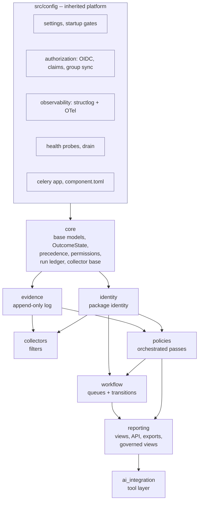
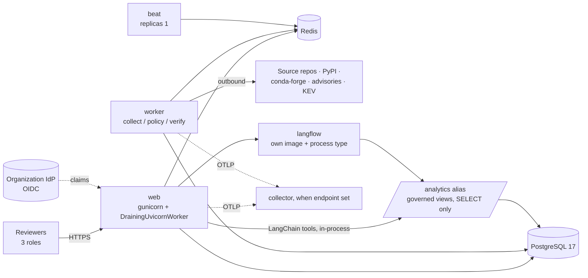
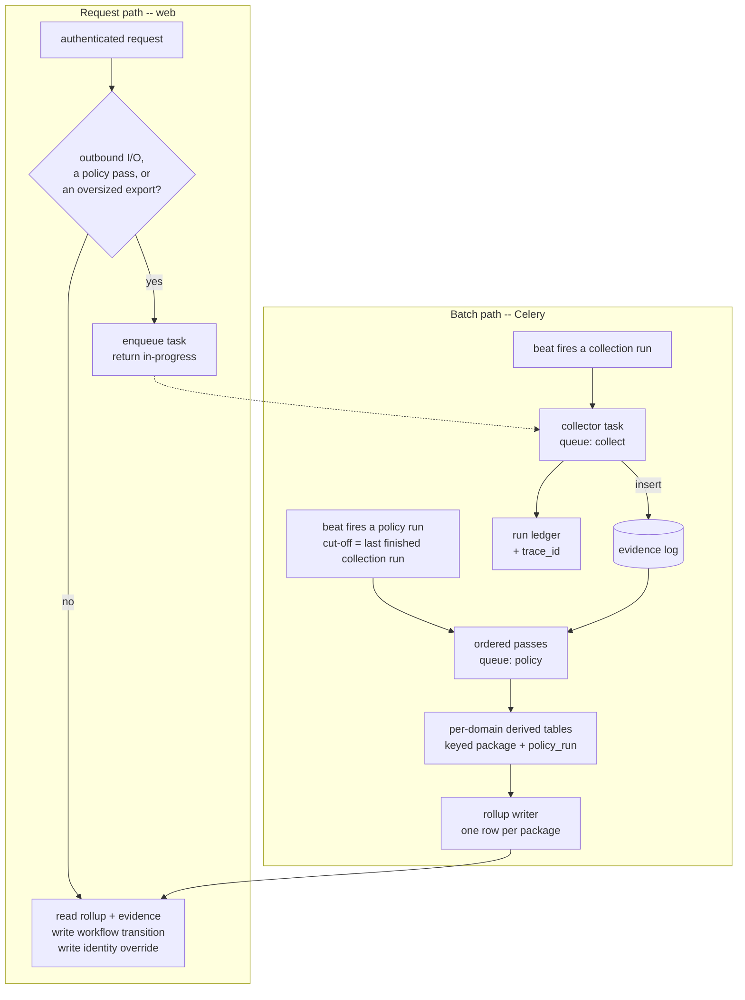
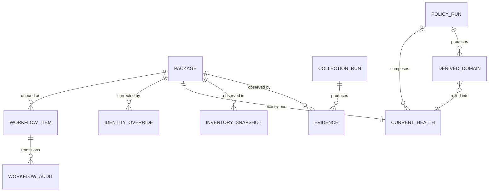

# Architecture Spine — Conda Package Supply Chain Monitor

## Identifier Namespace

Every decision here is `CPM-AD-n`. Requirements are cited as `CPM-FR-n` / `CPM-NFR-n`,
epics as `CPM-EP-*`.

The imported `django-15-factor-base` platform owns the **bare** identifiers — `AD-1`–`AD-31`,
`FR-4`–`FR-44`, `NFR-1`–`NFR-7`, `Epic 2`–`Epic 9`, `Story x.y`, `CG-3`, `R-2`/`R-3`/`R-5`,
and `SC-6` — referenced in comments across 45 files under `src/`. They are inherited,
read-only, and never renumbered or reused.

Worked example: a bare `FR-17` in this repository is the platform's **authentication-surface
allowlist** (`src/config/startup/allowlist.py`); `CPM-FR-17` is this product's vulnerability
rollup policy. The two share a number and nothing else.

## Design Paradigm

**Layered pipes-and-filters over an append-only evidence log, hosted on a 15-factor Django
service platform.**

Filters are the collectors: independent, idempotent, single-purpose, sharing nothing but
the log they append to. The log is the integration point — no collector calls another, and
no policy calls a collector. Policy is a separate orchestrated pass that reads the log and
writes derived state. Workflow records what humans decided. The application reads derived
state and never computes it.

| Layer | Lives in | Depends on |
|---|---|---|
| Platform (inherited) | `src/config/` | — |
| Shared kernel | `src/django_apps/core/` | platform |
| Package identity | `src/django_apps/identity/` | core |
| Evidence log | `src/django_apps/evidence/` | core |
| Collectors (filters) | `src/django_apps/collectors/` | evidence, identity |
| Policy (filters) | `src/django_apps/policies/` | evidence, identity |
| Workflow | `src/django_apps/workflow/` | policies, identity |
| Application + API | `src/django_apps/reporting/` | policies, workflow (read-only) |
| Governed analytics | `src/django_apps/ai_integration/` | governed views only |



Dependency direction is downward only. `collectors` never imports `policies`; `policies`
never imports `collectors` or `workflow`; nothing imports `reporting`; `ai_integration` is
a leaf.

## Inherited Invariants

Binding, read-only, from the imported platform. Not re-derived here. Where the platform's
enforcement is not yet built, that is stated — the rule still binds, but nothing catches a
violation yet.

| Inherited | Binds here | Enforcement |
|---|---|---|
| `AD-8` — adoption is explicit and two-line; entry-point discovery forbidden | Every `django_apps/*` app is added by a `pixi.toml` dependency plus an `adopted_apps` entry, in order. Nothing self-registers. | Declared; **enforced by the platform's Epic 9, which is not built.** Treat as convention until then. |
| `CONTRIBUTABLE_KEYS` allowlist | A domain app may contribute only to `DATABASES`, `DATABASE_ROUTERS`, `INSTALLED_APPS`, `NAVIGATION_REGISTRY`, `CELERY_BEAT_SCHEDULE`, `CELERY_IMPORTS`, `CELERY_TASK_ROUTES` — never `AUTHENTICATION_BACKENDS`, `DEFAULT_AUTHENTICATION_CLASSES`, `DEFAULT_PERMISSION_CLASSES`, `MIDDLEWARE`. | Declared in `allowlist.py`; enforcement is also Epic 9. |
| `AD-24` — sub-file feature removal only via paired `# feature:<name>` comments | Any feature-scoped collector or process uses the same marker syntax. | Marker syntax is live (`pixi.toml`, `component.toml`); the `accelerator.toml` that declares regions does not exist in this repo. |
| `AD-28` — runtime/deploy rules live in `component.toml`; materializer rules do not | New process types and per-database migration steps are declared there, nowhere else. | Enforced — closed key set in `config/component/loader.py`. |
| `AD-10` — authorization resolved per request, synced to Django groups at two frequencies | The product never re-implements group resolution; `CPM-FR-30` is satisfied by the platform. | Enforced in `authorization/mapper.py`. |
| `AD-22` — readiness flips before drain; probes mounted first, at the root, behind no prefix | `CPM-FR-28` is inherited, not built. | Enforced in `config/health/`, `config/workers.py`. |
| `CG-3` — every refusal raises `ImproperlyConfigured`; never a warning, never log-and-continue | Any startup condition this product adds refuses the same way. | Enforced across `config/startup/`. |
| `R-2` — a group revoked at the IdP is honoured until the token expires | The product cannot promise immediate revocation in `CPM-FR-30`. | Recorded consequence, not a check. |

## Invariants & Rules

### CPM-AD-1 — The package row is package identity and nothing else

- **Binds:** `CPM-EP-IDENTITY`, `CPM-FR-1`–`CPM-FR-6`
- **Prevents:** a collector or policy writing a version, a CVE, a build status or a score
  onto the package row, so history is destroyed and "current" becomes unauditable.
- **Rule:** the `identity` app owns one mutable row per package holding **only** canonical
  name, cross-ecosystem mappings, provenance and confidence. It holds no derived status, no
  observation, and no workflow state. No app outside `identity` writes a package row.
- **PRD Appendix A.1 is an export contract, not a table definition.** `priority_bucket`,
  `rank`, `score`, `work_type`, `vulnerability_rollup`, `risk_level`, `latest_vuln_count`,
  `priority_description/source/reason` are projected from the rollup (`CPM-AD-11`);
  `local_build_status` and `verified_at` are projected from evidence, as are `platforms`,
  `apps`, `downloads`, `versions`, `internal_component_count` and `internal_lob_count`,
  which are observed by the inventory collector and read from `inventory_snapshots`
  (`CPM-AD-25`). `reporting` performs the projection at read time. None of them is a field
  on `Package`.

### CPM-AD-2 — Evidence is append-only; run ledgers are not evidence  `[ADOPTED]`

- **Binds:** `CPM-EP-EVIDENCE`, `CPM-FR-36`, `CPM-FR-37`
- **Prevents:** two collectors disagreeing on whether re-observing an unchanged fact
  updates a row or writes a new one, which silently destroys the audit trail.
- **Rule:** evidence models inherit an abstract base in `core` whose `save()` refuses when
  `pk` is set, and whose manager exposes no `update()` or `delete()`. Re-observation always
  inserts.
- **Explicit exemption.** `collection_runs` and `policy_runs` are **run-ledger** models
  owned by `core`, not evidence, and they are mutable. A run row is created *before* the
  first outbound call with status `running`, and finalized in a `finally` to
  `succeeded | partial | failed | skipped`. This is the only way a process killed mid-run
  is still visible, which `CPM-FR-38` and `CPM-UJ-3` both require. PRD Appendix A.2's
  classification of them as evidence tables is superseded by this rule.
- **The one audited door (`CPM-OPERATE-S07`).** Retention is the one exception to
  append-only: the base exposes exactly one method, opened only by a token the
  retention module alone constructs, through which a declared nightly purge removes
  evidence and run-ledger rows older than `CPM_EVIDENCE_RETENTION_DAYS` in bounded
  batches, writing a run record per table naming the cut-off and the count. It never
  removes a package's newest row per table, the row a retained policy run read at its
  cut-off, a package row, a rollup row, or a human-audit row (`identity_overrides`,
  `inventory_changes`); every other refusal on the base stands, and the mutation-path
  audit licenses the door by count so a second deletion path fails the gate. A replay
  inside the retention window is byte-identical; outside it is refused with a reason
  (`CPM-FR-22`).

### CPM-AD-3 — Surrogate key, correctable canonical name  `[ADOPTED]`

- **Binds:** `CPM-EP-IDENTITY`, `CPM-EP-EVIDENCE`
- **Prevents:** evidence tables taking a wide Python-specific string foreign key that a
  later non-Python package cannot satisfy and a rename cascades through.
- **Rule:** every evidence, rollup and workflow row references the package by its integer
  primary key. `canonical_name` is `unique=True, db_index=True` and is never a foreign-key
  target. Export column headings are produced by `reporting`, never by field names.

### CPM-AD-4 — Confidence gates every outward claim, by writing a value  `[ADOPTED]`

- **Binds:** `CPM-FR-5`, `CPM-EP-CURRENCY`, `CPM-EP-SECURITY`, `CPM-EP-PY314`
- **Prevents:** one policy treating `unmapped` as "nothing found" while another treats it
  as "clean", and — separately — one policy skipping a package the others wrote.

| Confidence | What the system may assert |
|---|---|
| `verified` | Comparisons and recommendations shown normally |
| `inventory-derived` | Shown, with a confidence label. The **value is not degraded** |
| `unmapped` | Every gated status is written as `unknown`; never current, never clean, never "no feedstock"; routed to review |

- **Rule:** the gate is one function in `core`, called by the orchestrating policy run
  (`CPM-AD-21`), never re-implemented per pass. It is expressed as *writing a value*, never
  as suppressing a row — every inventory package always gets a rollup row (`CPM-AD-11`).
  `inventory-derived` sets a label the view renders; it never turns a determinate result
  into `unknown`.

### CPM-AD-5 — One status type, fixed values, one precedence order

- **Binds:** every policy, every derived status, `CPM-FR-6`
- **Prevents:** two policies producing incompatible status vocabularies, and three
  read surfaces inventing three different "worst of these" lattices.
- **Rule:**
  - `core` defines a single `OutcomeState` `TextChoices` with **fixed lowercase string
    values**: `not_applicable`, `unknown`, `not_found`, `error`, plus determinate values.
  - Per-status determinate values are namespaced and enumerated in `core` (e.g.
    `LicenseOutcome`), inheriting the four sentinels **by name and value**.
  - Every derived-status column is `CharField(choices=...)`. No boolean or nullable-boolean
    status fields anywhere. A test enumerates every derived-status field and asserts the
    four sentinels are present.
  - `core` defines the **single total precedence order** used by any aggregation of
    statuses. No other module defines one. No rollup, serializer, export or generated
    answer collapses the five.

### CPM-AD-6 — Version authority is explicit per package  `[ADOPTED]`

- **Binds:** `CPM-FR-16`, `CPM-EP-CURRENCY`
- **Prevents:** a package being marked stale against an ecosystem that was never
  authoritative for it.
- **Rule:** the authority order is data on the package, defaulting to: verified upstream
  releases → the verified primary release ecosystem (PyPI where it applies) → feedstock
  recipe → published conda package → internal deployed version. The chosen authority and
  its supporting evidence are stored with every currency result.

### CPM-AD-7 — Collectors share nothing but the log; evidence always inserts  `[ADOPTED]`

- **Binds:** `CPM-FR-7`–`CPM-FR-15`, `CPM-EP-CURRENCY`, `CPM-EP-SECURITY`, `CPM-EP-PY314`
- **Prevents:** an implicit ordering dependency forming between collectors; and two
  collectors reading "idempotent" as a unique constraint versus a read-time dedup.
- **Rule:**
  - A collector writes its own evidence table plus its run-ledger row, and reads only
    `identity`. It never imports another collector, never reads another collector's
    evidence table, and never writes a derived status.
  - **Evidence is always inserted.** No evidence table carries a unique constraint that
    suppresses an insert. `observed_at` always means the moment of *this* observation.
  - **Idempotency is a property of the run ledger, not the evidence table.** An
    *observation window* is a per-collector configured interval (`CPM-FR-38`'s freshness
    target is its default). A second run inside the window writes a ledger row with status
    `skipped` and no evidence. A manually triggered recollection (`CPM-UJ-1`) always
    bypasses the window and always writes.

### CPM-AD-8 — Policy is a separate versioned pass  `[ADOPTED]`

- **Binds:** `CPM-FR-16`–`CPM-FR-22`, `CPM-FR-40`, `CPM-FR-41`, `CPM-EP-PRIORITY`
- **Prevents:** a collector computing a status inline, which makes the result
  unreproducible and couples collection cadence to policy versions.
- **Rule:** no collector computes a derived status. A pass reads evidence at a stated
  cut-off, writes its own per-domain derived table, and never mutates evidence. Rule sets
  and scoring functions are versioned **data**, not code branches; every derived row
  records the policy version that produced it. Re-running a version against a cut-off must
  reproduce identical output.

### CPM-AD-21 — One orchestrated policy run owns the rollup

- **Binds:** `CPM-FR-22`, `CPM-FR-26`, `CPM-SM-6`, `CPM-EP-PRIORITY`
- **Prevents:** two policy passes writing the current-health row with different cut-offs
  and versions, clobbering each other's columns and making "the version this was computed
  at" unanswerable — and one pass re-deriving a status another pass owns.
- **Rule:**
  - A **policy run** is the unit. It has one id, one **cut-off**, and a declared ordered
    list of passes. Beat schedules the *run*, never an individual pass.
  - A cut-off is the `finished_at` of a completed collection run. A pass never reads
    evidence written by a run still `running`.
  - Each pass writes only its own per-domain derived table, keyed `(package, policy_run)`.
    **No pass writes the rollup.**
  - Passes **register** with the run rather than being invoked directly, and each declares
    the derived table it owns. The set of passes is therefore enumerable, and an audit
    fails if any registered pass declares the rollup — so this rule is mechanically
    enforced against passes not yet written, not checked by reading code (ASR-3).
  - The rollup is composed by **one writer**, once per run, as a full-row replace inside
    one transaction per package, stamped with `policy_run_id`. It carries the run's cut-off
    and a **per-domain version map**, not a scalar version.
  - A pass may read the derived output of a pass declared **earlier in the same run**, and
    must — it never re-derives a status another pass owns. Priority reads the vulnerability
    pass's output; it does not recompute severity.

### CPM-AD-9 — The request/task boundary

- **Binds:** `CPM-EP-APP`, `CPM-NFR-6`, all collectors
- **Prevents:** two teams disagreeing on what a view may do, and a rate-limited external
  call blocking a web worker until the request times out.
- **Rule:** a web request may read derived state, read evidence, and write workflow state
  or a package-identity override. It may **not** make an outbound call to an external
  source, run a collector, run a policy pass, or build an export beyond
  `settings.CPM_SYNC_EXPORT_MAX_ROWS` — a single settings constant used by **every** export
  path, so two surfaces cannot disagree on the threshold. Everything else is a Celery task
  and the request returns an in-progress state. Celery's inherited limits are a 5-minute
  time limit and a 60-second soft limit; work exceeding them is chunked per package, never
  raised.

### CPM-AD-23 — Transaction boundaries are per package, and audits are atomic with their write

- **Binds:** `CPM-FR-15`, `CPM-FR-32`, `CPM-NFR-1`, all collectors and passes
- **Prevents:** a sweep wrapped in one transaction rolling back 8,999 good packages
  because the 9,000th failed — making `CPM-FR-15`'s partial success unreachable and
  pinning the WAL for the length of a rate-limited sweep; and an audit row written by
  `on_commit` or a follow-up task being lost on a worker restart.
- **Rule:** `ATOMIC_REQUESTS=True` covers requests only; tasks get nothing by default. A
  collector or policy task **never holds a transaction across packages**. The atomic unit
  is one package, or one declared chunk. A later package's failure never rolls back an
  earlier package's evidence, and the run ledger records `partial`. Every privileged write
  and its audit row are one atomic unit written by one service function — never
  `transaction.on_commit`, never a follow-up task.

### CPM-AD-10 — Derived state is read-only to the application

- **Binds:** `CPM-EP-APP`, `CPM-FR-23`–`CPM-FR-27`, `CPM-FR-37`
- **Prevents:** a view or API endpoint "fixing" a status, so the policy engine stops being
  the source of truth.
- **Rule:** the application layer holds no write path to a derived status or to evidence.
  Its only writes are workflow state (`CPM-AD-22`) and the package-identity override
  (`CPM-AD-14`). Serializers over derived models are explicitly read-only.

### CPM-AD-11 — Current health is a refreshed rollup table, one row per package

- **Binds:** `CPM-FR-23`, `CPM-FR-26`, `CPM-NFR-4`, `CPM-NFR-5`
- **Prevents:** the most-read object in the product being built one way and operated as
  another; and a package being present in one filter and absent from another.
- **Rule:** current package health is a Django-managed table written by the orchestrating
  policy run (`CPM-AD-21`), **not** a PostgreSQL materialized view — it stays inside the
  migration graph and is ORM-filterable without raw SQL. It holds **exactly one row per
  inventory package, always**, including `unmapped` ones (`CPM-AD-4`). It carries
  `computed_at`, the run's cut-off, and the per-domain version map, and every view and
  export displays them. Only the rollup writer writes it.

### CPM-AD-22 — One workflow app owns every queue item, keyed on a finding key

- **Binds:** `CPM-FR-4`, `CPM-FR-25`, `CPM-FR-32`, `CPM-UJ-1`, `CPM-EP-APP`
- **Prevents:** an accepted finding resurrecting as new work tomorrow because it was keyed
  on an evidence row id that append-only re-observation replaces; the same item existing
  twice in two role-exclusive queues with diverging state; and last-writer-wins clobbering
  between two roles acting on one item.
- **Rule:**
  - One `workflow` app owns **all three queues** — identity review, remediation, and
    compliance review. They are filtered views over one table, not three models. The
    identity review queue lives here, not in `identity`, so it can rank by the same
    bucket-then-score rule as the others.
  - A workflow item is keyed on a **finding key**: a re-observation-stable natural key
    declared alongside each evidence table (for a vulnerability, `package + advisory_id +
    affected_range`). **Never an evidence row id.**
  - State transitions are declared once as data — `(from_state, to_state, required_role)` —
    and applied by one service function that locks the row with `select_for_update`, checks
    the expected prior state, refuses on mismatch, and appends the audit row in the same
    transaction (`CPM-AD-23`).
  - Routing between queues changes the item's queue field. It never creates a second item.
  - Ranking is bucket then score, for every queue; usage breadth is the score input for
    identity items.

### CPM-AD-12 — Pagination is structural  *(net-new: no pagination is configured today)*

- **Binds:** `CPM-EP-APP`, `CPM-NFR-4`
- **Prevents:** one endpoint paginating and another not, at 10,000 rows.
- **Rule:** `DEFAULT_PAGINATION_CLASS` and `PAGE_SIZE` are set globally in `REST_FRAMEWORK`;
  neither exists today. No view or serializer may opt out. An export beyond
  `CPM_SYNC_EXPORT_MAX_ROWS` is a task (`CPM-AD-9`), never an unpaginated response.

### CPM-AD-13 — Authorization is declared per surface, enforced centrally

- **Binds:** `CPM-FR-29`–`CPM-FR-32`, `CPM-EP-APP`
- **Prevents:** each view inventing its own role check, so a queue leaks to the wrong role.
- **Rule:** every view, viewset and report declares the role it requires via a permission
  class from `core`; the check is implemented once. The three roles map to Django groups
  named by the platform's claims contract. Read access to evidence is granted to all three
  roles; **queue write access is role-scoped per transition** (`CPM-AD-22`), not per queue,
  so one item can legitimately be advanced by two roles in sequence. A refused request is
  logged with the acting user identity. Domain apps never touch
  `DEFAULT_PERMISSION_CLASSES` — the platform's allowlist forbids it.

### CPM-AD-14 — Governed reference data has exactly one write path

- **Binds:** `CPM-FR-3`, `CPM-FR-32`, `CPM-EP-IDENTITY`
- **Prevents:** a second, unaudited route to correcting a package identity appearing
  alongside the audited one.
- **Rule:** package identity is mutated by resolution, or by the override path — nothing
  else. The override requires the override permission, requires a non-empty reason, and
  writes an `identity_overrides` row (actor, timestamp, prior value, new value, reason) in
  the same transaction (`CPM-AD-23`). An override is never downgraded by automated
  resolution. Workflow state is a separate class and never touches identity or evidence.
  Creation is resolution: a package shell created during inventory ingestion is written by
  `identity`'s resolution service, not by the collector that triggered it (`CPM-AD-25`).

### CPM-AD-15 — Every observation carries the platform's correlation identifiers

- **Binds:** `CPM-FR-39`, `CPM-NFR-12`, `CPM-NFR-13`
- **Prevents:** an `error` state that is recorded but not investigable.
- **Rule:** run-ledger rows and `identity_overrides` persist the `trace_id` of the request
  or task that produced them, taken from the active span the platform already binds.
  Structured logs already carry `request_id`, `user_id`, `trace_id`, `span_id`; the product
  adds no correlation scheme of its own.

### CPM-AD-24 — Every read surface projects the same values

- **Binds:** `CPM-FR-23`, `CPM-FR-26`, `CPM-FR-34`, `CPM-EP-APP`, `CPM-EP-NL`
- **Prevents:** the export rendering `unknown` as a blank cell — destroying the five states
  in the one artifact that leaves the system — and a new derived status reaching the API
  but not the governed view the analytics layer reads.
- **Rule:**
  - A derived status is emitted **verbatim as its `OutcomeState` value** on every surface:
    API, export, and governed view. Blank is reserved for a field with no value and is
    never used for a status. PRD Appendix A.1's "blank means missing" applies to identity
    fields only.
  - **The HTML renders that value's label, and carries the value beside it.** Clarified
    by `CPM-APP-S20`; the three surfaces above are all machine-read, and the screen was
    never among them — it printed values because a template prints what it is handed,
    not because this rule said to. So a reader sees *Advisories matched* on the table
    and `advisories_matched` in the CSV they export from it: **the projected value is
    the same everywhere, and only its rendering differs.** The label is derived from the
    value (`surface/labels.py`), so the two cannot drift, and
    `tests/integration/django_apps/test_no_slug_reaches_a_reader.py` asserts both
    halves — no slug reaches a reader, and the machine surfaces still speak in values.
  - Every derived-status column in the rollup appears in the governed views, enforced by a
    test that diffs the two column sets.
  - The reporting projection maps **names only** — never values, never formatting.

### CPM-AD-16 — Analytics reads a second connection, never the app's  *(net-new)*

- **Binds:** `CPM-FR-33`, `CPM-EP-NL`
- **Prevents:** the analytics layer being handed the application's read-write role because
  the routing work was not anticipated; and a read-only alias silently opening a
  transaction on every web request.
- **Rule:** a second `DATABASES` alias `analytics` holds credentials for a PostgreSQL role
  with `SELECT` on governed views only and no table grants. Its config contract is fixed:
  `ATOMIC_REQUESTS = False` (it is never written through, and the platform's
  `test_database_selection.py` assertion must be read as "every alias Django may write
  through"), an explicit `CONN_MAX_AGE`, and a `TEST` mirror. A `DATABASE_ROUTERS` entry
  confines `ai_integration` reads to it and returns `False` from `allow_migrate` and
  `allow_write`. Governed views are created and versioned by Django migrations in
  `reporting` using `RunSQL` with a reversible drop. Neither the alias nor the router
  exists today.
- **The inherited assertion is amended, not bypassed (ASR-5).** `tests/unit/test_database_selection.py`
  iterates every alias and asserts `ATOMIC_REQUESTS is True`. When the alias lands, that
  assertion narrows to the aliases Django may write through — `ATOMIC_REQUESTS` governs
  the request-transaction boundary and is meaningless on an alias nothing can write
  through, so this corrects the assertion's semantics rather than weakening it. It is a
  change to inherited platform code and is owned by the platform owner.

### CPM-AD-17 — Two analytics components, one in-process and one a deployment unit

- **Binds:** `CPM-EP-NL`, `CPM-FR-34`, `CPM-FR-35`
- **Prevents:** an analytics runtime embedded in the web process competing with request
  serving; and products with mutually exclusive dependency pins landing in one environment.
- **Rule:**
  - The layer is **LangChain** for the tool layer and natural-language querying, and
    **LangFlow** for composing repeatable investigations and reports.
  - **DB-GPT is not adopted.** It shipped no Python 3.14 classifier and tests only 3.10 and
    3.11 in CI, against a repository pinned to `python = "3.14.*"` with no alternative; its
    `sqlalchemy <2.0.29` / `fastapi <0.113.0` pins are mutually exclusive with
    `langflow-base`'s `sqlalchemy >=2.0.38` / `fastapi >=0.139.0`; and its conda-forge
    availability is unestablished against a supply-chain rule
    `tests/unit/test_dependency_policy.py` enforces. `CPM-FR-34`'s natural-language querying
    is served by LangChain tools over the governed views of `CPM-AD-16` — the payload shape
    `CPM-AD-18` already mandates.
  - **LangChain may be a dependency of this component**, in `ai_integration`, and only if
    it is available on conda-forge. It runs in the `web` process for interactive questions
    and on the `policy` queue for scheduled report composition.
  - **LangFlow is a separate deployment unit, not a dependency.** It gets its own image and
    its own `component.toml` process type inside a `# feature:analytics` marker pair
    (`AD-24`), with its own replica count and `rolling` replacement. It is a FastAPI
    application server, not a library, and keeping it out of this environment also keeps it
    clear of the conda-forge-only rule and the 3.14 pin.
  - Neither reaches data except through the `analytics` alias of `CPM-AD-16`. Neither is
    importable from any `django_apps` package other than `ai_integration`.
  - **Adoption is gated by a fitness spike** following the repository's existing pattern
    (`[feature.spike-storage]`): the spike establishes LangChain's conda-forge availability
    and its transitive resolution against Python 3.14 — `langgraph` and
    `langchain-community` lag on 3.14 classifiers and `langchain-classic` caps at 3.13.
    Until it passes, `CPM-EP-NL` is not plannable.

### CPM-AD-18 — Tools return evidence references, never prose facts

- **Binds:** `CPM-FR-34`, `CPM-FR-35`, `CPM-EP-NL`
- **Prevents:** a model restating a number it was handed and losing the citation, which
  makes an answer unfalsifiable.
- **Rule:** every tool returns a structured payload carrying the package identifier, the
  derived status **as its `OutcomeState` value** (`CPM-AD-24`), the evidence table,
  evidence ids, source names and observation timestamps. A tool never returns a rendered
  sentence. A composition embeds no business rule that policy does not own. The layer holds
  no write grant and cannot assert a conclusion policy did not produce.

### CPM-AD-19 — One app per domain, routed centrally

- **Binds:** every `django_apps/*` package
- **Prevents:** each domain inventing its own routing, serializer location and task
  conventions.
- **Rule:** each domain is one Django app under `src/django_apps/`, laid out like
  `django_service/users/`: `models.py`, `migrations/`, `tasks.py`, `apps.py`, an app-level
  `urls.py` with `app_name` for any HTML views, and an `api/` subpackage holding
  `serializers.py` and `views.py`. The `api/` subpackage has **no** `urls.py` — DRF routing
  is registered centrally in `config/api_router.py`. Templates and static stay at the
  `django_service/` package level. `src/django_apps/` is a second import root declared once
  in `pyproject.toml`.

### CPM-AD-20 — Scheduling is data; three queues by workload class  *(net-new)*

- **Binds:** `CPM-NFR-1`–`CPM-NFR-3`, `CPM-EP-CURRENCY`, `CPM-EP-SECURITY`
- **Prevents:** cadence hard-coded per collector, and a compute-backed verification build
  starving the daily security sweep on a shared queue.
- **Rule:** cadences live in `django_celery_beat`'s `DatabaseScheduler`, contributed via
  `CELERY_BEAT_SCHEDULE`, never as decorators. Beat schedules collection runs and policy
  runs (`CPM-AD-21`), never individual passes. Three queues routed by `CELERY_TASK_ROUTES`:
  `collect` (external I/O, rate-limited), `policy` (CPU, no external calls), `verify`
  (compute-backed Python 3.14 builds). Neither `CELERY_TASK_ROUTES` nor a default queue
  exists today. Rate limiting, retry with backoff, timeouts and caching live in a shared
  collector base in `core`, not per collector.

### CPM-AD-25 — The inventory arrives as evidence; resolution still owns the package row  *(net-new)*

- **Binds:** `CPM-FR-42`, `CPM-EP-IDENTITY`, `CPM-EP-PRIORITY`
- **Prevents:** the inventory becoming a second, unaudited write path onto the package row,
  and the internal usage signals becoming mutable columns that silently change what a
  replayed policy run concludes.
- **Rule:** the internal inventory is observed by a collector like any other source. It runs
  on the `collect` queue through the shared collector base, and writes `inventory_snapshots`
  — append-only rows carrying the source's package key, the internal usage signals as
  observed, `observed_at`, and the run's correlation identifiers.
- **The collector never writes the package table.** For a source record naming a package that
  does not exist yet, it calls `identity`'s resolution service, which creates the shell at
  `unmapped` confidence; the shell and the snapshot commit in one per-package transaction
  (`CPM-AD-23`). `CPM-AD-14` is unchanged: identity is still mutated by resolution or the
  override path, and by nothing else.
- **Absence is an observation.** A package present in an earlier run and absent from a later
  one is recorded as absent with a timestamp. No package row is ever deleted, and the rollup
  keeps its one row per package (`CPM-AD-11`).
- **Every reader is cut-off bound.** A policy reading a usage signal reads the latest snapshot
  at or before its run's cut-off, never the current value, so `CPM-FR-22` replay reproduces
  identical results.

### CPM-AD-26 — Time comes from an injected clock  *(net-new)*

- **Binds:** `CPM-FR-22`, `CPM-FR-37`, `CPM-FR-38`, `CPM-EP-EVIDENCE`
- **Resolves:** ASR-1.
- **Prevents:** freshness targets, observation windows, policy cut-offs and `observed_at`
  each reading a wall clock nothing controls, so staleness and window tests are either
  impossible to write or flaky by construction — leaving R-03 without a credible mitigation.
- **Rule:** one clock abstraction in `core`, injected into every collector, policy pass and
  freshness computation. No module calls `timezone.now()` directly, and an audit enforces it
  in the same shape as the existing import-root audit.

### CPM-AD-27 — The collector base owns the transport seam  *(net-new)*

- **Binds:** `CPM-NFR-3`, `CPM-EP-CURRENCY`, `CPM-EP-SECURITY`, `CPM-EP-PY314`
- **Resolves:** ASR-2.
- **Prevents:** eight collectors whose parse, `not_found`, `error` and `not_applicable`
  handling — the majority of this product's behaviour — is reachable only through the
  network, pushing it into the integration tier and out of the fast feedback loop.
- **Rule:** the transport boundary sits in the collector base (`CPM-EVIDENCE-S05`), so a
  collector is a pure translation from a recorded payload to evidence rows and is unit
  testable without network access. The integration tier proves the transport itself, once.

### CPM-AD-28 — A collector without a freshness target refuses to start  *(net-new)*

- **Binds:** `CPM-FR-38`, `CPM-EP-EVIDENCE`
- **Resolves:** ASR-4.
- **Prevents:** an unset per-collector target behaving as "fresh forever", so six-month-old
  evidence reads as current — the exact `CPM-SM-C1` failure the product is built to avoid.
- **Rule:** every registered collector declares a freshness target. Startup raises
  `ImproperlyConfigured` when one does not, per the inherited `CG-3` convention that a
  refusal raises rather than warns. The target *values* remain PRD Open Question 7; their
  presence is not optional.

### CPM-AD-29 — The inventory source is a declared adapter; locality selects its file  *(net-new)*

- **Binds:** `CPM-FR-42`, `CPM-EP-IDENTITY`, `CPM-IDENTITY-S06`, `CPM-IDENTITY-S07`
- **Prevents:** a deployed component ingesting a development subset and recording every
  package outside it as absent, and the inventory acquiring a second ingestion path each
  time a new source is added.
- **Rule:** ingestion reads exactly one **inventory source adapter** behind a single
  contract — yield records, or fail. An adapter is a transport substitution at the
  collector base's seam (`CPM-AD-27`), so the ingestion collector is unchanged whichever
  source is active, and adapters are **declared, never discovered** (inherited `AD-8`).
- **The v1 adapter is the versioned watchlist:** a delimited file held in the repository
  and changed by review. Reviewability is what makes it governed reference data under
  `CPM-AD-14` — a file changed without review would be an unaudited write path onto the
  package set, which is the thing `CPM-AD-14` exists to forbid.
- **Locality selects the file, and fails closed toward production.**
  `config.locality.is_local()` (inherited `AD-13`) selects the development subset; absent or
  unrecognized `COMPONENT_RUNTIME` reads deployed and takes the production watchlist. The
  asymmetry is deliberate and must not be tidied away. A local machine that reads the
  production watchlist ingests a longer list of package names and nothing else. A deployed
  component that reads the development subset would record every package outside that
  subset as **absent with a timestamp** — and because absence is an observation
  (`CPM-AD-25`) written to an append-only log that nothing may update or delete, the false
  absence is permanent and replayable. A misconfiguration would not merely under-monitor;
  it would corrupt the evidence record.
- **Refuse, never repair.** An unreadable file, a missing required column, a non-numeric
  count, or a repeated source package key raises `ImproperlyConfigured` and fails the run
  before any row is written (inherited `CG-3`). No run partially ingests a source.

## Consistency Conventions

| Concern | Convention |
|---|---|
| App naming | `src/django_apps/<domain>/`: `core`, `identity`, `evidence`, `collectors`, `policies`, `workflow`, `reporting`, `ai_integration` |
| Model naming | Evidence models are `<Source>Snapshot` or `<Kind>Finding`, matching PRD Appendix A.2 names |
| Terminology | PRD §3 Glossary verbatim. Bare "identity" is forbidden — always "package identity" or "user identity". Bare "confidence" is package-identity confidence; advisory matching is "match confidence" |
| Status fields | `CharField(choices=...)` over an `OutcomeState`-derived type from `core` (`CPM-AD-5`). Never boolean, never nullable boolean |
| Status values | Fixed lowercase strings, emitted verbatim on every surface (`CPM-AD-24`) |
| Timestamps | UTC, timezone-aware. `observed_at` on evidence, `computed_at` on the rollup, `started_at`/`finished_at` on run ledgers. Never `created_at` for an observation time |
| Identifiers | Product artifacts carry `CPM-`; platform identifiers stay bare and are never reused |
| Migrations | Governed views are `RunSQL` with a reversible drop, owned by `reporting`. Data migrations never call collectors |
| Transactions | One package per atomic unit in tasks (`CPM-AD-23`). Audit rows are atomic with the write they record — never `on_commit` |
| Errors | A refusal raises; a failed collection records an `error` row and returns. Never `except: pass`, never a silent fallback to clean |
| Logging | structlog only, from the platform's configuration. No `print`, no stdlib `logging`. Correlation fields are inherited, never re-bound |
| Config | Environment via `django-environ` in `settings/base.py`. A domain app reads settings, never `os.environ` |
| Tests | Mirror `src/` under `tests/unit/` and `tests/integration/`. Unit tests touch no database, network or filesystem; the `integration` marker is applied automatically by directory |

## Stack

Verified against `pixi.toml` at authoring; the code owns this from here.

| Name | Version |
|---|---|
| python | `3.14.*` |
| django | `>=5.2,<5.3` |
| psycopg | `>=3.2.4,<3.2.11` |
| libpq | `>=17,<18` |
| celery | `>=5.6,<6` |
| django-celery-beat | `>=2.9,<3` |
| redis-py | `>=8.1,<9` |
| django-redis | `>=7.0,<8` |
| hiredis | `>=3.4,<4` |
| djangorestframework | `>=3.17,<4` |
| drf-spectacular | `>=0.30,<0.31` |
| django-allauth | `>=65.19,<66` |
| django-environ | `>=0.14,<0.15` |
| pyjwt | `>=2.13,<3` |
| cryptography | `>=50.0,<51` |
| requests | `>=2.34,<3` |
| structlog | `>=26.1,<27` |
| django-structlog | `>=10.1,<11` |
| opentelemetry-api / -sdk | `>=1.44,<2` |
| opentelemetry-exporter-otlp-proto-http | `>=1.44,<2` |
| opentelemetry-instrumentation-{django,asgi,celery,psycopg,redis} | `>=0.65b0` — **uncapped, the only uncapped runtime pins** |
| uvicorn | `>=0.52,<0.53` |
| uvicorn-worker (linux-64, osx-arm64) | `>=0.4,<0.5` |
| gunicorn (linux-64, osx-arm64) | `>=26.0,<27` |
| whitenoise | `>=6.12,<7` |
| django-crispy-forms / crispy-bootstrap5 | `>=2.6,<3` / `>=2026.3,<2027` |
| LangChain | Spike-gated dependency of `ai_integration`, conda-forge availability unestablished (`CPM-AD-17`) |
| LangFlow | Not a dependency — its own image and process type (`CPM-AD-17`) |
| DB-GPT | **Not adopted** — see `CPM-AD-17` |

## Structural Seed

### Containers



### The two paths



### Core entities



### Source tree

```text
src/
  config/                  # inherited platform -- do not restructure
    api_router.py          # every domain viewset registers here (CPM-AD-19)
    settings/              # analytics alias + DATABASE_ROUTERS land here (CPM-AD-16)
  django_service/          # the reference application, users, templates, static
  django_apps/             # NET-NEW second import root
    core/                  # OutcomeState + precedence, base models, permission classes,
                           #   run-ledger models, the collector base (retry/backoff/limits)
    identity/              # package identity, provenance, confidence, overrides
    evidence/              # append-only models + the refuse-on-update base
    collectors/            # one filter per source; queue: collect
    policies/              # ordered passes + the rollup writer; queue: policy
    workflow/              # all three queues, finding keys, declared transitions
    reporting/             # views, API, exports, governed-view migrations
    ai_integration/        # tool layer; leaf
```

## Capability → Architecture Map

| Epic | Lives in | Governed by |
|---|---|---|
| `CPM-EP-PLATFORM` | `src/config/` (imported) | Inherited invariants |
| `CPM-EP-IDENTITY` | `django_apps/identity`, `collectors` | `CPM-AD-1`, `CPM-AD-3`, `CPM-AD-4`, `CPM-AD-14`, `CPM-AD-25` |
| `CPM-EP-EVIDENCE` | `django_apps/evidence`, `core` | `CPM-AD-2`, `CPM-AD-3`, `CPM-AD-15`, `CPM-AD-23` |
| `CPM-EP-CURRENCY` | `django_apps/collectors`, `policies` | `CPM-AD-6`, `CPM-AD-7`, `CPM-AD-8`, `CPM-AD-20` |
| `CPM-EP-SECURITY` | `django_apps/collectors`, `policies` | `CPM-AD-5`, `CPM-AD-7`, `CPM-AD-8`, `CPM-AD-20` |
| `CPM-EP-RENAME` | the `django_apps/` import root itself | `CPM-AD-8` (adoption stays explicit) |
| `CPM-EP-PY314` | `django_apps/collectors`, `policies` | `CPM-AD-5`, `CPM-AD-7`, `CPM-AD-20` (`verify` queue) |
| `CPM-EP-PRIORITY` | `django_apps/policies` | `CPM-AD-8`, `CPM-AD-11`, `CPM-AD-21` |
| `CPM-EP-APP` | `django_apps/reporting`, `workflow`, `config/api_router.py` | `CPM-AD-9`–`CPM-AD-14`, `CPM-AD-22`, `CPM-AD-24` |
| `CPM-EP-NL` | `django_apps/ai_integration` | `CPM-AD-16`, `CPM-AD-17`, `CPM-AD-18`, `CPM-AD-24` |

## Deferred

- **Priority rule set and scoring function content** (`CPM-FR-20`). `CPM-AD-8` fixes that
  they are versioned data with explainable output; what the rules *say* encodes an
  organizational risk posture that does not exist yet. PRD Open Question 8.
- ~~**Per-collector freshness targets and observation windows**~~ (`CPM-FR-38`, `CPM-AD-7`) —
  **no longer deferred.** PRD Open Question 7 was resolved on 2026-09-05, at the moment it
  said it would be needed: `CPM-IDENTITY-S06` ships the first collector. A target is derived
  rather than picked — `cadence x (1 + tolerated_missed_runs) + one sweep duration` — which
  leaves one judgement per *signal class* instead of one number per collector, and makes the
  cadences `CPM-NFR-2` already fixed the input to the arithmetic. The target is always
  strictly greater than its cadence; equal makes evidence stale exactly when the next run is
  due. Observation windows follow, because `CPM-AD-7` makes the freshness target a window's
  default. What remains open is narrower and is recorded as 7b, 7c and 7d in the PRD: the
  sweep-duration measurement the values still owe, the on-demand Python 3.14 collector that
  has no cadence to derive from, and whether `freshness_target` should be data the way
  cadence is rather than a `ClassVar` — the last of which is this pass's to answer, and
  until it does, `CPM-AD-28` is unchanged.
- **The p95 latency budget and `CPM_SYNC_EXPORT_MAX_ROWS`** (`CPM-NFR-5`, `CPM-AD-9`).
  Both are structurally enforced; their values need a populated inventory to measure
  against. PRD Open Question 5.
- **Advisory and KEV source selection** (`CPM-FR-11`, `CPM-FR-12`). Licensing unresolved;
  `CPM-AD-7` makes the collector swappable without touching policy. PRD Open Question 1.
- **License policy content** (`CPM-FR-18`). `CPM-AD-8` fixes it as versioned data. PRD
  Open Question 2.
- **Whether the analytics model is self-hosted** (`CPM-NFR-9`). `CPM-AD-16` and
  `CPM-AD-17` hold either way. PRD Open Question 6.
- **The analytics fitness spike itself** (`CPM-AD-17`). LangChain's conda-forge
  availability and its transitive resolution against Python 3.14 are unestablished. This is
  the one deferred item that **blocks** its epic rather than deferring inside it.
- ~~**The inventory source and the internal usage-signal field set**~~ — **no longer
  deferred.** PRD Open Question 3 was resolved on 2026-09-04: the source is the versioned
  watchlist read through the adapter contract (`CPM-AD-29`), and the field set is
  `internal_component_count` and `internal_lob_count` required, with `apps`, `platforms`,
  `downloads` and `versions` nullable. What remains deferred is the watchlist *content*,
  which is an organizational decision rather than an architectural one.
- **Non-Python conda artifacts.** `CPM-AD-3` and `CPM-AD-5` make the later phase a data
  change, not a schema migration.
