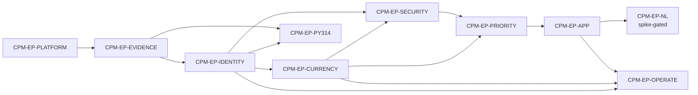

# Conda Package Supply Chain Monitor — Epic Breakdown

## Overview

This document decomposes the PRD requirements and the architecture spine's invariants into
implementable stories. `CPM-EP-APP` builds views against the PRD's user journeys, the
spine's surface rules, and the UX design contract at `_bmad-output/planning-artifacts/ux-designs/ux-conda-package-supply-chain-monitor-2026-09-04/` — two peer spines, `DESIGN.md`
for visual identity and `EXPERIENCE.md` for behaviour, information architecture, states and
accessibility.

## Identifier Scheme

The imported `django-15-factor-base` platform owns the **bare** identifiers — `AD-1`–`AD-31`,
`FR-4`–`FR-44`, `NFR-1`–`NFR-7`, `Epic 2`–`Epic 9`, `Story x.y`, `CG-3`, `R-2`/`R-3`/`R-5`,
`SC-6` — referenced across 45 files under `src/`. They are never renumbered or reused.

Everything this document creates carries `CPM-`:

| Kind | Form | Example |
|---|---|---|
| Epic | `CPM-EP-<NAME>` (non-positional, fixed by the PRD) | `CPM-EP-EVIDENCE` |
| Story | `CPM-<EPIC>-S<nn>` (sequential within its epic) | `CPM-EVIDENCE-S01` |
| Requirement | `CPM-FR-n` / `CPM-NFR-n` (from the PRD) | `CPM-FR-36` |
| Invariant | `CPM-AD-n` (from the spine) | `CPM-AD-2` |

A bare `FR-17` in this repository is the platform's authentication-surface allowlist;
`CPM-FR-17` is this product's vulnerability rollup policy.

## Requirements Inventory

### Functional Requirements

- **CPM-FR-1** — Resolve package identity. The system resolves each inventory package to a canonical name, a source repository, its release ecosystem identity (PyPI for the Python packages v1 targets), and zero or more conda-forge feedstocks.
- **CPM-FR-2** — Persist identity provenance and confidence. Every resolution records where it came from and how confident it is.
- **CPM-FR-3** — Manual package-identity override, and the inventory change. A platform lead can correct a package identity from the application, on the record, and can add, change or retire an inventory row from the application, on the record. These are the **two** human writes that mutate **governed reference data** — package identity and the inventory — and each carries a permission, a required reason and an audit row in the same transaction (amended by `sprint-change-proposal-2026-09-13.md` §7, CPM-OPERATE-S03). Queue actions (CPM-FR-25) write **workflow state**, which is a separate class: it records what a human decided about a finding, and never alters the package identity, the inventory or the evidence beneath them.
- **CPM-FR-4** — Package-identity review queue. Unmapped and low-confidence packages surface as a worked queue, not a report.
- **CPM-FR-5** — Confidence gates what automation may claim. Confidence constrains what the system asserts about a package.
- **CPM-FR-6** — Not-applicable is a distinct outcome. A check that does not apply to a package is never folded into clean or unknown.
- **CPM-FR-42** — Inventory ingestion. The system acquires the package inventory and its internal usage signals from the organization's internal source, as append-only evidence.
- **CPM-FR-7** — Source release collector. Obtains latest release or tag, its date, and a repository activity signal from the package's source repository.
- **CPM-FR-8** — PyPI collector. Obtains project existence, latest version and date, and `Requires-Python` metadata.
- **CPM-FR-9** — Conda-forge feedstock collector. Obtains feedstock existence, recipe version, recipe metadata, and recent recipe activity.
- **CPM-FR-10** — Published conda package collector. Obtains published version, build string, and channel for each monitored channel.
- **CPM-FR-11** — Vulnerability collector. Matches package and version against advisory sources and records affected and fixed ranges.
- **CPM-FR-12** — KEV collector. Cross-references vulnerability findings against the KEV catalog.
- **CPM-FR-13** — License collector. Extracts and normalizes license metadata and records the raw value alongside the normalized expression.
- **CPM-FR-14** — Python 3.14 readiness collector. Performs static metadata assessment by default; build and import verification is a separate, optionally triggered capability.
- **CPM-FR-15** — Collector independence and run records. Each collector writes only its own evidence table plus the collection-run record.
- **CPM-FR-16** — Version currency policy. Compares source, PyPI, feedstock recipe, and published conda versions using a documented release-authority order recorded per package.
- **CPM-FR-17** — Vulnerability and KEV rollup policy. Derives the per-package vulnerability status and risk level from vulnerability and KEV evidence.
- **CPM-FR-18** — License policy. Derives allowed, restricted, forbidden, unknown, or manual-review from a versioned, data-driven policy.
- **CPM-FR-19** — Python 3.14 readiness policy. Derives readiness status, keeping inferred and verified evidence distinguishable.
- **CPM-FR-20** — Priority bucket and score. Assigns `P1`–`P10` by top-down first-match rules and computes a 1–100 score from internal usage signals to rank within a bucket.
- **CPM-FR-21** — Work type derivation. Derives the recommended work type independently of the priority bucket.
- **CPM-FR-40** — Feedstock presence and maintenance policy. Derives whether a conda-forge feedstock exists for a package and, where one does, whether it appears maintained. Realizes CPM-UJ-2.
- **CPM-FR-41** — Remediation readiness policy. Derives whether a package with an open finding can actually be acted on now. Realizes CPM-UJ-1.
- **CPM-FR-22** — Policy versioning and replay. Every policy run is versioned and re-runnable against historical evidence.
- **CPM-FR-23** — Current package-health view. An authenticated user can browse, filter, and sort current package health across the inventory.
- **CPM-FR-24** — Package detail with evidence provenance. An authenticated user can open one package and see every current status traced to the evidence that produced it.
- **CPM-FR-25** — Role-scoped work queues. Each role reaches its own queue: the identity review queue (CPM-FR-4), the remediation work queue, and the compliance review queue.
- **CPM-FR-26** — Operational reports. The application produces the recurring reports the roles depend on: daily KEV, weekly feedstock lag, Python 3.14 readiness, license exceptions, unmapped identities, and stale-evidence and collector failures.
- **CPM-FR-27** — Governed API. A documented HTTP API exposes the current-health, package-detail, and report reads.
- **CPM-FR-28** — Operational probes. Liveness and readiness endpoints report process and dependency health.
- **CPM-FR-29** — Authenticate through the organization's identity provider. Users authenticate via OIDC against the organization's provider.
- **CPM-FR-30** — Map group claims to roles. Asserted group claims resolve to the three roles.
- **CPM-FR-31** — Role-scoped surfaces. Each role reaches the evidence, queues, and reports it is responsible for.
- **CPM-FR-32** — Privileged writes are audited. Every write that changes governed data records who did it and why.
- **CPM-FR-33** — Governed read-only analytics access. Analytics and natural-language components reach the data through a read-only role over approved views.
- **CPM-FR-34** — Evidence-cited natural-language answers. A user can ask a question in natural language and receive an answer traceable to evidence.
- **CPM-FR-35** — Repeatable investigation and reporting compositions. The recurring investigations and reports are composable and repeatable rather than re-prompted each time.
- **CPM-FR-36** — Evidence is append-only. No finding is overwritten in place; each observation is a new row.
- **CPM-FR-37** — Current values are derived and timestamped. Current status is computed from the latest eligible evidence and exposes that evidence's timestamp.
- **CPM-FR-38** — Staleness and failure are visible. Evidence past its freshness target, failed collection, and unavailable sources are shown as themselves.
- **CPM-FR-39** — Observations carry correlation identifiers. Every collection run and privileged write is traceable to the process that performed it.

### NonFunctional Requirements

- **CPM-NFR-1** — Full-inventory collection at 10,000 packages completes without manual batching.
- **CPM-NFR-2** — Collector cadences are configured independently — daily for security and KEV, daily to weekly for version currency, on demand for Python 3.14 build verification.
- **CPM-NFR-3** — External calls apply rate limiting, retries with backoff, request timeouts, and caching. A rate-limited source degrades to stale evidence, never to a clean result.
- **CPM-NFR-4** — Every collection response is paginated with an enforced maximum page size. No view or endpoint can return the unbounded inventory.
- **CPM-NFR-5** — The current-health view and its API equivalent respond within a stated p95 latency budget at full inventory size with filters applied. `[ASSUMPTION: budget to be set during architecture; the requirement is that one exists and is enforced.]`.
- **CPM-NFR-6** — Work that cannot complete inside a request — recollection, verification builds, policy runs, exports over a stated size — is asynchronous, and the user is told it is in progress rather than left waiting.
- **CPM-NFR-7** — Readiness and liveness probes answer independently of application load and are excluded from rate limiting.
- **CPM-NFR-8** — All LLM-facing components have read-only access, row limits, and query timeouts.
- **CPM-NFR-9** — Sensitive internal usage fields are not transmitted to an external model API without explicit approval; a private or self-hosted deployment must be supportable.
- **CPM-NFR-10** — Configuration comes from the environment; no credential, endpoint, or secret is committed or defaulted to a production value.
- **CPM-NFR-11** — Refused authorization, privileged writes, and analytics queries are logged with the acting user identity.
- **CPM-NFR-12** — Logs are structured and machine-parseable, and carry request, user, and trace identifiers.
- **CPM-NFR-13** — Requests, background tasks, database queries, and cache calls are traced, and traces correlate to the collection runs and writes they performed.

### Additional Requirements

Derived from the architecture spine and the state of the codebase. These are not PRD
requirements but they gate or shape the stories below.

**Net-new structure — nothing in `src/` does this yet:**

- `src/django_apps/` is a second import root declared in `pyproject.toml`'s
  `[tool.hatch.build.targets.wheel]` table. **Not** by appending it to a `sources` array
  alongside `"src"` — `CPM-PLATFORM-S01` proved that a silent no-op, because hatchling sorts
  `sources` ascending and matches the first prefix, so `"src"` always shadows
  `"src/django_apps"`. The table carries a mapping of the three subtrees instead, plus
  `dev-mode-exact` so the editable install is a finder rather than directories on `sys.path`.
  Domain applications live under one package inside that root, `conda_sentinel`, and
  `django_apps` never appears in an import statement. (That package was
  `conda_package_supply_chain_monitor` until `CPM-RENAME-S01`; the rename moved the import
  root and nothing else — no table, no app label, no migration operation.)
- No DRF pagination is configured. `REST_FRAMEWORK` sets auth, permission and schema
  classes only — `DEFAULT_PAGINATION_CLASS` and `PAGE_SIZE` are absent (`CPM-AD-12`).
- Only one `DATABASES` alias (`default`) exists, and `DATABASE_ROUTERS` is never assigned —
  it appears solely in `config/startup/allowlist.py`'s `CONTRIBUTABLE_KEYS` (`CPM-AD-16`).
- No Celery queue conventions exist: no `CELERY_TASK_ROUTES`, no `CELERY_TASK_DEFAULT_QUEUE`,
  no `CELERY_BEAT_SCHEDULE`. Only `CELERY_BEAT_SCHEDULER` is set (`CPM-AD-20`).

**Inherited platform constraints every story must obey:**

- App adoption is explicit and two-line — a `pixi.toml` dependency plus an `adopted_apps`
  entry in `component.toml`, order load-bearing. Entry-point discovery is forbidden (`AD-8`).
- A domain app may contribute only to `DATABASES`, `DATABASE_ROUTERS`, `INSTALLED_APPS`,
  `NAVIGATION_REGISTRY`, `CELERY_BEAT_SCHEDULE`, `CELERY_IMPORTS`, `CELERY_TASK_ROUTES` —
  never `AUTHENTICATION_BACKENDS`, `DEFAULT_AUTHENTICATION_CLASSES`,
  `DEFAULT_PERMISSION_CLASSES` or `MIDDLEWARE`.
- Every refusal raises `ImproperlyConfigured`; never a warning, never log-and-continue (`CG-3`).
- New process types and per-database release-stage migration steps are declared in
  `component.toml` and nowhere else (`AD-28`).
- Authorization is already resolved per request and synced to Django groups (`AD-10`);
  `CPM-FR-29` and `CPM-FR-30` are largely inherited, not built.
- Health and drain probes are already mounted at the root behind no prefix (`AD-22`);
  `CPM-FR-28` is inherited, not built.

**Project standards — the definition of done for every story:**

- `pixi` is the only Python runner. Never `uv`, never bare `python`, never `pip`.
- Every code change ships with tests. Unit tests touch no database, network or filesystem;
  integration tests live under `tests/integration/` and are marked automatically by directory.
- `pixi run ci` must exit 0 — precommit, build, typecheck, lint, then test-cov at a 90% floor.
- Conventional Commits; branches prefixed `feature/`, `bugfix/` or `hotfix/`.

**Values that must NOT be invented.** These are open questions in the PRD. A story may build
the mechanism that reads them as versioned data, but must not fabricate their content:

| Open question | What stays unspecified |
|---|---|
| OQ 1 | Advisory and KEV source selection |
| OQ 2 | License allow/deny policy content |
| OQ 3 — resolved | Answered 2026-09-04. Residual rule: `apps`, `platforms`, `downloads` and `versions` stay blank until a source supplies them — blank means missing, never zero, and is never estimated |
| OQ 5 | The p95 latency budget and the sync export row cap |
| OQ 7 | Per-collector freshness targets and observation windows |
| OQ 8 | The priority rule set and the score function |
| OQ 10 | The feedstock inactivity threshold |

### UX Design Requirements

A UX design contract exists at `_bmad-output/planning-artifacts/ux-designs/ux-conda-package-supply-chain-monitor-2026-09-04/`. It was written after this document, ahead of
`CPM-EP-APP`, and it binds: where a story and the contract disagree about presentation,
the contract wins.

- **`DESIGN.md`** — the visual identity. The token system, the status chip vocabulary and
  its marker geometry, typography, spacing, elevation, and the contrast and target-size
  floors.
- **`EXPERIENCE.md`** — behaviour. Information architecture, voice and tone, state patterns
  (including the empty, refused, in-progress and error states no source had designed),
  interaction primitives, the accessibility floor, and the three journeys as key flows.

Both derive from the PRD's three user journeys (`CPM-UJ-1`–`CPM-UJ-3`), the role table in
brief §2, and the spine's surface invariants (`CPM-AD-9`–`CPM-AD-14`, `CPM-AD-22`,
`CPM-AD-24`). Neither states a value the sources withhold: the p95 latency budget,
`PAGE_SIZE`, `CPM_SYNC_EXPORT_MAX_ROWS`, per-collector freshness targets and the content of
`P1`–`P10` remain Open Questions 5, 7 and 8.

**Eighteen open gaps are registered in `EXPERIENCE.md`, each with a recommendation.** Four
bear on stories in this document and should be settled before those stories are written:
`G-15` (the queue-to-role mapping is the contract's assumption, not this document's, and
`CPM-FR-25`'s list order implies the opposite pairing), `G-16` (the HTMX and Alpine boundary
is codified in the contract but no spine invariant protects it), and `G-9` / `G-18` (the
coverage view and the feedstock-gap report are journey entry surfaces with no requirement
behind them).

### FR Coverage Map

Every one of the 41 functional requirements maps to exactly one epic — no gaps, no
duplicates. Non-functional requirements are assigned to the epic that first has to satisfy
them; later epics inherit rather than re-implement.

| Requirement | Epic | Delivers |
|---|---|---|
| `CPM-FR-1` – `CPM-FR-6` | `CPM-EP-IDENTITY` | Package identity resolution, provenance, confidence gating, the review queue, five-state outcomes |
| `CPM-FR-32` | `CPM-EP-IDENTITY` | Privileged writes are audited |
| `CPM-FR-42` | `CPM-EP-IDENTITY` | Inventory ingestion as evidence |
| `CPM-FR-36` – `CPM-FR-38` | `CPM-EP-EVIDENCE` | Append-only storage, derived-and-timestamped current values, visible staleness and failure |
| `CPM-FR-7` – `CPM-FR-10` | `CPM-EP-CURRENCY` | Source, PyPI, feedstock and published-conda collectors |
| `CPM-FR-15` | `CPM-EP-CURRENCY` | Collector independence and run records |
| `CPM-FR-16`, `CPM-FR-40` | `CPM-EP-CURRENCY` | Version currency and feedstock presence policies |
| `CPM-FR-11` – `CPM-FR-13` | `CPM-EP-SECURITY` | Vulnerability, KEV and license collectors |
| `CPM-FR-17`, `CPM-FR-18`, `CPM-FR-41` | `CPM-EP-SECURITY` | Vulnerability/KEV rollup, license policy, remediation readiness |
| `CPM-FR-14`, `CPM-FR-19` | `CPM-EP-PY314` | Python 3.14 assessment collector and readiness policy |
| `CPM-FR-20` – `CPM-FR-22` | `CPM-EP-PRIORITY` | Priority bucket, score, work type, policy versioning and replay |
| `CPM-FR-23` – `CPM-FR-27` | `CPM-EP-APP` | Health view, package detail, queues, reports, governed API |
| `CPM-FR-31` | `CPM-EP-APP` | Role-scoped surfaces |
| `CPM-FR-28` – `CPM-FR-30`, `CPM-FR-39` | `CPM-EP-PLATFORM` | Probes, OIDC authentication, group-claim mapping, correlation identifiers — **inherited, largely complete** |
| `CPM-FR-33` – `CPM-FR-35` | `CPM-EP-NL` | Governed analytics access, evidence-cited answers, repeatable compositions |

### Non-functional coverage

The PRD's epic table assigned only six of thirteen. The remaining seven are placed here:

| Requirement | Epic | Note |
|---|---|---|
| `CPM-NFR-10`, `CPM-NFR-12`, `CPM-NFR-13` | `CPM-EP-PLATFORM` | Environment config, structured logs, tracing — inherited |
| `CPM-NFR-7` | `CPM-EP-PLATFORM` | Probes answer independently of load — inherited |
| `CPM-NFR-3` | `CPM-EP-EVIDENCE` | **Newly assigned.** Rate limiting, retry/backoff, timeouts and caching live in the shared collector base in `core` (`CPM-AD-20`), which this epic builds |
| `CPM-NFR-1`, `CPM-NFR-2` | `CPM-EP-CURRENCY` | **Newly assigned.** First epic to collect at full inventory scale and the one that establishes cadence-as-data |
| `CPM-NFR-4` – `CPM-NFR-6` | `CPM-EP-APP` | Pagination, latency budget, async boundary |
| `CPM-NFR-11` | `CPM-EP-APP` | **Newly assigned.** Refused authorization is logged here; the privileged-write half is satisfied by `CPM-FR-32` in `CPM-EP-IDENTITY` |
| `CPM-NFR-8`, `CPM-NFR-9` | `CPM-EP-NL` | **Newly assigned.** Read-only access with row limits and timeouts; no sensitive fields to an external model |

## Epic List

Ten epics, on the non-positional keys the PRD fixed. They are not renumbered here, and
adding one later never renumbers another -- which `CPM-EP-DOCS` is the first exercise of:
it was added after the other nine and took the next key rather than a position.

Build order is a dependency graph, not the list order below.

### `CPM-EP-PLATFORM`: The service platform

The Django service platform is already imported and running: settings and the two-stage
startup gates, OIDC authentication with group-claim sync, structured logging and tracing,
health and drain probes, Celery, and the `component.toml` deployment contract.

**Largely complete.** Its stories are the gaps between what the accelerator provides and
what this product needs — chiefly declaring `src/django_apps/` as a second import root.

**FRs covered:** `CPM-FR-28`, `CPM-FR-29`, `CPM-FR-30`, `CPM-FR-39`
**NFRs covered:** `CPM-NFR-7`, `CPM-NFR-10`, `CPM-NFR-12`, `CPM-NFR-13`
**Depends on:** nothing

### `CPM-EP-EVIDENCE`: An evidence log that cannot lie

Delivers the shared kernel every later epic builds on: the append-only base that refuses
an update, the five-state `OutcomeState` enum with its single precedence order, the
mutable run-ledger models, and the collector base carrying retry, backoff, timeout and
rate limiting.

**User outcome:** an operator can see that a collection run started, failed and left an
`error` state — rather than seeing nothing at all.

**FRs covered:** `CPM-FR-36`, `CPM-FR-37`, `CPM-FR-38`
**NFRs covered:** `CPM-NFR-3`
**Depends on:** `CPM-EP-PLATFORM`
**Governed by:** `CPM-AD-2`, `CPM-AD-3`, `CPM-AD-5`, `CPM-AD-15`, `CPM-AD-23`

### `CPM-EP-IDENTITY`: Every package resolved, or visibly not

Delivers the package identity layer: resolution to canonical name, source repository,
release ecosystem and feedstocks; recorded provenance and confidence; the confidence gate
that constrains what automation may claim; the review queue; and the audited override.

**User outcome:** a platform lead can carry an unmapped package to a resolved, attributed
identity and correct a wrong one on the record — `CPM-UJ-3`.

**FRs covered:** `CPM-FR-1` – `CPM-FR-6`, `CPM-FR-32`, `CPM-FR-42`
**Depends on:** `CPM-EP-EVIDENCE`
**Governed by:** `CPM-AD-1`, `CPM-AD-3`, `CPM-AD-4`, `CPM-AD-14`, `CPM-AD-25`

### `CPM-EP-CURRENCY`: Where a package sits across every surface

Delivers the four version collectors, the run records that make them independent, and the
currency and feedstock-presence policies — plus the scheduling and queue conventions every
later collector inherits.

**User outcome:** a packaging engineer can see source, PyPI, recipe and published conda
versions side by side, and find packages with no feedstock — `CPM-UJ-2`.

**FRs covered:** `CPM-FR-7` – `CPM-FR-10`, `CPM-FR-15`, `CPM-FR-16`, `CPM-FR-40`
**NFRs covered:** `CPM-NFR-1`, `CPM-NFR-2`
**Depends on:** `CPM-EP-IDENTITY`, `CPM-EP-EVIDENCE`
**Governed by:** `CPM-AD-6`, `CPM-AD-7`, `CPM-AD-8`, `CPM-AD-20`
**Inherits from `CPM-EP-EVIDENCE`:** the three queues, the collector base, and the policy run its policies register as passes with.

### `CPM-EP-SECURITY`: Vulnerability, KEV and licence exposure

Delivers the vulnerability, KEV and licence collectors and their policies, plus
remediation readiness — whether a finding can actually be acted on now.

**User outcome:** a security reviewer sees which findings are real, current and theirs to
act on, with evidence attached — `CPM-UJ-1`.

**FRs covered:** `CPM-FR-11` – `CPM-FR-13`, `CPM-FR-17`, `CPM-FR-18`, `CPM-FR-41`
**Depends on:** `CPM-EP-IDENTITY`, `CPM-EP-CURRENCY`
**Governed by:** `CPM-AD-5`, `CPM-AD-7`, `CPM-AD-8`, `CPM-AD-20`
**Constrained:** advisory and KEV source selection is PRD Open Question 1; licence policy
content is Open Question 2. Stories build the mechanism, not the values.

### `CPM-EP-PY314`: Inferred and verified compatibility, kept apart

Delivers static metadata assessment, then optional compute-backed build and import
verification, keeping inferred and verified evidence distinguishable.

**User outcome:** a packaging engineer can tell a package believed compatible from one
proven compatible on a stated platform.

**FRs covered:** `CPM-FR-14`, `CPM-FR-19`
**Depends on:** `CPM-EP-IDENTITY`, `CPM-EP-EVIDENCE`
**Governed by:** `CPM-AD-5`, `CPM-AD-7`, `CPM-AD-20` (the `verify` queue)

### `CPM-EP-PRIORITY`: A ranked, explainable queue of work

Delivers the orchestrated policy run, the single rollup writer, priority bucket, score,
rank and work type — every one explainable without reading the rule set — and policy
versioning with replay.

**User outcome:** every role opens a queue ranked by risk and internal impact rather than
by who asked loudest.

**FRs covered:** `CPM-FR-20`, `CPM-FR-21`, `CPM-FR-22`
**Depends on:** `CPM-EP-CURRENCY`, `CPM-EP-SECURITY`
**Governed by:** `CPM-AD-8`, `CPM-AD-11`, `CPM-AD-21`
**Inherits from `CPM-EP-EVIDENCE`:** the orchestrated policy run and the rollup writer. This epic adds passes to them, it does not build them.
**Constrained:** the rule set and score function are Open Question 8. Stories build them as
versioned data with explainable output; they do not fabricate the content.

### `CPM-EP-APP`: The surface the three roles actually work in

Delivers the authenticated application and the governed API: the current-health view,
package detail traced to evidence, the three role-scoped queues, the six operational
reports, and role scoping enforced centrally.

**User outcome:** all three roles do their whole job in the application — no database
console. This epic is where `CPM-UJ-1`, `CPM-UJ-2` and `CPM-UJ-3` become real.

**FRs covered:** `CPM-FR-23` – `CPM-FR-27`, `CPM-FR-31`
**NFRs covered:** `CPM-NFR-4`, `CPM-NFR-5`, `CPM-NFR-6`, `CPM-NFR-11`
**Depends on:** `CPM-EP-PRIORITY`
**Governed by:** `CPM-AD-9` – `CPM-AD-14`, `CPM-AD-22`, `CPM-AD-24`
**Governed by the UX design contract** at `_bmad-output/planning-artifacts/ux-designs/ux-conda-package-supply-chain-monitor-2026-09-04/`. Stories specify behaviour, data and
acceptance criteria; the contract specifies presentation, and it is binding rather than
advisory.

### `CPM-EP-NL`: Governed natural-language investigation

Delivers the second read-only database connection, the governed views, the LangChain tool
layer whose answers cite evidence, and repeatable compositions.

**User outcome:** a reviewer investigates conversationally and can trace every figure to
the evidence row behind it.

**FRs covered:** `CPM-FR-33`, `CPM-FR-34`, `CPM-FR-35`
**NFRs covered:** `CPM-NFR-8`, `CPM-NFR-9`
**Depends on:** `CPM-EP-APP`
**Governed by:** `CPM-AD-16`, `CPM-AD-17`, `CPM-AD-18`, `CPM-AD-24`
**Carried test requirement:** `NL.01-INT-001` — the analytics role cannot write, asserted
at the database permission level — is authored onto the `CPM-AD-16` story when the spike
reports, not onto the spike itself: the alias does not exist yet, and `CPM-AD-16` is
settled independently of the spike's outcome.
**BLOCKED.** Not plannable until a fitness spike establishes LangChain's conda-forge
availability and its transitive resolution against Python 3.14. Only the spike story is
written; the rest waits on its outcome.

### `CPM-EP-DOCS`: Documentation that says which product it is about

Splits the accelerator's documentation from this product's, brands the site, and writes
the product documentation that has never existed -- the domain model, the five outcome
states, the policy run, the roles and their queues, and the architecture spine distilled
for a reader rather than for a reviewer.

**User outcome:** a new maintainer can understand and run the system without reading the
planning artifacts.

**FRs covered:** none. Raised by the product owner; every acceptance criterion in it was
drafted by the implementing agent.
**Depends on:** nothing.

### `CPM-EP-OPERATE`: Operating the inventory

Turns the shell snippets that operate the product into named commands and declared
options: a shell and a runner that carry the stack's environment, ingestion and sweeps and
policy runs as management commands and admin processes, the inventory as a governed table
shared by every pod and by the demo, a first sweep on day one, an authenticated GitHub allowance, a local
channel default, ninety days of evidence purged nightly, a per-package re-run from the
page, an operator digest, the evidence tables measured at ten thousand packages, and
an absent package leaving the queues.

**User outcome:** an operator can add, resolve, observe, re-run and retire packages on the
running product with named commands, on day one, without a Python shell.

**FRs covered:** none new. Operates `CPM-FR-42`, `CPM-FR-15`, `CPM-FR-22`, `CPM-FR-10`.
**NFRs covered:** `CPM-NFR-1`, `CPM-NFR-2`.
**Depends on:** `CPM-EP-IDENTITY` (the resolver, the override's audit shape), `CPM-EP-CURRENCY`, `CPM-EP-APP` (S03's surface, S08).
**Governed by:** `CPM-AD-2`, `CPM-AD-9`, `CPM-AD-14`, `CPM-AD-20`, `CPM-AD-25`, `CPM-AD-29`;
inherited `AD-13`.
**Raised by:** the product owner, 2026-09-13 (`sprint-change-proposal-2026-09-13.md`).

### Build order



---

# Stories

Story keys are `CPM-<EPIC>-S<nn>`, sequential within their epic. Every story is sized for a
single dev session, depends only on stories before it, and creates only the models it needs.

Each carries the requirements it satisfies and the invariants that govern it. A story never
restates an invariant's rule — it inherits it, and its acceptance criteria are written so a
violation fails a test.

## CPM-EP-PLATFORM: The service platform

The platform is imported and running. These stories close the gap between what the
accelerator provides and what this product needs.

### CPM-PLATFORM-S01: A second import root for domain applications

As a developer,
I want `src/django_apps/` to be an importable second root with one app in it,
So that every domain application has a declared home before any of them is written.

**Acceptance Criteria:**

**Given** `pyproject.toml` declares `src/` as the wheel root
**When** `src/django_apps/` is added to the same `[tool.hatch.build.targets.wheel]` sources
**Then** `django_apps` imports as a top-level package alongside `config` and `django_service`
**And** the import root is declared in exactly one place, and a test pins that it is not declared twice

**Given** the new root exists
**When** a minimal `django_apps.core` application is created following the `django_service/users/` layout
**Then** it is adopted in two lines — a `pixi.toml` entry and an `adopted_apps` entry in `component.toml` — in that order
**And** nothing self-registers and no entry-point discovery is introduced

**Given** the app is adopted
**When** `pixi run ci` runs
**Then** it exits 0 with coverage at or above the 90% floor

**Satisfies:** structural prerequisite for every later epic
**Governed by:** `CPM-AD-19`, inherited `AD-8`, `AD-28`

### CPM-PLATFORM-S02: Group claims resolve to the three product roles

As a platform lead,
I want the identity provider's group claims to grant one of the three product roles,
So that a person's access follows from what the provider asserts, with no manual step.

**Acceptance Criteria:**

**Given** the platform already syncs asserted group claims to Django groups
**When** the three product role groups are provisioned by migration, as the platform provisions its designated groups
**Then** a person whose claims assert a role group holds that role at their next authentication
**And** a group revoked at the provider removes the role at the next resolution

**Given** a role group name is configured
**When** the configuration is read
**Then** it comes from the environment and has no default value baked into the settings module

**Given** an authentication asserts no group claim at all
**When** authorization is resolved
**Then** it is refused, and that refusal is distinguishable from an authentication asserting zero groups

**Satisfies:** `CPM-FR-29`, `CPM-FR-30`
**Governed by:** inherited `AD-10`, `R-2`, `CG-3`
**Note:** authentication itself, the probes (`CPM-FR-28`) and trace correlation (`CPM-FR-39`) are inherited and already working; this story adds only the product's role groups.

### CPM-PLATFORM-S03: One command brings up the whole local stack

> **Added after the epic was written**, on the terms `CPM-APP-S09` established, and
> asked for by the product owner — who named the task `local-stack` and pointed at the
> sibling `django-python-generate-sbom` repository, whose honcho/`Procfile` arrangement
> this follows.

Locally, Celery runs **eagerly**: tasks execute inline in the calling process, so the
product works with nothing running. That is the right default for reading screens and
it hides every consequence of `CPM-AD-9` — a developer never sees a worker, never sees
a queue, and never sees what a job looks like while it is still queued.

As a maintainer,
I want one command that runs the product the way it actually runs,
So that I can see the request boundary work rather than take it on trust.

**Acceptance Criteria:**

**Given** a checkout with Docker available
**When** `pixi run local-stack` is run
**Then** Redis and PostgreSQL come up, and the web process, a worker, beat and a
monitor run together

**Given** the containers
**When** they publish their ports
**Then** they do not take a port a developer's own services commonly hold

**Given** any process in the stack
**When** it starts
**Then** it resolves local settings and reaches the broker the stack started — not a
default it was never pointed at

**Given** the tasks the stack adds
**When** the deployment's process group is reconciled
**Then** none of them is in it

**Satisfies:** nothing directly.
**Governed by:** `CPM-AD-9` (the boundary the stack exists to make visible),
`CPM-AD-20` (the queues the worker drains), and the process-model contract in
`component.toml`.
**Constrained:** the compose file brings up **infrastructure only**. The application
runs from the pixi environment, which is the runtime; a `web` service in compose would
mean a rebuild on every edit and a second, slower way to run what pixi already runs.
`Dockerfile` remains what builds the deployable image.

The stack's web process is the **deployed** one — `pixi run web`, gunicorn with the
draining uvicorn worker, the same line `Dockerfile` runs — at the product owner's
direction and against the implementing agent's first draft, which used `runserver`
because the sibling repository does.

The decision is the more coherent one and is recorded as such: a stack whose purpose
is to run the product the way it actually runs should serve it the way production
serves it, and `runserver` hides ASGI behaviour, the worker class and shutdown
draining. The costs are accepted rather than overlooked — no autoreload, since
`--reload` does not belong on a deployed command, and gunicorn is Unix-only, so that
one line does not run on Windows while the rest of the stack does.

A database broker was considered at the product owner's suggestion and rejected on
inspection: kombu still ships a `sqla` transport, but it needs SQLAlchemy — a second
ORM beside Django's, against the same database — it polls rather than being pushed to,
and SQLite serialises writes behind one lock while the full-inventory sweep enqueues
one task per package against `CPM-NFR-1`'s ten thousand.


### CPM-PLATFORM-S04: One local persona reaches every screen

> **Added after the epic was written**, on the terms `CPM-APP-S09` established, and
> asked for by the product owner — who found, correctly, that no persona on the local
> sign-in page could open the whole navigation bar.

The three product roles are scoped, deliberately and by `CPM-AD-13`: a security
reviewer opens `compliance_review`, a packaging engineer opens `remediation`, a
leader opens `identity_review`, and none of them opens the other two. `CPM-APP-S09`
gave each its own persona for exactly that reason — seeing a queue refuse you is one
sign-in away, and that is the only way to see it.

What the three do not cover is somebody **operating** the platform, who is not testing
the scoping and needs one way in to every screen. Before this story, checking that a
change left all four queues rendering meant signing in three times.

As a maintainer,
I want one local persona that reaches every screen the product has,
So that I can check the whole navigation bar without signing in three times.

**Acceptance Criteria:**

**Given** the local sign-in page
**When** a persona holding all three product roles and administrative access is offered
**Then** signing in as it opens Home, Packages, Reports, Coverage, all three queues and
the Django admin

**Given** the three single-role personas
**When** the new one is added
**Then** each of them still holds exactly one product role and no administrative
access, so a scoped surface can still be seen refusing somebody

**Given** the role contract
**When** the persona is declared
**Then** it holds the three roles that already exist and adds no fourth — no new
environment variable, and nothing for a deployment to provision

**Given** the sign-in page's list
**When** it is rendered
**Then** the persona that reaches everything is not the first one offered

**Satisfies:** nothing directly.
**Governed by:** `CPM-AD-13` — the authorization this persona satisfies rather than
bypasses. It holds group claims like any other persona and every surface gates it the
same way; what changes is which groups it claims.
**Constrained:** a **local persona, not a fourth product role.** `core/roles.py`
declares three slots, each backed by an entry in `ROLE_ENVIRONMENT_VARIABLES` and
provisioned by the deployment from an identity-provider claim. A real platform
operations role would be a change to that contract and to whoever provisions the
groups; this is a row in the local sign-in fixture and reaches nothing deployed.
`test_permission_audit.py` still pins the contract at three.

The cost is stated rather than hidden: a developer who checks a role-scoped surface
while signed in as this persona proves nothing about that surface's scoping. Keeping
the other three single-roled is what keeps that mistake recoverable, and the audit
that used to read "no persona holds more than one role" now reads "exactly one does,
and it is this one" — narrowed rather than dropped, so the day somebody adds a second
multi-role persona the gate still says so.

### CPM-PLATFORM-S05: A hundred packages, and real advisories behind them

> **Added after the epic was written**, on the terms `CPM-APP-S09` established, and
> asked for by the product owner — who asked for a hundred packages rather than ten,
> named the mixture (web frameworks, data science, ordinary utilities, well known and
> less so), and then rejected this agent's recommendation that the advisories stay
> fictional.

The demo seeder wrote ten packages. Ten is enough to put every tone the stylesheet
draws on one screen and not nearly enough to judge one: ten rows fit above the fold,
sort instantly on any design, paginate never, and make a queue holding two items look
like a queue. A reviewer asking "is this screen usable" was being shown a screen that
could not be unusable.

It also carried advisories named `GHSA-demo-high` and `GHSA-demo-moderate`. A reviewer
who looks one of those up finds nothing, and what they learn is to stop looking things
up — which is worse than a demo with no advisories at all, because it trains out the
habit the product exists to support.

As a reviewer,
I want the demo inventory to look like a real one,
So that what I conclude from these screens is about the design rather than about the
fixture.

**Acceptance Criteria:**

**Given** the demo seeder
**When** it runs
**Then** it writes a hundred packages, mixing web frameworks, data science packages
and ordinary utilities — well known and lesser known — and things conda-forge ships
that are not Python at all

**Given** a package the roster says is vulnerable
**When** its advisory is recorded
**Then** the identifier, the severity and the affected range are the ones a real
advisory database states, and the identifier resolves

**Given** a package the roster says is in the KEV catalogue
**When** its listing is recorded
**Then** it is genuinely listed and the catalogue date is the one the catalogue states

**Given** the seeded screens
**When** they are opened
**Then** every state `CPM-FR-5` distinguishes appears on more than one row, the
package table paginates, and the priority buckets that the shipped rules can reach are
reached

**Satisfies:** nothing directly.
**Governed by:** `CPM-AD-2` (the seeder writes evidence, never a verdict),
`CPM-AD-10` (which is why it cannot write one), `CPM-AD-14` and `CPM-AD-25` (identity
arrives through resolution), `CPM-AD-8` (every status on the resulting screens is
concluded by the pass that owns it, at the shipped policy version).

**Constrained:** **the advisories are real and everything around them is a fixture**,
and the seeder has to be able to say which is which. Identifier, severity, affected
range and fixed version come from OSV.dev; the KEV listing is a real CISA entry with
its stated date. No collector ran, no build was performed, and the versions on a
package with no advisory are plausible rather than observed.

**Constrained:** a hundred rows only stay readable as one line each, so the roster's
first three columns are positional — name, upstream, installed. That is the shape
positional arguments always make risky, and the risk is specific: swapping the version
pair inverts a package's currency verdict and renders perfectly either way. The audit
that compares every parsable pair is what makes the shape safe rather than merely
shorter.

**Two shipped priority rules turned out to be unreachable**, which is what a hundred
packages found and ten could not:

- `p6` — "behind upstream, with no conda-forge feedstock" — cannot match. A package
  with no feedstock has `feedstock_status = not_found`, and `not_found` outranks every
  determinate value in the one precedence order, so its overall currency is
  `not_found` and never `behind`. The two conditions the rule joins are mutually
  exclusive by construction.
- `p4` and `p7` are licence rules and are unreachable *by design*, because
  `license_rules` is deliberately empty (PRD Open Question 4).

Neither is fixed here. A priority rule is `CPM-AD-8` policy and changing one means
recording a new version, which is a decision for whoever owns PRD Open Question 8 —
not a side effect of improving a fixture.

### CPM-PLATFORM-S06: The local stack seeds the database it runs against

> **Added after the epic was written**, on the terms `CPM-APP-S09` established, and
> raised by the product owner reading `CPM-DOCS-S06`'s first-run sequence: `runserver`
> only starts the web server — should day one not start the whole stack?

It should, and the question uncovered a worse problem than the one it asked about.

`migrate`, `seed-personas` and `seed-demo` run against whatever the **default**
environment resolves, which is SQLite. `local-stack` sets `DATABASE_URL` to the
compose PostgreSQL on 5433. **They are two different databases and nothing said so.**

So the documented first-run sequence seeded one database and then, at Part 4, told the
reader to start the other. Measured: a hundred packages and six personas in SQLite,
zero and zero in the PostgreSQL the stack serves. The screens would have been empty —
and because the personas were in the other database too, there would have been **no way
to sign in and find out why**.

As somebody running this product for the first time,
I want one command that starts the whole thing with something in it,
So that my first look is at the product rather than at an empty database I cannot
sign in to.

**Acceptance Criteria:**

**Given** a fresh clone with Docker running
**When** `local-stack` is started
**Then** it finds a migrated schema rather than no tables

**Given** the same checkout
**When** one seeding command is run
**Then** the database the stack serves holds the demo inventory and the personas

**Given** the stack
**When** it is restarted
**Then** it does not seed again

**Given** any task that runs against the stack
**When** it names a database
**Then** it is the stack's, and a test fails if a later task names another

**Satisfies:** nothing directly.
**Governed by:** `CPM-AD-2` — which is why seeding is not part of starting. Evidence
is append-only, so a stack that seeded on start-up would append a second observation of
every seeded fact on every restart.

**Constrained:** `runserver` against SQLite stays, and the documentation stops
presenting it as the way in. It is the right tool when you are editing code and want
autoreload; it is the wrong one for learning what the product is, because it hides the
whole of `CPM-AD-9` — no worker, no queue, and no job ever visibly *queued*.

**Constrained:** the fix is three tasks carrying the stack's environment, and the risk
it creates is **four copies of one database URL** — which is the shape the original
defect had. `test_local_stack.py` reconciles them, so a fifth task added later that
seeded the wrong database fails there rather than in somebody's first hour.

### CPM-PLATFORM-S07: A local run sends a sign-in somewhere that exists

> **Added after the epic was written**, on the terms `CPM-APP-S09` established, and
> raised by the product owner pasting a `local-stack` log and asking what the errors
> were.

Opening any gated page in a local run, before signing in, returned a **500 with a
traceback**:

```
requests.exceptions.MissingSchema: Invalid URL '/.well-known/openid-configuration':
No scheme supplied.
```

The chain: `base.py` points `LOGIN_URL` at allauth's OIDC login view, which is right in
every deployment. `local.py` supplies a fallback issuer — but deliberately does not
reach `SOCIALACCOUNT_PROVIDERS`, which `base.py` had already built from the issuer it
read *there*, because the fallback exists for the Bearer path, which verifies the
string and never fetches it. So in a local run with nothing configured the provider's
`server_url` is `""`, and allauth asks `requests` for that joined to the discovery
path.

It is not a redirect to a provider that is down. It is a stack trace on the first page
anybody opens, before they have found the local sign-in page, with nothing in the error
to suggest that is where they were going.

As somebody running this locally,
I want an unauthenticated page to send me somewhere I can sign in,
So that my first click is not a traceback.

**Acceptance Criteria:**

**Given** a local run with no identity provider configured
**When** an unauthenticated request reaches a gated page
**Then** it is redirected to the local sign-in page, carrying where it was going

**Given** the same run
**When** the redirect is followed
**Then** it reaches a page that exists

**Given** a local run where `COMPONENT_OIDC_ISSUER` **is** configured
**When** an unauthenticated request reaches a gated page
**Then** the OIDC flow is kept, because there is now something to redirect to

**Satisfies:** nothing directly.
**Governed by:** inherited `AD-23` — the issuer stays the single trust anchor, and
nothing here changes what the Bearer path verifies against. This is only where a
*browser* is sent when there is no provider to send it to.

**Constrained: the provider block is left alone.** Making `local.py` rewrite
`SOCIALACCOUNT_PROVIDERS` to carry the fallback issuer would turn a `MissingSchema`
into a DNS failure against a `.invalid` host — a different 500, not a fix — and would
undo a separation `local.py` argues for at length. The local sign-in page *is* the
substitute for the provider, so it is what `LOGIN_URL` names.

**Constrained:** the path is reversed from the URL name rather than written out. The
prefix is pinned to one module by an audit, and that audit reads comments too — which
is how the first draft of this change failed it, three times, in prose.

## CPM-EP-EVIDENCE: An evidence log that cannot lie

Delivers the shared kernel every later epic builds on. Nothing here is user-facing, and
everything here is load-bearing: get it wrong and every collector inherits the mistake.

### CPM-EVIDENCE-S01: Five outcome states with one precedence order

As a developer,
I want a single status type carrying `not_applicable`, `unknown`, `not_found` and `error`,
So that no two policies can invent incompatible vocabularies for the same idea.

**Acceptance Criteria:**

**Given** `django_apps.core` exists
**When** `OutcomeState` is defined as a `TextChoices` with fixed lowercase string values
**Then** it carries `not_applicable`, `unknown`, `not_found` and `error`
**And** a per-status determinate type inherits those four sentinels by name *and* value

**Given** a derived status needs storing
**When** the field is declared
**Then** it is a `CharField` with `choices`, never a boolean and never a nullable boolean
**And** a test enumerates every derived-status field from the model registry, never a
hand-written list, and asserts the four sentinels are present (`EVIDENCE.01-AUDIT-001`)

**Given** two statuses must be aggregated into one
**When** the precedence order is applied
**Then** it comes from the single total order defined in `core`
**And** a test asserts no other module defines an ordering

**Given** any module in the project
**When** it needs the current time
**Then** it takes it from the injected clock in `core`, and an audit fails on a direct
`timezone.now()` call (`EVIDENCE.01-AUDIT-002`)

**Satisfies:** `CPM-FR-6`
**Governed by:** `CPM-AD-5`, `CPM-AD-26`

### CPM-EVIDENCE-S02: Evidence that refuses to be updated

As a compliance reviewer,
I want an observation to be impossible to overwrite,
So that what the system knew at a point in time can always be reconstructed.

**Acceptance Criteria:**

**Given** an abstract append-only base model in `core`
**When** `save()` is called on an instance whose primary key is already set
**Then** it raises rather than updating
**And** the manager exposes no `update()` or `delete()` path

**Given** an unchanged fact is observed again
**When** the collector writes it
**Then** a new row is inserted with a new `observed_at`
**And** no evidence table carries a unique constraint that would suppress that insert

**Given** any evidence model in the project
**When** the test suite runs
**Then** a test asserts it inherits the append-only base

**Given** an evidence table
**When** the audit runs
**Then** it fails on any `queryset.update()`, `bulk_update()` or raw SQL write against
that table — the bypass `save()` cannot catch (`EVIDENCE.02-AUDIT-002`)

**Satisfies:** `CPM-FR-36`
**Governed by:** `CPM-AD-2`, `CPM-AD-7`

### CPM-EVIDENCE-S03: A run ledger that survives a killed worker

As a platform lead,
I want every collection and policy run recorded from before it starts until after it ends,
So that a run that died mid-call is visible rather than absent.

**Acceptance Criteria:**

**Given** run-ledger models in `core`
**When** they are defined
**Then** they are mutable and explicitly exempt from the append-only base, and that exemption is documented at the definition

**Given** a run begins
**When** the ledger row is written
**Then** it is created with status `running` *before* the first outbound call
**And** it carries the collector or policy name, the package, and the `trace_id` of the request or task

**Given** a run ends by any path including an exception
**When** control leaves the run
**Then** the row is finalized in a `finally` to `succeeded`, `partial`, `failed` or `skipped`
**And** a collector raising mid-run still finalizes its row, which is never absent
(`EVIDENCE.03-INT-002`)

**Given** a worker is killed mid-run
**When** the coverage view is queried
**Then** the row is still present showing `running`, and "started and never finished" is answerable

**Given** a collector whose run is not scoped to a single package
**When** its ledger row is written
**Then** the package reference is absent rather than fabricated, and "started and never
finished" stays answerable for that run

**Satisfies:** `CPM-FR-39`, and the ledger half of `CPM-FR-38`
**Governed by:** `CPM-AD-2`, `CPM-AD-15`

### CPM-EVIDENCE-S04: Three queues and cadence as data

As a platform lead,
I want collection, policy and verification work on separate queues with cadence in the scheduler,
So that a compute-backed build cannot starve the daily security sweep.

**Acceptance Criteria:**

**Given** no Celery routing exists today
**When** routing is configured
**Then** three queues exist — `collect` for external I/O, `policy` for CPU work, `verify` for compute-backed builds
**And** tasks reach them through `CELERY_TASK_ROUTES`, contributed via the platform's allowlist

**Given** any scheduled work
**When** its cadence is set
**Then** it lives in the database scheduler as data, never as a decorator on the task

**Given** a task that would exceed the inherited 5-minute time limit
**When** the work is designed
**Then** it is chunked per package rather than the limit being raised

**Given** every registered task
**When** routing is audited
**Then** each task's declared route resolves to one of the three queues, asserted as
configuration because eager Celery hides routing (`EVIDENCE.04-AUDIT-001`)

**Satisfies:** `CPM-NFR-2`
**Governed by:** `CPM-AD-20`, `CPM-AD-9`
**Note:** built here rather than in a collector epic because `CPM-EP-CURRENCY`, `CPM-EP-SECURITY` and `CPM-EP-PY314` all need these queues and none depends on the others.

### CPM-EVIDENCE-S05: One collector base carrying every external-call rule

As a developer,
I want retry, backoff, timeout, rate limiting and the observation window in one place,
So that eight collectors cannot each implement them differently.

**Acceptance Criteria:**

**Given** a collector base in `core`
**When** a collector makes an outbound call through it
**Then** the call has a timeout, a rate limit and retry with backoff applied by the base
**And** no collector implements any of them itself

**Given** a successful run already exists for this collector and package inside the configured observation window
**When** the collector runs again
**Then** it records a ledger row with status `skipped` and writes no evidence

**Given** a recollection is triggered manually
**When** the collector runs
**Then** it bypasses the observation window and always writes

**Given** an external source is rate-limited or unavailable
**When** the call ultimately fails
**Then** an evidence row carrying `error` or `not_found` is inserted, never a clean result, and never no row

**Satisfies:** `CPM-NFR-3`
**Governed by:** `CPM-AD-7`, `CPM-AD-20`
**Constrained:** observation-window and freshness-target *values* are PRD Open Question 7. This story builds the mechanism and reads them as per-collector configuration; it does not choose them.

### CPM-EVIDENCE-S06: Stale and failed evidence read as themselves

As a platform lead,
I want evidence past its freshness target and failed collection to be visibly distinct from clean,
So that the coverage view tells me what the monitor cannot see.

**Acceptance Criteria:**

**Given** a freshness target configured per collector
**When** the latest evidence for a package and collector is older than that target
**Then** it reports `stale`, and `stale` is never rendered as clean

**Given** collection runs that failed
**When** the collector-health query runs
**Then** failures are retrievable in the application layer, not only from logs
**And** each failure exposes its error detail and its `trace_id`

**Given** derived state
**When** any model holding it is defined
**Then** no current-status field is directly writable from outside a policy run

**Given** a registered collector that declares no freshness target
**When** the application starts
**Then** startup raises `ImproperlyConfigured` rather than defaulting to fresh-forever
(`EVIDENCE.06-AUDIT-001`)

**Satisfies:** `CPM-FR-37`, `CPM-FR-38`
**Governed by:** `CPM-AD-5`, `CPM-AD-11`, `CPM-AD-28`

### CPM-EVIDENCE-S07: The policy run, and the one writer of the rollup

As a developer,
I want an orchestrated policy run with one cut-off and a single rollup writer,
So that every later policy has something correct to plug into rather than inventing its own.

**Acceptance Criteria:**

**Given** a policy run
**When** it is scheduled
**Then** beat schedules the run, never an individual pass
**And** the run has one identifier, one cut-off, and a declared ordered list of passes

**Given** a cut-off
**When** it is chosen
**Then** it is the `finished_at` of a completed collection run, never the current time
**And** no pass reads evidence written by a collection run still `running`

**Given** any policy pass registered with the run
**When** it writes its results
**Then** it writes only its own per-domain derived table, keyed `(package, policy_run)`
**And** a test asserts no pass writes the rollup

**Given** the passes have completed
**When** the rollup is composed
**Then** one writer performs a full-row replace per package inside one transaction, stamped with the policy run id, the run's cut-off, and a per-domain version map
**And** the rollup holds exactly one row per inventory package, always — including `unmapped` packages, whose gated statuses read `unknown`

**Given** the rollup
**When** its storage is chosen
**Then** it is a Django-managed table inside the migration graph, not a database materialized view, and it carries `computed_at`

**Given** a pass that needs another pass's output
**When** it runs
**Then** it reads a pass declared earlier in the same run, and never re-derives a status another pass owns

**Given** the registered passes
**When** the ownership audit runs
**Then** every pass declares the derived table it owns, and none declares the rollup
(`EVIDENCE.07-AUDIT-002`)

**Given** two passes writing different domains in one run
**When** the run completes
**Then** both results survive, and neither is reset to defaults (`EVIDENCE.07-INT-001`)

**Satisfies:** `CPM-FR-37`, and the orchestration half of `CPM-FR-22`
**Governed by:** `CPM-AD-8`, `CPM-AD-11`, `CPM-AD-21`, `CPM-AD-23`, `CPM-AD-4`
**Note:** built here, not in `CPM-EP-PRIORITY`, because the currency, feedstock, vulnerability, licence and readiness policies all run as passes and all land before priority does. The rollup composes whatever derived tables exist, so it grows as passes are added.
### CPM-EVIDENCE-S08: Conditional requests, cached responses, and one shared allowance

As a platform lead,
I want the collector base to ask sources what changed rather than re-fetching what did not, and one allowance shared across workers,
So that a daily sweep over ten thousand packages does not spend its rate limit re-reading bodies it already has.

**Acceptance Criteria:**

**Given** a source that answered before with a validator
**When** the collector runs again and the source still holds that validator
**Then** the request is conditional, the source answers "not modified", and no body is transferred
**And** the run still records evidence and a ledger row, because a confirmed-unchanged fact is an observation

**Given** a transport that must send a `User-Agent`, an `Authorization` header or a conditional-request header
**When** a collector declares what it needs
**Then** the header travels with the request through the base, and no collector opens a connection to send it

**Given** the response cache
**When** it is read or written
**Then** it goes through `django.core.cache`'s public API and no call site branches on the backend, exactly as the rate limiter does

**Given** two worker processes sharing one allowance
**When** both collect for the same collector inside one window
**Then** the counter is shared and the allowance is spent once, proven against a real Redis rather than the in-process substitution

**Satisfies:** the caching half of `CPM-NFR-3`, and completes it
**Governed by:** `CPM-AD-20`, `CPM-AD-27`, `CPM-AD-7`
**Note:** authored after `CPM-EVIDENCE-S05` rather than inside it. S05 delivered rate limiting, retry with backoff and timeouts and recorded the caching clause as unmet; the header affordance and the conditional request are one piece of work with it, because a conditional request *is* a header. Widening `Transport` after eight collectors depend on it is the expensive version of this change, which is why it lands before `CPM-EP-CURRENCY`.

### CPM-EVIDENCE-S09: The run ledger references the package it names

As a platform lead,
I want a collection run's package reference to be a real foreign key,
So that a run cannot be recorded against a package that does not exist, and `CPM-AD-3` is met by
every table rather than by all but one.

**Sequenced after `CPM-IDENTITY-S06`, which inverts this epic's usual order and is deliberate.**
`core/models.py` has said since `CPM-EVIDENCE-S03` that `CPM-EP-IDENTITY` converts this column
"when the model lands". The model landed in `CPM-IDENTITY-S01` and packages first existed in
`CPM-IDENTITY-S06`; both stories declined the conversion for the same sound reason, that it is not
a field swap but a change to `core/ledger.py`'s recorder contract. Two hand-offs is where a
deferral stops being one, so it is a story rather than a third nomination. It belongs to
`CPM-EP-EVIDENCE` because the run ledger is `core`'s, not identity's.

**Acceptance Criteria:**

**Given** `core.CollectionRun`
**When** its package reference is inspected
**Then** it is a `ForeignKey` to `identity.Package` with `on_delete=PROTECT`, still nullable, and
the database column is still named `package_id`

**Given** an existing `collection_runs` table carrying rows
**When** the migration is applied
**Then** no row is lost and the column is preserved rather than dropped and re-added

**Given** the `collection_run` recorder
**When** a run is recorded against a package key that names no package
**Then** the write is refused rather than stored, and the refusal names the key

**Given** a sweep that is not scoped to one package
**When** its run is recorded
**Then** the reference is NULL, and that remains an ordinary state rather than a refused one

**Given** a package with collection runs against it
**When** it is deleted
**Then** the delete is refused, because `CPM-AD-25` says no package row is ever deleted and
`PROTECT` is what makes that true rather than merely intended

**Given** `core/models.py`, `tests/collectors.py` and every other place recording this conversion
as owed
**When** they are read after this story
**Then** none of them claims it is still outstanding

**Satisfies:** completes `CPM-AD-3` for the run ledger
**Governed by:** `CPM-AD-2`, `CPM-AD-3`, `CPM-AD-23`
**Depends on:** `CPM-IDENTITY-S01` for the model, `CPM-IDENTITY-S06` for packages to point at
**Constrained:** the cost is the recorder's contract, not the column. `core/ledger.py`'s
`_require_package_key` rejects only negatives today, and every existing `core` integration case
passes a literal key for a package no test creates -- those cases must create packages. The
conversion is also not a single `AlterField`: the attribute is named `package_id`, so a
`ForeignKey` named `package` reads to the autodetector as a remove-and-add, and preserving the
column needs a hand-written `RenameField` plus `AlterField` pair. `PolicyRun` carries no package
reference and this story does not give it one.

## CPM-EP-IDENTITY: Every package resolved, or visibly not

Delivers the package identity layer and the one audited human write in the product.

### CPM-IDENTITY-S01: The package identity model

As a developer,
I want one row per package holding identity and nothing else,
So that no observation or derived status can be written onto it later.

**Acceptance Criteria:**

**Given** the `identity` application
**When** the `Package` model is defined
**Then** its primary key is a surrogate integer and `canonical_name` is a unique indexed column
**And** `canonical_name` is never a foreign-key target, so correcting it does not cascade

**Given** the model
**When** its fields are reviewed
**Then** it holds only canonical name, cross-ecosystem mappings, provenance and confidence
**And** it holds no derived status, no observation and no workflow state
**And** it holds no internal usage signal; those are observed evidence (`CPM-AD-25`)

**Given** the PRD's export column headings
**When** an export is produced
**Then** the headings are applied by the reporting layer, and no model field is named for one

**Satisfies:** the model prerequisite for `CPM-FR-1` – `CPM-FR-6`
**Governed by:** `CPM-AD-1`, `CPM-AD-3`

### CPM-IDENTITY-S02: Resolution that records where it came from

As a packaging engineer,
I want each package resolved to its mappings with the provenance and confidence recorded,
So that I can tell a verified mapping from an inferred one.

**Acceptance Criteria:**

**Given** an inventory package
**When** resolution runs
**Then** it records canonical name, source repository, release ecosystem identity and zero or more feedstocks
**And** every resolution records an identity source, an associator key and a confidence

**Given** a mapping cannot be established
**When** resolution completes
**Then** it records `unmapped`, never a guess

**Given** a package type to which a mapping does not apply
**When** resolution completes
**Then** it records `not_applicable`, distinct from `unmapped` and from a successful empty result

**Given** an existing `verified` confidence
**When** a lower-confidence resolution runs
**Then** it does not overwrite it

**Given** a package the inventory created and resolution has since renamed
**When** the next ingestion sweep runs over the same source record
**Then** it finds the same package row, and no second shell is created
**And** the package goes on receiving snapshots on the row it already had

**Satisfies:** `CPM-FR-1`, `CPM-FR-2`, `CPM-FR-6`
**Governed by:** `CPM-AD-1`, `CPM-AD-4`, `CPM-AD-3`, `CPM-AD-14`
**Constrained:** `CPM-IDENTITY-S06`'s review surfaced a trap this story must close, and the last
criterion above is it. S06 writes the inventory's source package key into `canonical_name` as a
placeholder at `unmapped` confidence, and resolution finds an existing shell *by* `canonical_name`
— so the moment this story corrects one, the next sweep creates a second shell and the corrected
package silently stops receiving inventory evidence. Correction is the expected outcome for every
package this story resolves, so it fires for all of them rather than rarely. Closing it means
joining on `(identity_source, associator_key)` rather than the correctable name, making that pair
a `UniqueConstraint` (permitted — `Package` is not evidence), forbidding resolution and
`CPM-IDENTITY-S05`'s override from touching either field while correcting a name, and a regression
test that ingests, resolves and ingests again.

### CPM-IDENTITY-S03: Confidence gates what the system will claim

As a security reviewer,
I want an unmapped package to never read as current or clean,
So that absence of evidence is never presented as evidence of absence.

**Acceptance Criteria:**

**Given** a single gate function in `core`
**When** a package at `unmapped` confidence is evaluated
**Then** every gated status is written as `unknown`, and the package is never reported current, clean, or lacking a feedstock

**Given** a package at `inventory-derived` confidence
**When** it is evaluated
**Then** the result is shown with a confidence label and its value is not degraded

**Given** the gate
**When** the test suite runs
**Then** a test asserts the gate is implemented once and not re-implemented per policy

**Satisfies:** `CPM-FR-5`
**Governed by:** `CPM-AD-4`

### CPM-IDENTITY-S04: Unresolved packages are selectable and ranked

As a platform lead,
I want the set of packages needing identity review to be queryable and ranked,
So that the review surface has something correct to render before the surface exists.

**Acceptance Criteria:**

**Given** packages at `unmapped` or `inventory-derived` confidence
**When** the unresolved-package selection runs
**Then** it returns every one of them, ranked by internal usage breadth
**And** candidate mappings and the evidence for each are available where any exist

**Given** a package whose confidence reaches `verified`
**When** the selection runs again
**Then** it no longer appears

**Given** this story
**When** its scope is reviewed
**Then** it creates no queue table and no workflow state — `CPM-AD-22` puts all three queues in the `workflow` app, which sits above `policies` and is built in `CPM-APP-S04`

**Satisfies:** the selection half of `CPM-FR-4`
**Governed by:** `CPM-AD-4`, `CPM-AD-1`
**Note:** the worked queue surface that completes `CPM-FR-4` is `CPM-APP-S05`. Split because `identity` sits below `policies` in the layer order and cannot host a workflow table.
**Constrained:** internal usage breadth is read from inventory evidence at a cut-off
(`CPM-AD-25`). Open Question 3 is resolved: breadth is `internal_component_count` and
`internal_lob_count`, required on every inventory record (`CPM-FR-42`), so the ranking
always has an input.

### CPM-IDENTITY-S05: The one audited human write

As a platform lead,
I want to correct a wrong package identity on the record,
So that a collector's mistake can be fixed without anyone editing the database directly.

**Acceptance Criteria:**

**Given** a user holding the override permission
**When** they submit a package-identity correction with a reason
**Then** the identity is updated and an override row records actor, timestamp, prior value, new value and reason
**And** both writes happen in one transaction, so neither survives alone
(`IDENTITY.05-INT-001`)

**Given** a user not holding the override permission
**When** they attempt the same write
**Then** it is refused, and the refusal is logged with the acting user identity

**Given** a submission with an empty reason
**When** it is validated
**Then** it is rejected

**Given** an override exists
**When** automated resolution next runs
**Then** the override survives, and is downgraded only by an explicit re-resolution

**Given** an auditor
**When** they query overrides
**Then** every human correction is retrievable as a set

**Satisfies:** `CPM-FR-3`, `CPM-FR-32`
**Governed by:** `CPM-AD-14`, `CPM-AD-23`

### CPM-IDENTITY-S06: The inventory arrives, and arrives as evidence

As a platform lead,
I want the package inventory and its usage signals observed like any other source,
So that every later story has packages to work on and a replay reads the numbers that were
true at its cut-off.

**Sequenced first.** Numbered last because story keys are never reused, built before
`CPM-IDENTITY-S02` because every story after it assumes packages exist.

**Acceptance Criteria:**

**Given** the inventory source configured as data
**When** the ingestion collector runs
**Then** it runs on the `collect` queue through the shared collector base, inheriting its
timeout, retry, backoff and ledger row
**And** the source location and its credentials come from the environment with no default

**Given** a source record naming a package that does not exist yet
**When** ingestion processes it
**Then** `identity`'s resolution service creates the shell at `unmapped` confidence
**And** the collector never writes the package table itself, and a test asserts it

**Given** a source record
**When** its snapshot is written
**Then** the shell and the snapshot commit in one per-package transaction
**And** the row is append-only, references the package by integer pk, and carries
`observed_at`, the usage signals as observed, and the run's `trace_id`

**Given** ingestion runs a second time over unchanged source data
**When** the rows are written
**Then** a new row is inserted rather than a prior one updated

**Given** a package present in an earlier run and absent from this one
**When** ingestion completes
**Then** absence is recorded as an observation with a timestamp, and no package row is deleted

**Given** a policy that reads a usage signal
**When** it runs
**Then** it reads the latest snapshot at or before its run's cut-off, and a replay at a stated
cut-off reproduces identical results

**Satisfies:** `CPM-FR-42`, and the inventory prerequisite for `CPM-FR-1` – `CPM-FR-6`
**Governed by:** `CPM-AD-25`, `CPM-AD-2`, `CPM-AD-3`, `CPM-AD-14`, `CPM-AD-23`, `CPM-AD-29`
**Source and fields:** PRD Open Question 3 is resolved (2026-09-04). The source is the
versioned watchlist, read through the inventory source adapter contract (`CPM-AD-29`);
`internal_component_count` and `internal_lob_count` are required on every record, and
`apps`, `platforms`, `downloads` and `versions` are nullable. This story builds the
collector, the model and the cut-off-bound read; `CPM-IDENTITY-S07` supplies the adapter
and the watchlist files.

### CPM-IDENTITY-S07: The watchlist is the inventory source

As a platform lead,
I want the packages we track declared in a reviewed file and read by the ingestion collector,
So that the inventory is something we own and change on the record, and a developer can run
the product against a realistic subset.

**Sequenced with `CPM-IDENTITY-S06`.** S06 owns the collector, the snapshot model and the
cut-off-bound read; S07 owns the adapter contract, the files and the selection rule. Neither
is useful alone, and S06's acceptance criteria cannot be exercised without a source.

**Acceptance Criteria:**

**Given** the inventory source adapter contract
**When** ingestion runs
**Then** it resolves exactly one declared adapter and calls it, and `CPM-IDENTITY-S06`'s
collector carries no branch on which source is active
**And** no adapter is discovered by entry point or by scanning (inherited `AD-8`)

**Given** the versioned watchlist file
**When** the adapter reads it
**Then** each row yields a record carrying the source package key, the package name,
`internal_component_count` and `internal_lob_count`
**And** `apps`, `platforms`, `downloads` and `versions` are yielded as present when populated
and as missing when blank, distinguishably from zero

**Given** a watchlist carrying a column the contract does not define — a repository URL, a
feedstock URL, a purl, a confidence
**When** the adapter reads it
**Then** the run is refused rather than the column ignored, because ingestion never asserts a
mapping (`CPM-FR-42`, `CPM-FR-1`)

**Given** a file that is unreadable, missing a required column, carrying a non-numeric count,
or repeating a source package key
**When** the adapter reads it
**Then** `ImproperlyConfigured` is raised and the run fails before any row is written, leaving
no package and no snapshot behind (inherited `CG-3`)

**Given** a run where `config.locality.is_local()` is true
**When** the adapter selects its file
**Then** it reads the development subset

**Given** a run where `COMPONENT_RUNTIME` is absent, empty, or set to an unrecognized value
**When** the adapter selects its file
**Then** it reads the production watchlist, because selection fails closed toward production
(`CPM-AD-29`), and a test asserts all three of those cases separately

**Given** the development subset
**When** it is ingested into an empty database
**Then** every row becomes a package at `unmapped` confidence carrying a snapshot with both
required signals, so `CPM-IDENTITY-S04`'s queue and `CPM-EP-APP`'s surfaces have data to render

**Satisfies:** `CPM-FR-42`, with `CPM-IDENTITY-S06`
**Governed by:** `CPM-AD-29`, `CPM-AD-27`, `CPM-AD-25`, `CPM-AD-14`
**Constrained:** the watchlist *content* — which packages are tracked, and their breadth
counts — is an organizational decision and not this story's. The story ships the contract, the
selection rule, the refusals, and a development subset sized for a developer machine (of the
order of a hundred packages). The production watchlist is populated by review.

## CPM-EP-CURRENCY: Where a package sits across every surface

Delivers the four version collectors and the currency policies — and the scheduling and
queue conventions every later collector inherits.

### CPM-CURRENCY-S01: Upstream release evidence

As a packaging engineer,
I want the latest upstream release and its date recorded for each package,
So that I can tell whether a package is behind its own source.

**Acceptance Criteria:**

**Given** a package with a source repository
**When** the source collector runs
**Then** it records latest release or tag, its date, and a repository activity signal
**And** lookup status is recorded explicitly, including `not_found` and `error`

**Given** a repository that publishes no releases at all
**When** the collector runs
**Then** it records that fact rather than reporting the package stale

**Satisfies:** `CPM-FR-7`
**Governed by:** `CPM-AD-7`

### CPM-CURRENCY-S02: PyPI release evidence

As a packaging engineer,
I want PyPI existence, latest version and `Requires-Python` recorded,
So that Python packages can be compared against their primary release ecosystem.

**Acceptance Criteria:**

**Given** a Python package
**When** the PyPI collector runs
**Then** it records project existence, latest version and date, and `Requires-Python`

**Given** a package with no PyPI presence
**When** the collector runs
**Then** it records `not_found`

**Given** a non-Python package
**When** the collector runs
**Then** it records `not_applicable`, and the package is never marked stale against PyPI for not being published there

**Satisfies:** `CPM-FR-8`
**Governed by:** `CPM-AD-5`, `CPM-AD-7`

### CPM-CURRENCY-S03: Feedstock evidence

As a packaging engineer,
I want feedstock existence, recipe version and recipe activity recorded,
So that I can see whether conda-forge has caught up and whether anyone is maintaining it.

**Acceptance Criteria:**

**Given** a package
**When** the feedstock collector runs
**Then** it records feedstock existence, recipe version, recipe metadata and recent recipe activity
**And** absence of a feedstock is an observation with a timestamp, not a null

**Given** a package with a staged recipe but no feedstock
**When** the collector runs
**Then** staged-recipe state is recorded separately from an existing feedstock

**Satisfies:** `CPM-FR-9`
**Governed by:** `CPM-AD-7`

### CPM-CURRENCY-S04: Published conda package evidence

As a packaging engineer,
I want published version and build string recorded per monitored channel,
So that what is actually installable is visible alongside what the recipe says.

**Acceptance Criteria:**

**Given** the monitored channels
**When** the conda package collector runs
**Then** each channel produces its own observation, and channels are never merged
**And** each records published version, build string and channel

**Satisfies:** `CPM-FR-10`
**Governed by:** `CPM-AD-7`
**Constrained:** which channels and platforms are monitored is PRD Open Question 4. The collector reads them as configuration.

### CPM-CURRENCY-S05: One source failing never stops the others

As a platform lead,
I want a full-inventory sweep to survive a failing source,
So that one rate-limited provider does not cost me a day of monitoring everywhere else.

**Acceptance Criteria:**

**Given** a full sweep across 10,000 packages
**When** one collector fails for some packages
**Then** every other collector's run is unaffected and the overall run reports `partial`, not `failed`

**Given** a sweep in progress
**When** a package fails partway through
**Then** the transaction boundary is one package, and no earlier package's evidence is rolled back

**Given** the same collector, package, source and observation window
**When** the run is repeated
**Then** it does not duplicate evidence

**Given** 10,000 packages
**When** the sweep is scheduled
**Then** it completes without manual batching

**Satisfies:** `CPM-FR-15`, `CPM-NFR-1`
**Governed by:** `CPM-AD-7`, `CPM-AD-23`

### CPM-CURRENCY-S06: Currency judged against the right authority

As a packaging engineer,
I want each package compared against the ecosystem that is actually authoritative for it,
So that a package is never called stale against a registry it never published to.

**Acceptance Criteria:**

**Given** a package
**When** the currency policy runs
**Then** it compares source, PyPI, recipe and published conda versions using the authority order recorded on that package
**And** the chosen authority and its supporting evidence are stored with the result

**Given** no authority is explicitly set
**When** the policy runs
**Then** it applies the documented default order

**Given** a package current at source but behind on the feedstock
**When** currency is computed
**Then** the two are expressible separately, per surface

**Satisfies:** `CPM-FR-16`
**Governed by:** `CPM-AD-6`, `CPM-AD-8`

### CPM-CURRENCY-S07: Feedstock presence and maintenance

As a packaging engineer,
I want to know whether a feedstock exists and whether anyone is maintaining it,
So that I can find the gaps worth filling.

**Acceptance Criteria:**

**Given** a package at `verified` or `inventory-derived` confidence
**When** the feedstock policy runs
**Then** it derives one of absent, present-and-maintained, present-and-inactive, or staged-recipe-pending

**Given** a package at `unmapped` confidence
**When** the policy runs
**Then** it reports `unknown` and never absent

**Given** the inactivity threshold
**When** it is applied
**Then** it is read as a versioned policy parameter, not a constant in code

**Satisfies:** `CPM-FR-40`
**Governed by:** `CPM-AD-4`, `CPM-AD-8`
**Constrained:** the inactivity threshold and what counts as recipe activity are PRD Open Question 10.

## CPM-EP-SECURITY: Vulnerability, KEV and licence exposure

Delivers the security and compliance collectors and their policies. Every story here builds
a mechanism whose *content* is an open question.

### CPM-SECURITY-S01: Vulnerability evidence with ranges and match confidence

As a security reviewer,
I want advisory matches recorded with affected and fixed ranges,
So that I can tell whether a finding applies to the version we actually ship.

**Acceptance Criteria:**

**Given** a package and version
**When** the vulnerability collector runs
**Then** each finding records advisory identifier, severity, affected range, fixed range, matched version, source and match confidence

**Given** a package the collector could not match
**When** the run completes
**Then** it records `unknown`, never clean

**Given** the advisory source
**When** it is configured
**Then** it is pluggable, so changing source does not touch the policy layer

**Satisfies:** `CPM-FR-11`
**Governed by:** `CPM-AD-5`, `CPM-AD-7`
**Constrained:** which advisory sources are used is PRD Open Question 1 and is not chosen here.

### CPM-SECURITY-S02: KEV cross-reference

As a security reviewer,
I want to know which vulnerabilities are known to be exploited,
So that the queue leads with what is actually being used against people.

**Acceptance Criteria:**

**Given** existing vulnerability findings
**When** the KEV collector runs
**Then** each KEV finding links to the vulnerability finding it derives from and records the catalog date added

**Satisfies:** `CPM-FR-12`
**Governed by:** `CPM-AD-7`
**Constrained:** KEV source availability is part of PRD Open Question 1.

### CPM-SECURITY-S03: Licence evidence, raw and normalized

As a compliance reviewer,
I want the raw licence and its normalized expression recorded side by side,
So that I can see what normalization did before I trust its result.

**Acceptance Criteria:**

**Given** a package
**When** the licence collector runs
**Then** it records raw licence, normalized SPDX expression and detection method

**Given** a licence that cannot be parsed
**When** the collector completes
**Then** it records `unknown` and routes to manual review, never `allowed`

**Satisfies:** `CPM-FR-13`
**Governed by:** `CPM-AD-5`, `CPM-AD-7`

### CPM-SECURITY-S04: Vulnerability and KEV rollup

As a security reviewer,
I want one vulnerability status per package that keeps KEV visible,
So that an exploited vulnerability is never averaged away into a severity score.

**Acceptance Criteria:**

**Given** vulnerability and KEV evidence
**When** the rollup policy runs
**Then** it derives a per-package vulnerability status and risk level
**And** KEV membership remains distinguishable in the rollup and is never averaged into severity

**Given** a package with no vulnerability evidence at all
**When** the rollup runs
**Then** the result is `unknown`, not clean

**Satisfies:** `CPM-FR-17`
**Governed by:** `CPM-AD-5`, `CPM-AD-8`

### CPM-SECURITY-S05: Licence policy as versioned data

As a compliance reviewer,
I want licence outcomes computed from a versioned policy I can change without a deployment,
So that a policy revision can be replayed over history.

**Acceptance Criteria:**

**Given** licence evidence
**When** the policy runs
**Then** it derives allowed, restricted, forbidden, unknown or manual-review
**And** the policy is data, not code branches, and its version is recorded on every result

**Given** the policy content changes
**When** it is re-run against unchanged evidence
**Then** it reproduces new results without recollection

**Satisfies:** `CPM-FR-18`
**Governed by:** `CPM-AD-8`
**Constrained:** the allow/deny content is PRD Open Question 2. This story ships the mechanism and a schema, not a seeded policy.

### CPM-SECURITY-S06: Whether a finding can actually be acted on

As a security reviewer,
I want to know if a fix exists and where,
So that I can separate work I can do now from work that is waiting on someone else.

**Acceptance Criteria:**

**Given** a package with an open finding
**When** the readiness policy runs
**Then** it derives readiness from whether a fixed version exists and where it is available — upstream, PyPI, recipe or a monitored channel

**Given** a finding whose fix exists nowhere yet
**When** readiness is computed
**Then** it is `blocked`, distinct from `ready` and from `unknown`

**Given** the supporting evidence is past its freshness target
**When** readiness is computed
**Then** it reports stale rather than asserting a fix is available

**Satisfies:** `CPM-FR-41`
**Governed by:** `CPM-AD-5`, `CPM-AD-8`

## CPM-EP-RENAME: The product is called Conda-Sentinel

Renames the product to **Conda-Sentinel** and the Django import root from
`conda_package_supply_chain_monitor` to `conda_sentinel`. This epic changes no behaviour and
satisfies no functional requirement. It is placed here, between `CPM-EP-SECURITY` and
`CPM-EP-PY314`, for one reason: the cost is textual and grows with every story, while the risk
does not fall by waiting.

**What makes this cheaper than a Django app rename usually is.** Two things that normally make
it expensive do not apply, and both were verified against the tree rather than assumed:

- **No table is renamed.** All twenty models declare an explicit `db_table` and not one
  carries the package name. There is no `AlterModelTable`, no data migration, and nothing an
  operator has to schedule.
- **No app label changes.** Django derives a label from the last segment of the app's `name`,
  so the labels are `core`, `identity`, `collectors` and `policies`. Migration dependencies
  reference those short labels, as does `django_content_type`. Only three of the twenty-five
  migrations mention the package name at all, and those three are the only ones edited: no
  operation is added, removed, reordered or changed in meaning, and no migration is created.

What remains is a Python import path, the `name` field of four `AppConfig` classes, and prose.

**What keeps the former name on purpose, and why.** After this epic, `_bmad-output/` still
carries the former product name in two places, and both are decisions rather than an unfinished
job:

- **The four dated planning-artifact directories** — `briefs/`, `prds/`, `architecture/`,
  `ux-designs/`. **178 citations across 59 files** name them, almost all in merged story
  records. The date in each name marks it as a snapshot of a moment; renaming would make those
  stories cite paths that did not exist when the work was done.
- **The merged story files themselves**, for the same reason. They record what was built,
  against which baseline, and what the reviewers found.

`CPM-RENAME-S03` makes that decision explicit rather than leaving a reader to guess whether the
sweep was simply abandoned partway.

**What is deliberately not in scope.** The `CPM-` requirement prefix does not change. Those
identifiers are opaque keys cross-referenced by the PRD, this file, the architecture spine and
the Dev Notes of every merged story. Renaming them would break traceability on shipped work and
buy nothing; `CPM-` becomes a historical prefix.

### CPM-RENAME-S01: The import root becomes `conda_sentinel`

As an engineer reading this codebase,
I want the import root to carry the product's name,
So that the module path and the product stop disagreeing.

**Acceptance Criteria:**

**Given** the repository after this story
**When** `conda_package_supply_chain_monitor` is searched for anywhere under `src/` or `tests/`
**Then** it appears nowhere, and a test fails if it ever returns

**Given** the database schema before and after this story
**When** the two are compared
**Then** no table, column, index or constraint differs, and `makemigrations --check` reports
no changes

**Given** the twenty-five existing migration files
**When** the diff for this story is read
**Then** no operation is added, removed or reordered, no operation's meaning changes, and no
`AlterModelTable` or `RenameModel` appears; the only edit permitted inside an `operations`
list is the dotted spelling of a module the migration already imports

**Amended 2026-09-07 (CPM-RENAME-S01).** This criterion previously read "no migration's
operations are edited". That was written from the twenty-two migrations whose operations are
schema literals, and it is self-contradictory for the other three: it permits updating a
migration's imports while forbidding the only expression that uses them. Django serialises a
callable field kwarg as a dotted module path — `identity/migrations/0004_version_authority_order.py`
carries `<import root>.identity.models.validate_authority_order` inside an `AddField` — and a
rename of the import root must reach it. Leaving it stale makes the migration graph fail to
import, and the autodetector compares the deconstructed validator by identity, so a
differently-spelled module produces a spurious `AlterField` that AC 2 forbids. The criterion is
therefore semantic rather than textual: what may not change is what an operation *means*.

**Satisfies:** no functional requirement — this story changes no behaviour
**Governed by:** `CPM-AD-8` — adoption stays explicit; entry-point discovery remains forbidden
**Constrained:** the four `AppConfig.name` values move with the package, but their derived
labels must not. A story that changes an app label has changed the migration graph and
`django_content_type`, which this story is defined not to do.

### CPM-RENAME-S02: Conda-Sentinel on every operator-facing surface

As an operator,
I want the documentation and packaging to call the product by its name,
So that what I deploy and what I read about are recognisably the same thing.

**Acceptance Criteria:**

**Given** the README, `docs/`, the packaging metadata and the workspace manifests
**When** they are read after this story
**Then** they name Conda-Sentinel, and no operator-facing surface **naming the product** uses
the former name — the surfaces naming the *repository* (the badges, `mkdocs.yml`'s `repo_url`,
the Sonar identity, `.github/**`'s URLs, `collectors/agent.py`'s `PROJECT_URL`) are excluded
and are `CPM-RENAME-S04`'s, and `OTEL_SERVICE_NAME`'s default is excluded because it is an
emitted value

**Given** an operator following the deployment documentation
**When** they run the commands it gives
**Then** the commands work against the renamed import root

**Satisfies:** no functional requirement
**Governed by:** none — this story touches no architecture decision
**Constrained:** deployment prose names module paths in several places. A rename that updates
the narrative and leaves a stale path in a command is worse than not renaming, because the
prose then reads as current while the command fails.

### CPM-RENAME-S03: The living planning artifacts name the new module

As the next person to pick up a story,
I want the documents I am told to read to name paths that exist,
So that a Code Map does not send me to a directory that is gone.

**Acceptance Criteria:**

**Given** this file, the architecture spine, the PRD and `CLAUDE.md`
**When** they name a module path after this story
**Then** the path is the one on disk

**Given** the story files of already-merged work
**When** they are read after this story
**Then** they are unchanged, and a recorded decision says why

**Satisfies:** no functional requirement
**Governed by:** none
**Constrained:** merged story files are a record of what was built and when. Rewriting their
Code Maps would make them describe paths that did not exist at the time, and would edit the
review history of shipped work. The stubs of stories not yet started are a different case:
they are instructions to a future reader, and they must be correct.

### CPM-RENAME-S04: The repository is called conda-sentinel

As the person who clones and works in this repository,
I want the repository itself to carry the product's name,
So that the last place still calling it the old thing is not the first place anybody looks.

**Acceptance Criteria:**

**Given** the GitHub repository after this story
**When** it is fetched, browsed or linked to
**Then** it answers as `conda-sentinel`, and links to the former name still resolve

**Given** the local working copy after this story
**When** `pixi run ci` is run in the renamed directory
**Then** it exits 0, with no path from the former directory name anywhere in the environment

**Given** the git remote after this story
**When** `git remote -v` is read
**Then** it names the new repository rather than relying on the redirect

**Given** every tracked file that names the repository — the README badges, `mkdocs.yml`'s
`repo_url`, `sonar-project.properties`' `projectKey` and `projectName`, `.github/**`'s URLs
and clone paths, `collectors/agent.py`'s `PROJECT_URL` and `pyproject.toml`'s commented
git-cliff samples
**When** they are read after this story
**Then** each names `conda-sentinel`, and `pixi run ci` and `pixi run docs` both exit 0

**Satisfies:** no functional requirement
**Governed by:** none
**Depends on:** `CPM-RENAME-S01`, `CPM-RENAME-S02`, `CPM-RENAME-S03` — sequenced last, because
renaming the working directory while the others are in flight would move every branch and
worktree out from under them.
**Constrained:** this story has two halves and they are sequenced. The first is operator-run —
`gh repo rename`, `git remote set-url`, and `pixi clean` / `mv` / `pixi install` — and no test
can prove it. The second is ordinary tracked-file work: every surface `CPM-RENAME-S02`
deliberately left because it names the *repository* rather than the product. It runs **after**
the rename, because those URLs 404 until the repository has actually moved, and it is the only
thing that stops the epic closing with the former name on the README badges, the doc-site
repository link, the Sonar identity and the issue-template links.

**Amended 2026-09-07 (`CPM-RENAME-S02` review).** This criterion previously read "this story is
operator-run and changes no tracked file". That was written before `CPM-RENAME-S02` established
which surfaces name the repository, and it left every one of them ownerless: `S02`'s scope is
the *product* name, `S03`'s is `_bmad-output/`, and nothing else in the epic reaches a badge, a
`repo_url`, a Sonar key or an issue template. The tracked-file half is added here rather than
back-filled into `S02`, because it cannot be done before the rename it depends on.

Renaming the directory breaks the pixi environment, which writes absolute paths into the
executables it installs — 97 of them at the time of writing. The environment is therefore
removed with `pixi clean` *before* the rename and rebuilt from `pixi.lock` afterwards, rather
than repaired. `pixi clean cache` is deliberately **not** part of that: the cache is
machine-wide, shared with every other project, content-addressed, and carries no path from
this directory. Anything outside the repository keyed to the absolute path — Claude Code's
project memory among it — needs re-pointing by hand.

The one thing the tracked-file half must **not** sweep up is
`src/config/observability/telemetry.py`'s `DEFAULT_SERVICE_NAME`. It names the product, not the
repository; `CPM-RENAME-S02` kept it because it is an *emitted* value, and nothing in the suite
pins the literal, so changing it would pass the gate silently and break every dashboard keyed
on the old `service.name`.

## CPM-EP-PY314: Inferred and verified compatibility, kept apart

### CPM-PY314-S01: Static readiness assessment

As a packaging engineer,
I want cheap metadata-based Python 3.14 assessment across the inventory,
So that I know where to spend expensive verification.

**Acceptance Criteria:**

**Given** a Python package
**When** the assessment collector runs
**Then** it performs a static metadata check and records the result as inferred evidence

**Given** a package where Python compatibility does not apply
**When** the collector runs
**Then** it records `not_applicable`

**Satisfies:** the static half of `CPM-FR-14`
**Governed by:** `CPM-AD-5`, `CPM-AD-7`

### CPM-PY314-S02: Verified compatibility on its own queue

As a packaging engineer,
I want optional build and import verification that records what it actually ran on,
So that a proven-compatible package is distinguishable from a presumed-compatible one.

**Acceptance Criteria:**

**Given** a package selected for verification
**When** verification runs
**Then** it executes on the `verify` queue, never on `collect` or `policy`
**And** it records the platform and architecture it ran on and a log reference

**Given** verification completes
**When** the evidence is written
**Then** inferred compatibility and verified compatibility are distinct recorded states

**Given** verification is not triggered
**When** the inventory is assessed
**Then** it is not run across the inventory by default

**Satisfies:** the verification half of `CPM-FR-14`
**Governed by:** `CPM-AD-7`, `CPM-AD-20`

### CPM-PY314-S03: Readiness that states its own evidence type

As a packaging engineer,
I want every readiness claim to say which kind of evidence produced it,
So that inference is never mistaken for proof.

**Acceptance Criteria:**

**Given** readiness evidence of either kind
**When** the policy runs
**Then** it derives a readiness status and states which evidence type produced it

**Given** both inferred and verified evidence exist for one package
**When** the policy runs
**Then** the distinction survives into the derived result

**Satisfies:** `CPM-FR-19`
**Governed by:** `CPM-AD-8`

## CPM-EP-PRIORITY: A ranked, explainable queue of work

Delivers the orchestrated policy run and the single rollup writer — the part of the system
most likely to be built wrong in a way that looks correct.

### CPM-PRIORITY-S01: An explainable priority bucket and score

As a platform lead,
I want every priority assignment to explain itself,
So that nobody has to read the rule set to understand why a package is P1.

**Acceptance Criteria:**

**Given** a package with derived statuses
**When** the priority policy runs
**Then** it assigns `P1`–`P10` by top-down first-match rules and computes a 1–100 score from internal usage signals
**And** rank is derived from bucket and score and is stable for a given policy run

**Given** any assignment
**When** it is stored
**Then** it records the bucket description, the rule that matched, and the reason

**Given** the rule set and the score function
**When** they are loaded
**Then** they are versioned data, changeable without a deployment, and every result records the version that produced it

**Satisfies:** `CPM-FR-20`
**Governed by:** `CPM-AD-8`, `CPM-AD-21`
**Constrained:** the rule content and the score function are PRD Open Question 8. The internal usage signals they score are settled by Open Question 3's resolution and read from inventory evidence at the run's cut-off (`CPM-AD-25`): `internal_component_count` and `internal_lob_count` are always present, while `apps`, `platforms`, `downloads` and `versions` may be blank — and the score function must treat blank as missing, never as zero. This story ships the engine, the schema and the explainability fields — not a seeded rule set.

### CPM-PRIORITY-S02: Work type, derived independently of priority

As a packaging engineer,
I want the recommended action computed separately from the priority bucket,
So that low-priority work still tells me what to do.

**Acceptance Criteria:**

**Given** a package in any priority bucket
**When** the work-type policy runs
**Then** a work type is computable, and the two are not coupled

**Given** a derived work type
**When** it is stored
**Then** it comes from the closed set of eight values, and a value outside that set is rejected

**Satisfies:** `CPM-FR-21`
**Governed by:** `CPM-AD-8`

### CPM-PRIORITY-S03: Replay a policy version over history

As a compliance reviewer,
I want to re-run a stated policy version against a stated cut-off,
So that I can reproduce exactly what the system concluded at a point in time.

**Acceptance Criteria:**

**Given** a policy version and an evidence cut-off
**When** the run is repeated
**Then** it reproduces identical results
**And** it requires no recollection

**Given** any policy run
**When** it completes
**Then** it recorded policy version, run timestamp, evidence cut-off and status

**Given** a policy run
**When** it executes
**Then** it never mutates evidence

**Satisfies:** `CPM-FR-22`
**Governed by:** `CPM-AD-8`, `CPM-AD-21`

## CPM-EP-APP: The surface the three roles actually work in

These stories fix behaviour, data and acceptance criteria. Layout and interaction detail
are fixed by the UX design contract at `_bmad-output/planning-artifacts/ux-designs/ux-conda-package-supply-chain-monitor-2026-09-04/`; where a story and the contract disagree
about presentation, the contract wins.

### CPM-APP-S01: Pagination and role checks, configured once

As a platform lead,
I want pagination and role enforcement to be structural rather than per-view,
So that no endpoint can be shipped unpaginated or unguarded.

**Acceptance Criteria:**

**Given** no DRF pagination exists today
**When** it is configured
**Then** `DEFAULT_PAGINATION_CLASS` and a maximum `PAGE_SIZE` are set globally
**And** a test asserts no view or serializer opts out

**Given** a permission class in `core`
**When** any view, viewset or report is defined
**Then** it declares the role it requires, and the check is implemented once

**Given** a request from a role without the required grant
**When** it is handled
**Then** it is refused and the refusal is logged with the acting user identity

**Given** the domain applications
**When** their settings contributions are reviewed
**Then** none of them touches `DEFAULT_PERMISSION_CLASSES`, `AUTHENTICATION_BACKENDS`, `DEFAULT_AUTHENTICATION_CLASSES` or `MIDDLEWARE`

**Satisfies:** `CPM-FR-31`, `CPM-NFR-4`, `CPM-NFR-11`
**Governed by:** `CPM-AD-12`, `CPM-AD-13`

### CPM-APP-S02: The current package-health view

As a platform lead,
I want to browse, filter and sort current package health across the inventory,
So that I can see the whole estate and narrow to what matters.

**Acceptance Criteria:**

**Given** the rollup
**When** the health view is rendered
**Then** it carries every derived status with the observation timestamp behind each
**And** it states when the underlying rollup was last recomputed

**Given** 10,000 packages
**When** the view is requested
**Then** results are paginated and no request returns the unbounded inventory

**Given** the view
**When** filters are applied
**Then** filtering by any derived status, confidence, priority bucket and work type is supported

**Given** a status of `unknown`, `not_found`, `not_applicable` or `error`
**When** it is displayed
**Then** it renders as itself and never as blank or as clean

**Given** the view at full inventory size with filters applied
**When** its performance is measured
**Then** it meets the configured p95 latency budget
**And** a test bounds its query count, so a regression fails rather than merely slowing

**Satisfies:** `CPM-FR-23`, `CPM-NFR-5`
**Governed by:** `CPM-AD-10`, `CPM-AD-11`, `CPM-AD-12`, `CPM-AD-24`
**Constrained:** the budget *value* is PRD Open Question 5. This story requires that a budget exists, is configured, and is enforced by a test; it does not choose the number.

### CPM-APP-S03: Package detail traced to its evidence

As a security reviewer,
I want every status on a package traced to the evidence that produced it,
So that I can check the reasoning rather than trusting the conclusion.

**Acceptance Criteria:**

**Given** a package
**When** its detail view is opened
**Then** each status links to the evidence rows behind it with source, observation timestamp and confidence

**Given** a package identity
**When** it is displayed
**Then** its provenance and confidence are shown, including any override and the reason recorded with it

**Given** superseded evidence
**When** the detail view is rendered
**Then** it remains reachable, and current values are shown without deleting history

**Satisfies:** `CPM-FR-24`
**Governed by:** `CPM-AD-10`, `CPM-AD-24`

### CPM-APP-S04: One workflow table keyed on a stable finding key

As a security reviewer,
I want a finding I have accepted to stay accepted after the next collection,
So that my decisions are not silently undone by re-observation.

**Acceptance Criteria:**

**Given** an evidence-backed finding
**When** a workflow item is created for it
**Then** it is keyed on a re-observation-stable finding key declared alongside that evidence table, never on an evidence row id

**Given** an accepted finding
**When** the collector re-observes it and inserts a new evidence row
**Then** the item does not reappear as new unactioned work

**Given** a state transition
**When** it is applied
**Then** it comes from the declared `(from_state, to_state, required_role)` data
**And** the service locks the row, checks the expected prior state, refuses on mismatch, and appends the audit row in the same transaction

**Given** an item routed from one queue to another
**When** the routing happens
**Then** the item's queue field changes and no second item is created

**Satisfies:** the model half of `CPM-FR-25`
**Governed by:** `CPM-AD-22`, `CPM-AD-23`

### CPM-APP-S05: Three role-scoped queues over one table

As a packaging engineer,
I want my own queue ranked by risk,
So that I work the highest-impact item first without seeing another role's work.

**Acceptance Criteria:**

**Given** the workflow table
**When** the three queues are rendered
**Then** they are filtered views over one table — identity review, remediation, compliance review

**Given** any queue
**When** it is listed
**Then** it is ranked by priority bucket then score, with usage breadth as the score input for identity items

**Given** a role
**When** it opens a queue that is not its own
**Then** access is refused, and the refusal is logged with the acting user identity
(`APP.05-API-004`)

**Given** an item advanced by a reviewer
**When** the action completes
**Then** who acted, when, and the resulting state are recorded

**Given** the feedstock-gap surface
**When** it is produced
**Then** it excludes `unmapped` packages, which report `unknown` rather than absent
(`APP.05-API-002`)

**Satisfies:** the surface half of `CPM-FR-25`, and the surface half of `CPM-FR-4` (whose selection logic is `CPM-IDENTITY-S04`)
**Governed by:** `CPM-AD-13`, `CPM-AD-22`

### CPM-APP-S06: The recurring operational reports

As a platform lead,
I want the recurring reports produced from the same evidence the views use,
So that a report and the application never disagree.

**Acceptance Criteria:**

**Given** the rollup and evidence
**When** the reports are produced
**Then** daily KEV, weekly feedstock lag, Python 3.14 readiness, licence exceptions, unmapped identities, and stale-evidence-and-collector-failure reports are available

**Given** any report
**When** it is rendered
**Then** it states the evidence cut-off and policy version it was produced from

**Given** a report export
**When** it is generated
**Then** it carries the same freshness and confidence columns the application shows
**And** a status value is emitted verbatim, with blank reserved for a field that has no value

**Satisfies:** `CPM-FR-26`
**Governed by:** `CPM-AD-11`, `CPM-AD-24`

### CPM-APP-S07: A governed, documented API

As an integrator,
I want the same reads available over HTTP with a published schema,
So that automation uses the product's own contract rather than the database.

**Acceptance Criteria:**

**Given** the API
**When** it is exposed
**Then** current-health, package-detail and report reads are available
**And** the schema is generated from the implementation, not maintained by hand

**Given** any collection endpoint
**When** it is called
**Then** it is paginated with a maximum page size

**Given** the API in v1
**When** its writes are enumerated
**Then** the only writes are the package-identity override and queue actions
**And** no endpoint writes evidence or a derived status

**Given** an API request
**When** authorization is evaluated
**Then** the same role scoping as the application applies

**Given** a derived status on any API response
**When** it is serialized
**Then** it is emitted verbatim as its `OutcomeState` value, and never maps to `null`,
`""` or a boolean (`APP.07-API-001`)

**Satisfies:** `CPM-FR-27`
**Governed by:** `CPM-AD-9`, `CPM-AD-10`, `CPM-AD-12`, `CPM-AD-13`, `CPM-AD-24`

### CPM-APP-S08: Long work leaves the request

As a security reviewer,
I want a recollection or a large export to run in the background,
So that the page returns instead of hanging on a rate-limited third party.

**Acceptance Criteria:**

**Given** a request
**When** it needs an outbound call, a collector, a policy pass, or an export beyond the configured row cap
**Then** the work is enqueued and the request returns an in-progress state

**Given** the export row cap
**When** it is read
**Then** it comes from one settings constant used by every export path

**Given** a request that needs none of those
**When** it is handled
**Then** it reads derived state and evidence, and may write workflow state or an override, synchronously

**Satisfies:** `CPM-NFR-6`
**Governed by:** `CPM-AD-9`
**Constrained:** the row cap value and the p95 latency budget (`CPM-NFR-5`) are PRD Open Question 5. This story enforces that a single constant exists and is honoured everywhere; it does not choose the number.

### CPM-APP-S09: Coverage — what the monitor cannot see

> **Added after the epic was written, and the acceptance criteria below were drafted
> by the implementing agent rather than derived from the PRD.** No functional
> requirement commissions this screen. It closes design gap `G-8`, and it is the
> aggregate of what `CPM-FR-5` requires per package: that nothing is presented as
> clean without evidence. Whether that deserves an FR of its own is an open question
> for the next PRD pass — see "Open questions this epic raises" below.
>
> Appended as `S09` rather than inserted in reading order: renumbering `S04`–`S08`
> would break their references in the architecture spine, the test-design handoff and
> four merged pull requests.

As any of the three roles,
I want to see how much of the estate the product has formed no opinion about,
So that I do not read a partial picture as a complete one.

**Acceptance Criteria:**

**Given** the inventory
**When** the coverage view is opened
**Then** it states how many packages have no established identity
**And** how many carry no verdict in each rollup status column, with a denominator

**Given** a status of `not_found` or `not_applicable`
**When** coverage is counted
**Then** it is reported as an answer and never as a gap — a gap is `unknown` or `error`

**Given** the adopted collectors
**When** collector health is displayed
**Then** every **registered** collector appears, including one that has never run
**And** each is judged against the freshness target it declares for itself

**Given** a collector that has never completed a run
**When** it is displayed
**Then** it says so, and never renders as blank or as healthy

**Serves:** `CPM-FR-5` (its aggregate). **Satisfies no FR directly.**
**Governed by:** `CPM-AD-10`, `CPM-AD-11`, `CPM-AD-13`, `CPM-AD-24`, `CPM-AD-26`
**Constrained:** the definition of a "gap" is the implementing agent's, narrowed once
in review. It excludes adverse verdicts and negative answers, on the reasoning that a
gap number which rises as the product learns more is measuring the wrong thing.

### CPM-APP-S10: A home that dates the picture

> **Added after the epic was written**, on the same terms as `CPM-APP-S09` above. It
> closes design gap `G-9`. Navigational rather than functional: no FR is expected to
> commission it.

As any of the three roles,
I want the first screen to tell me how current the product's picture is,
So that I do not act on a conclusion that stopped being true last week.

**Acceptance Criteria:**

**Given** no policy run has completed
**When** the home view is opened
**Then** it says so, rather than showing counts that read as conclusions

**Given** a completed policy run
**When** the home view is opened
**Then** it shows when the rollup was computed and the evidence cut-off it used

**Given** a counter on the home view
**When** it is displayed
**Then** it links to the surface that shows the packages it counted

**Satisfies:** nothing directly.
**Governed by:** `CPM-AD-10`, `CPM-AD-11`, `CPM-AD-13`
**Constrained:** the mockup's "top of my queue" panel is deliberately **not** built.
`CPM-AD-22`'s workflow application arrives with `CPM-APP-S04`, and a placeholder would
mean inventing the product's central abstraction on a screen no requirement asks for.
It is the natural content of this screen once `CPM-APP-S05` exists.

### CPM-APP-S11: A reader chooses light, dark, or the machine's answer

> **Added after the epic was written, and the acceptance criteria below were drafted
> by the implementing agent rather than derived from the PRD.** No functional
> requirement commissions a theme control. It closes a gap between what the design
> spine shipped and what the product exposes: `static/css/conda-sentinel.css` has
> carried three-state theming since the mockups landed — light tokens on bare
> `:root`, a `prefers-color-scheme: dark` block, and a `:root[data-theme="dark"]`
> block for an explicit choice — and nothing has ever set `data-theme`. Half of that
> stylesheet is unreachable and the product cannot be told it is wrong about the
> machine.

As any of the three roles,
I want to choose whether this product is light, dark, or follows my machine,
So that I can read it on the screen I am actually sitting at.

**Acceptance Criteria:**

**Given** any page in the product
**When** it is rendered
**Then** the control is present and marks which of the three is in force

**Given** a reader who has chosen nothing
**When** a page is rendered
**Then** it is light, whatever the operating system says

**Given** a reader who chooses light or dark
**When** the next page is rendered
**Then** the choice is honoured on the **first paint**, with no flash of the other

**Given** a reader who chooses "auto"
**When** a page is rendered
**Then** it follows the machine — auto is a choice a reader makes, not the state they
are left in by making none

**Given** a stored preference
**When** it is read
**Then** a value outside the three is discarded rather than rendered

**Satisfies:** nothing directly. Serves the design spine's own three-state palette.
**Governed by:** `CPM-AD-24` (the tone vocabulary is unaffected by the theme — a
status renders as its own value under every one).
**Constrained:** **light is the default, at the product owner's direction**, and it is
a product decision rather than a technical one — following the machine would have been
the technical default, since that is what the stylesheet does when nothing overrides
it. The reasoning: this product is read beside other operator tooling and in
screenshots pasted into tickets, and a reader who has not chosen should see the same
screen as whoever is describing it to them. The cost is stated rather than hidden — a
reader on a dark desktop gets a light page until they say otherwise — and it is why
`auto` stays in the control rather than being what you get by not choosing.

The default has to *assert* itself: the stylesheet's dark block is guarded by
`:root:not([data-theme="light"])`, so a default of light that rendered no attribute
would still hand a dark-desktop reader the dark palette.

The product ships no JavaScript, so the choice is a form post and a cookie rather than
`localStorage`. That is what makes the first-paint criterion
satisfiable at all: a client-side toggle cannot render the right theme before the
document loads, and the flash it produces is the failure this criterion names.
Deliberately **not** stored on `User`: a theme is a property of the screen somebody is
looking at, not of who they are, and it has to work before anybody signs in — the
sign-in page is a screen too.

### CPM-APP-S12: Every page a person sees is this product's

> **Added after the epic was written**, on the same terms as `CPM-APP-S09` above, and
> raised by the product owner rather than by a design gap. It finishes what
> `CPM-RENAME-S02` started: that story put Conda-Sentinel on every operator-facing
> surface the *product* owns, and left the inherited accelerator pages alone.

Eleven templates still extend the accelerator's shell, and they are exactly the pages
a person hits when they are **not** on one of this product's screens: the front page
at `/`, `/about/`, sign-in and account management, and the 403, 404 and 500 pages.
`base.html` still reads "Django 15-Factor Application Accelerator" in its `<title>`
and its navbar brand. So a reviewer who mistypes a package name is shown an error page
branded for a different product, which is the moment they are least able to tell
whether they are in the right place.

As any of the three roles,
I want every page this deployment serves to be recognisably Conda-Sentinel,
So that I can tell I am in the right product, especially when something has gone wrong.

**Acceptance Criteria:**

**Given** the root URL
**When** it is opened
**Then** it is this product's home, not the accelerator's landing page

**Given** any page a person can reach without knowing a product URL — sign-in, account
management, `/about/`, and the 403, 404 and 500 pages
**When** it is rendered
**Then** it carries this product's name and shell

**Given** the product's shell
**When** it is rendered for somebody who is not signed in
**Then** it does not offer navigation they cannot use, and does not fail to render

**Given** the accelerator's own routes
**When** they are enumerated
**Then** none of them serves a page naming a different product

**Satisfies:** nothing directly. Completes `CPM-RENAME-S02`.
**Governed by:** `CPM-AD-13` (the shell is shared; role scoping stays below the nav).
**Constrained:** a path prefix was considered twice and is **deferred**, not rejected.

The first framing — that it would make the root this product's — it does not answer:
mounting the pages under `/conda-sentinel/` moves `/packages/` and its siblings while
leaving `/`, `/about/`, `/accounts/` and every error page where they are, so the
product would live in two places and the accelerator would still own the front door.
This story answers that directly instead.

The second framing is stronger, and it was **decided in favour** shortly after this
story shipped -- `CPM-APP-S13` below delivers it. A prefix says which application a
page belongs to, if this platform ever hosts more than one. It does not
today — the six apps under `django_apps/` are this product's own domains, which is
what `CPM-AD-19` means by "one app per domain" — and the deferral rests on one
measured fact: every product page is mounted by a **single line** in `config/urls.py`,
and nothing anywhere reverses by path, because `CPM-AD-19` routes centrally and every
template goes through the `conda_sentinel:` namespace. Adding the prefix the day a
second product arrives is that one line -- which is exactly why the product owner's
decision to add it now costs no more than deferring it would have saved.

`FORCE_SCRIPT_NAME` remains the mechanism for a deployment that needs a prefix on
*everything*, including `/api/` and the accounts flows, with no code change at all.

### CPM-APP-S13: The application is mounted under its own name

> **Added after the epic was written**, on the same terms as `CPM-APP-S09`, and
> decided by the product owner against the implementing agent's recommendation. That
> is recorded plainly because the reasoning on both sides is worth keeping: the
> recommendation was to defer, and the deferral rested on the change being cheap to
> make later. It is the same change either way, so the cost of making it now is the
> cost of making it at all.

`CPM-APP-S12` made the root this product's. This puts every one of its pages under a
path that says which application they belong to.

**The argument for it is legibility across a platform that may host more than one
product.** `django_apps/` is a second import root and `component.toml` adopts
applications into a component explicitly. Today the six adopted applications are this
product's own domains — that is what `CPM-AD-19` means by "one app per domain" — but
nothing in the architecture says a second product's application could not be adopted
beside them, and the paths this product holds are the generic ones: `packages`,
`reports`, `coverage`, `queues`. A namespace prevents a *name* collision. It does not
prevent a *path* collision, and the first one would be discovered by a route
silently shadowing another.

The prefix also answers a smaller question every day: which system produced this line
in a log, this URL in a ticket, this entry in somebody's browser history.

**What it does not do**, and this was the first framing's mistake: it does not make
the root this product's, and it leaves `/api/`, `/accounts/` and `/users/` where they
are. `CPM-APP-S12` answered the first. The second is deliberate — the API is versioned
and routed centrally on its own terms, and the accounts flows are the platform's.

As any of the three roles,
I want this product's pages to live under a path that names it,
So that I can tell which application a URL belongs to, and so a second application on
this platform cannot silently take a path this one holds.

**Acceptance Criteria:**

**Given** any of this product's HTML surfaces
**When** its URL is resolved
**Then** it is under `/conda-sentinel/`

**Given** the root
**When** it is opened
**Then** it sends the reader to this product's home under the prefix

**Given** anything that names one of this product's pages — a template, a redirect, a
test
**When** it is resolved
**Then** it resolves through the URL namespace and not through a written path

**Given** the platform's own routes — the API, the accounts flows, the health probes
**When** the prefix is applied
**Then** they are unmoved

**Satisfies:** nothing directly.
**Governed by:** `CPM-AD-19` — routing is central, which is what makes this one line.
**Constrained:** `FORCE_SCRIPT_NAME` remains the mechanism for a deployment that needs
a prefix on *everything*, including the API and the accounts flows. This story is not
that and does not replace it: it names the application within a service, where
`FORCE_SCRIPT_NAME` names the service within a host. A deployment can use both.

### CPM-APP-S14: The API is under the application's name, and carries a version

> **Added after the epic was written**, on the same terms as `CPM-APP-S09`, and raised
> by the product owner as a direct question: if the pages moved, should the API move
> too, and where does a version go?

`CPM-APP-S13` moved this application's HTML surfaces under its own name and left the
API at `/api/`, which put the application in two places again — the exact shape S13
was written against. This finishes it.

**The version is the other half, and it was free to add for one more day.**
`CPM-APP-S07` published the contract and its own acceptance criteria call it "the API
in v1", yet no version appeared in any path. A published contract with no version has
nowhere to put a breaking change. Nobody holds these URLs yet, so the cost of adding
it now is nothing and the cost of adding it later is every integrator's client.

**Two roots also remove a wart rather than adding one.** While this application's API
and the platform's user endpoint shared `/api/`, they shared a schema document — and
`tests/unit/django_apps/test_api_contract_audit.py` had to record the platform's
`UserViewSet` as a named exemption to answer "what does this API write" honestly. Two
roots, two contracts, and an integrator reading this application's schema is no longer
reading half of somebody's platform.

As an integrator,
I want this product's API under the product's own name and behind a version,
So that I can tell whose contract I am calling, and so a change to it has somewhere to
go that does not break what I already wrote.

**Acceptance Criteria:**

**Given** any endpoint this application publishes
**When** its URL is resolved
**Then** it is under `/conda-sentinel/api/v1/`

**Given** a request for a version this API does not serve
**When** it is answered
**Then** it says which versions exist, rather than answering as though the endpoint
were missing

**Given** the platform's own API
**When** the move is made
**Then** it is unmoved, and is not described by this application's contract

**Given** this application's published schema
**When** it is read
**Then** it describes this application's endpoints and no others

**Given** a browser-based caller of either API
**When** its preflight is evaluated
**Then** the CORS rule covers both roots

**Satisfies:** nothing directly. Completes `CPM-FR-27`'s addressing.
**Governed by:** `CPM-AD-19` — routing is central, which is why both rosters are
declared in `config/api_router.py` even though they are mounted apart.
**Constrained:** versioning is a path segment and a refusal, **not** DRF's
`URLPathVersioning`. That class reads the version from a URL keyword argument, which
would mean `<str:version>` in every mounted pattern and a `version` argument in every
one of the thirty-odd `reverse()` calls that name these routes. Nothing branches on
`request.version`; the refusal is the only behaviour wanted, and it is bought for one
route rather than for every call site. Adding the class later changes no path.

`SCHEMA_PATH_PREFIX_TRIM` is deliberately off: a client generated from the document
should reach the right URL without also being handed a base path to prepend.

### CPM-APP-S15: The navigation reads the way a person reads

> **Added after the epic was written**, on the same terms as `CPM-APP-S09`, and raised
> by the product owner from the screen: why is Packages before Home, and why do the
> queues read `identity_review`?

Both were real. The order was never revisited -- Packages was the first screen built
(`CPM-APP-S02`) and Home arrived eight stories later (`CPM-APP-S10`). The queue names
were the *stored values*: `Queue` has carried labels since `CPM-APP-S04` and no
surface had ever used one, which is also why they were lower case -- nothing was
reading them to notice.

It leaked in four places: the navigation, the queue page's title, its heading, and its
"owned by" line, which showed a role slot.

**The rule this settles is not "never render a raw value", and getting that wrong in
either direction is a defect.** A derived status is emitted verbatim by `CPM-AD-24`
precisely so the five states mean the same thing on a screen, in a CSV and in a JSON
response; a well-meant "Unknown" on one surface takes that away. A queue name and a
role name are storage nobody says aloud. So: **a value a person reads is a status this
product asserts, or it has a label.**

As any of the three roles,
I want the screens to name things the way I would say them,
So that I can read the product without translating its database columns.

**Acceptance Criteria:**

**Given** the navigation
**When** it is rendered
**Then** Home is its first entry

**Given** a queue anywhere a person reads it
**When** it is rendered
**Then** it is the queue's label, never its stored value

**Given** a role anywhere a person reads it
**When** it is rendered
**Then** it is the role's label, never its slot

**Given** a derived status
**When** it is rendered
**Then** it is still emitted verbatim, and has acquired no label

**Satisfies:** nothing directly.
**Governed by:** `CPM-AD-24` — which this is careful *not* to break: the same story
that gives queues labels asserts the statuses have none.
**Constrained:** the labels are spelled out rather than derived from the slot.
`leadership.title()` is "Leadership" and the role is called "Platform and engineering
leadership"; a derived label is one nobody can correct without first replacing the
mechanism.

### CPM-APP-S16: Wide content scrolls itself, not the page

> **Added after the epic was written**, on the same terms as `CPM-APP-S09`, and raised
> by the product owner with a screenshot: the health table is too wide and would
> benefit from scrollbars.

The screenshot showed more than a wide table. The *page* had scrolled: the navigation
and the heading were off-screen to the left, and the visible left edge read "alth".

**That is the defect, and the width is not.** Eleven columns of status chips do not
fit a laptop beside the facet rail, and never will. What went wrong is how that
failed: `.main-pane` could shrink and declared no `overflow-x`, so the table did not
overflow its container -- it made its container wider, and the page grew with it.

A table that scrolls is a table somebody reads. A page that scrolls is a layout
somebody believes is broken: they cannot see the product's name or which screen they
are on, and the first thing they do is scroll left to find out, which puts the table's
own left edge off-screen instead.

`.panel` -- the container the queue, coverage and report tables sit in -- has carried
the pair since the mockups. `.main-pane` had half of it, which is why the health view
was the one that broke.

As any of the three roles,
I want a table wider than my screen to scroll inside itself,
So that I can still see where I am while I read it.

**Acceptance Criteria:**

**Given** a table wider than the viewport
**When** the page is rendered
**Then** the table scrolls within its own container

**Given** the same page
**When** it is rendered
**Then** the page body does not scroll horizontally, and the navigation and heading
stay where they are

**Given** a container that holds content wider than a laptop
**When** the stylesheet is read
**Then** it declares both halves — the container may shrink, and it scrolls what does
not fit

**Given** the health table at a narrow width
**When** it is rendered
**Then** its columns scroll rather than being crushed to unreadability

**Satisfies:** nothing directly.
**Constrained:** asserted against the stylesheet rather than a rendered page, because
this suite has no browser. That is a real limit and is written down rather than
implied: the audit proves the rules are declared, not that the result looks right. The
rendered check was done by hand.


### CPM-APP-S17: Finding a package by name

> **Added after the epic was written**, on the same terms as `CPM-APP-S09`, and raised
> by the product owner: should the views be searchable by package?

`CPM-APP-S02` gave the health table nine facets, and every one of them filters by
something the **policy engine decided** — a status, a bucket, a confidence. None of
them answers "where is django", because `django` is not a status.

So today the only way to reach a package's detail page is to page to it or to type its
URL. On the seeded hundred that is two pages. At `CPM-NFR-1`'s ten thousand it is two
hundred, and a name search stops being a convenience and becomes the primary way
anybody reaches a package at all.

As any of the three roles,
I want to find a package by typing part of its name,
So that I can reach it without knowing which page it is on.

**Acceptance Criteria:**

**Given** the health table
**When** a name fragment is submitted
**Then** the rows are narrowed to packages whose canonical name contains it, matched
without regard to case

**Given** the same fragment
**When** it is sent to the JSON API instead
**Then** the parameter is spelled the same and means the same thing, so a URL a
reviewer sends an integrator works

**Given** a fragment no package matches
**When** it is submitted
**Then** the result is **empty and not a refusal** — unlike a facet value outside its
vocabulary, which stays a 400

**Given** a search and a set of facets together
**When** both are submitted
**Then** they narrow the same result rather than replacing one another, and the
applied-filter summary says both are in force

**Given** a search is in force
**When** the reader clears it
**Then** the facets they had ticked survive, and the reverse also holds

**Satisfies:** nothing directly; `CPM-NFR-1` is what makes it necessary rather than
pleasant.
**Governed by:** `CPM-AD-12` — the search narrows the queryset the paginator counts,
so the page count is the number of matches and not the number of packages.
`CPM-AD-24` — one queryset builder feeds the screen and the API, so `?q=` cannot come
to mean two things.

**Constrained: a search is not a tenth facet, and the difference is the whole
design.** `surface/filters.py` refuses a value outside its vocabulary, deliberately:
`CPM-AD-24`'s vocabularies are closed, so `?vuln=criticl` is a typo or a stale
bookmark and silently returning the unfiltered inventory under a URL that claims to be
filtered is the worse answer. A name is not a closed vocabulary. `?q=djangoo` is a
search that matched nothing, which is a *result*, and answering it with a 400 would
be as wrong as answering `?vuln=criticl` with the whole inventory.

The two rules are opposites and both are right. Whoever writes this has to say so
where it can be read, or the next person reconciles them — in either direction, and
both are damage.

**Constrained:** matched with `icontains` against the canonical name. Adequate at ten
thousand rows; the answer if it stops being adequate is a trigram index, which is
PostgreSQL-only and would make the SQLite development database diverge from the
deployed one. Noted rather than done.

### CPM-APP-S18: The queues and the reports are searchable too

> **Added after the epic was written**, on the same terms as `CPM-APP-S09`. The second
> half of the product owner's question, separated from `CPM-APP-S17` because the
> health table shares a queryset builder with the API and these surfaces share nothing.

`CPM-APP-S17` makes the inventory searchable. The queues and the reports are the
surfaces a reviewer actually *works* from, and neither can be narrowed at all: a queue
is a ranked list of open items and a report is a projection, and both are read
top-to-bottom or not at all.

A reviewer who has been told "the aiohttp finding is wrong" cannot get to it except by
reading the queue until they see it.

As any of the three roles,
I want to narrow a queue or a report to one package,
So that I can answer a question about that package without reading a list.

**Acceptance Criteria:**

**Given** any of the three queues
**When** a name fragment is submitted
**Then** the open items are narrowed to those about matching packages, and their rank
order is unchanged

**Given** any of the six reports
**When** a name fragment is submitted
**Then** its rows are narrowed the same way

**Given** a narrowed queue or report
**When** the count is displayed
**Then** it is the number of matches, and the pagination follows the matches

**Given** the parameter
**When** it is read on any of these surfaces
**Then** it is spelled exactly as `CPM-APP-S17` spells it on the health table

**Satisfies:** nothing directly.
**Governed by:** `CPM-AD-12`, `CPM-AD-13` (the search narrows what a role may already
see and never widens it), `CPM-AD-24`.

**Constrained:** all six reports, including the three that are usually one or two rows
on the seeded inventory. A control that appears on four of six pages of the same kind
reads as a bug in the two that lack it, and the three small ones are only small on
*this* inventory.

**Constrained:** the coverage screen is **excluded, deliberately**. It has one row per
collector rather than per package, so a box that looked like the others would answer a
different question. Not an oversight; recorded so it is not later "completed".

### CPM-APP-S19: One row, one fact, one spelling

> **Added after the epic was written**, on the terms `CPM-APP-S09` established, and
> raised by the product owner with a screenshot of the coverage screen: *Last finished*
> says `never run` and *Status* says `never_run` — shouldn't they both be "never run"?

They should. `CPM-APP-S15` fixed exactly this in the navigation — a stored value
rendered where a label belonged — and the coverage table had the same defect in a
sharper form, because here the two spellings sit **on the same row**:

| Last finished | Status |
|---|---|
| `never run` | `never_run` |

The left column had no timestamp to print and wrote a sentence. The right column
rendered the value it had. To the one person most likely to be reading — somebody
wondering why nothing has run — that is two different states.

`surface/labels.py` already draws the line and already decides this case. Its rule is
not "labels everywhere": *a value a person reads is either a status this product
asserts, or it has a label*, and an underscore is the tell. `never_run` is not an
`OutcomeState` — `surface/coverage.py` argues at length that it is deliberately not
`unknown`, because `unknown` is an answer about a package and this is a statement about
a collector. So it is a slug, and it needed a label.

As anybody reading the coverage screen,
I want one fact to be spelled one way,
So that I am not left wondering whether two columns disagree.

**Acceptance Criteria:**

**Given** a collector nothing has run
**When** its row is rendered
**Then** both columns say the same thing, the way a person says it

**Given** the status value
**When** the row picks its tone
**Then** it still uses the value, because that is what a tone is chosen from

**Given** a collector status this product declares
**When** it is rendered anywhere
**Then** it carries no slug separator

**Given** one of the five outcome states
**When** it appears on the coverage screen
**Then** it is emitted verbatim, as `CPM-AD-24` requires

**Satisfies:** nothing directly.
**Governed by:** `CPM-AD-24` — and the constraint is which half of it applies. The five
states survive verbatim to every surface; a collector's health is a different
vocabulary and does not.

**Constrained:** `ok` and `failing` are **not** given labels. They are already what a
person would say, and a map spelling them out would look like a translation table for a
vocabulary that mostly does not need one — which is how a later reader concludes every
value must have a label and gives one to a status, undoing
`test_no_outcome_state_acquires_a_label` from the other direction.

**Constrained:** asserted over the **rendered page**, not the projection. The
projection was never wrong — `last_status` is correct and is still on the row. What was
wrong was what got printed, which is the one thing a test of the projection cannot
see.

### CPM-APP-S20: Every screen reads in sentence case

> **Added after the epic was written**, on the terms `CPM-APP-S09` established, and
> asked for by the product owner with five screenshots: go through each view and
> identify which text is just the label or id of something, and give it a sentence-case
> label.

`CPM-APP-S15` fixed this in the navigation and `CPM-APP-S19` fixed one column of the
coverage table, both after somebody noticed and reported it. Rendering every view and
reading what is on it found **forty-seven distinct slugs reaching a reader across
eleven views** — collector names, evidence table names, mapping kinds, work types,
priority buckets, and every derived status.

Fixing them one screenshot at a time is not a strategy.

As anybody reading any screen,
I want what I read to be written the way somebody would say it,
So that I am reading a product rather than its database.

**Acceptance Criteria:**

**Given** any view a person reads
**When** it is rendered
**Then** no stored value reaches them spelled with this product's slug separator

**Given** a value that carries an acronym, a name or a version number
**When** it is labelled
**Then** it is spelled out rather than derived — `KEV`, `PyPI release`, `Python 3.14
verification`

**Given** any other value
**When** it is labelled
**Then** it derives from the value itself, in **sentence** case and not title case

**Given** the JSON API and the CSV export
**When** the same status appears there
**Then** it is the value, unchanged

**Given** a template that renders a status chip
**When** it picks a tone and prints a label
**Then** it takes both from the value and derives neither from the other

**Satisfies:** nothing directly.
**Governed by:** `CPM-AD-24`, **clarified** by this story. Its rule names three
surfaces — "API, export, and governed view" — and all three are machine-read. The
screen was never among them; it rendered values because a template prints what it is
handed, not because the rule said to. The clarification is recorded in the spine: the
projected **value** is the same everywhere, and only its rendering differs.

**Constrained: the label derives from the value**, so the two cannot drift. A
hand-written map of forty labels would be forty chances to disagree with the value and
a file the next person to add a status has to find. What cannot derive is spelled out,
and that list is ten entries.

**Constrained: sentence case, not Django's automatic title case.** Every one of these
vocabularies is a `TextChoices` and already carries a generated label — but it is
`Not Listed`, which is a heading rather than a thing anybody says. Deriving here is
what makes the whole product read one way.

**Constrained:** `finding_facts` is **out of scope and it is recorded rather than
missed.** `advisory_id=CVE-2026-48588 affected_range=>=6.0.0,<6.0.7` is one stored
string whose *values* may themselves contain spaces — a licence expression is
`Apache-2.0 OR BSD-3-Clause` — so it cannot be split reliably at render time. Making it
readable means changing what is stored, which is a story of its own.
### Open questions this epic raises

- **Does the coverage screen deserve a functional requirement?** `CPM-APP-S09` was
  built without one. Its subject — what the product cannot see, across the whole
  inventory — is the aggregate of `CPM-FR-5`, and `CPM-FR-5` is written per package.
  Either the FR is widened or a new one is added; this is recorded rather than
  decided.

## CPM-EP-DOCS: Documentation that says which product it is about

> **Added after the epics were written, and raised by the product owner.** No
> functional requirement commissions documentation. The acceptance criteria in every
> story below were drafted by the implementing agent, on the terms `CPM-APP-S09`
> established.

`mkdocs` has been configured since `CPM-PLATFORM-S01` and the site builds. What it
serves is the accelerator's documentation with this product's name on the tab:
`docs/index.md` opens *"Django 15-Factor Base — A Django application accelerator
template"*, and all six pages describe the platform — the stack, the development
workflow, observability, authentication, deployment. **Nothing on the site explains
what Conda-Sentinel does.** The domain model, the five outcome states, the policy
run, the three roles and their queues, and the twenty-six architecture decisions
exist only in `_bmad-output/planning-artifacts/`, which is not served and is not
written for a reader.

The two are also mixed inside single files. `docs/development.md` has eighteen
sections: thirteen are the platform's and three are this product's. So the split this
epic performs is a content separation rather than a file move, and it has a cost that
has to be paid rather than deferred — **237 references** in source comments, tests and
planning artifacts cite `docs/development.md` and `docs/deployment.md` by path.

**Depends on:** nothing. Every story here is documentation and configuration.

### CPM-DOCS-S01: Two trees, and every reference still resolves

As a maintainer,
I want the platform's documentation and this product's kept apart,
So that a reader asking how Conda-Sentinel works is not handed a chapter on
15-factor process models.

**Acceptance Criteria:**

**Given** the documentation tree
**When** it is listed
**Then** every page lives under `docs/accelerator/` or `docs/conda-sentinel/`, and
the navigation reflects the same split

**Given** a section of a page that describes the other side
**When** the split is performed
**Then** it moves rather than being duplicated, and no content is lost

**Given** any reference to a documentation path in source, tests or planning
artifacts
**When** the move is complete
**Then** it names a file that exists

**Given** a later change that moves or renames a documentation page
**When** the suite runs
**Then** a reference naming a file that no longer exists fails a test

**Satisfies:** nothing directly.
**Constrained:** the reference sweep is the expensive half and is not optional — 237
citations exist today, and a stale pointer in a module docstring is worse than the
mixture it replaced, because a reader who follows it concludes the documentation was
deleted rather than moved. The audit in AC 4 is what stops the count growing back.

### CPM-DOCS-S02: The site wears the product's own skin

As any reader,
I want the documentation to look like the product it documents,
So that I can tell at a glance which system I am reading about.

**Acceptance Criteria:**

**Given** the documentation site
**When** any page is rendered
**Then** it uses the product's palette, type and brand mark

**Given** the site's front page
**When** it is opened
**Then** it describes Conda-Sentinel and not the accelerator this component was
built from

**Given** a reader's light or dark preference
**When** a page is rendered
**Then** the site honours it, in both schemes

**Given** an outcome state named in prose
**When** it is rendered
**Then** it is distinguishable as a state rather than set as ordinary words

**Satisfies:** nothing directly. Serves `CPM-FR-5` in prose: a page that wrote
`unknown` as an ordinary word would make, in documentation, the mistake `CPM-AD-24`
forbids in an export.
**Constrained:** the palette is *mapped* onto Material's own `--md-*` variables
rather than restated, so the theme keeps working and only the colours are this
product's. The site's scheme attribute is Material's `[data-md-color-scheme]` and is
deliberately **not** reconciled with the application's `[data-theme]`: the docs are
read in a tab beside the product, not inside it.

### CPM-DOCS-S03: What Conda-Sentinel does, and how it was built

As a new maintainer,
I want the product explained on the documentation site,
So that I do not have to read the planning artifacts to understand the system.

**Acceptance Criteria:**

**Given** the product documentation
**When** it is read start to finish
**Then** it explains what the product concludes about a package and from what
evidence

**Given** the five outcome states
**When** they are documented
**Then** each is named, and it is explained why `unknown` is a finding rather than an
absence

**Given** the architecture spine
**When** it is presented on the site
**Then** the decisions a maintainer has to know are explained in prose, with the
identifiers preserved so the spine remains findable

**Given** the flow from a collector to a screen
**When** it is documented
**Then** each stage names the table it writes and the rule that governs it

**Satisfies:** nothing directly.
**Constrained:** a distillation, never a copy. `_bmad-output/planning-artifacts/`
stays the record; a second full copy of the spine would be a second thing to keep
true, and the one that drifts is always the copy.

### CPM-DOCS-S04: Running it, and keeping it running

As a maintainer,
I want to be able to start the product, put data in it, and change it safely,
So that my first day does not depend on somebody being available to explain it.

**Acceptance Criteria:**

**Given** a fresh checkout
**When** the documentation is followed
**Then** the application can be started and signed into with no external service
running

**Given** the demo seeder
**When** it is documented
**Then** it is explained what it writes and, more importantly, what it does not

**Given** a change to the product
**When** the documentation describes how to ship it
**Then** it names the gate, the audits a change has to satisfy, and why each exists

**Given** the audits the suite enforces
**When** they are listed
**Then** each names the failure it prevents rather than only the rule it applies

**Satisfies:** nothing directly.
**Constrained:** `pixi run ci` cannot complete on macOS — the `docker build` child in
`tests/integration/test_image_payload.py` zombies, which reproduces on unmodified
`main`. That is documented as the substitute procedure rather than hidden, because a
maintainer who does not know it concludes their change broke the suite.

### CPM-DOCS-S05: The three subsystems with no page of their own

> **Added after the epic was written**, on the terms `CPM-APP-S09` established, and
> asked for by the product owner: teach me how to run all of the components, how the
> collectors work, where the data comes from, how the queues are maintained, how the
> authentication and authorization work, how OIDC fits, and how Celery and beat fit.

`CPM-DOCS-S03` and `CPM-DOCS-S04` covered what the product does, how it is built, how
to run it and how to change it. `operations.md` is a thorough reference on the
collectors and the policy passes. Between them they leave three subsystems a
maintainer has to understand and cannot read about anywhere:

- **Identity and authorization.** The platform's half is documented; the product's is
  not. Nothing says how a claim becomes one of three roles, what each role reaches, or
  how a surface declares its requirement.
- **The asynchronous half.** Nothing lists the tasks, says which queue each lands on,
  or says what beat actually fires — and therefore nothing says that two of the
  thirteen tasks are fired by nothing at all.
- **The queues.** The state machine, who may move an item, and the fact that moving
  one is an API call rather than a button.

Adding or removing a package has the same problem in a smaller way: it is described
inside a collector's section of a long operations reference, where somebody looking for
"how do I add a package" will not find it.

As a maintainer new to this product,
I want a page for each subsystem I have to operate,
So that I can answer a question about it without reading the source.

**Acceptance Criteria:**

**Given** a person configuring a deployment
**When** they read the authorization page
**Then** every environment variable the product reads for identity or roles is named,
along with what each role reaches and what a refusal looks like

**Given** an operator planning a schedule
**When** they read the asynchronous-work page
**Then** every registered task is listed with the queue it lands on, every beat entry
is named, and any task that nothing fires is called out as such

**Given** a reviewer working a queue
**When** they read the queues page
**Then** they can find every state transition, the role each requires, and where a
transition is actually performed

**Given** somebody adding a package
**When** they read the inventory page
**Then** they can do it, and can say what happens to a package they remove

**Given** any table on any of these pages
**When** the code it describes changes
**Then** a test fails

**Satisfies:** nothing directly.
**Governed by:** nothing new. Each page distils decisions already recorded —
`CPM-AD-9`, `CPM-AD-13`, `CPM-AD-14`, `CPM-AD-20`, `CPM-AD-22`, `CPM-AD-25`.

**Constrained: a table is the most dangerous shape to leave unchecked.** Prose that
goes stale reads as vague; a table that goes stale reads as precise and is wrong, and
a reader has no way to tell. Every table on these pages is swept against its
declaration — the seven environment variables, the thirteen tasks, the four queues,
the eight beat entries, the seven transitions, the eight watchlist columns. A
documented state machine missing a move is worse than no documented state machine,
because somebody plans around it.

**Constrained:** these pages **distil and link**; they do not restate. `operations.md`
remains the per-collector reference and is not duplicated.

### CPM-DOCS-S06: A path through it, not a pile of it

> **Added after the epic was written**, on the terms `CPM-APP-S09` established, and
> the second half of the product owner's request: a primer that takes somebody from
> novice to professional, as though they were onboarding to maintain both the code and
> the running system.

After `CPM-DOCS-S05` there are eleven pages about this product, and they are good
pages. What there is no such thing as is an **order to read them in**. A new
maintainer meets a navigation menu and has to guess whether the architecture or the
operations reference comes first, and the honest answer — that they should run it
before reading either — is written nowhere.

The failure is specific and it is not "there are no docs". It is that every page is a
reference, references assume you know what you are looking for, and somebody in their
first week does not.

As a maintainer in my first week,
I want a sequence to work through with a terminal open,
So that I learn this product by using it rather than by reading about it.

**Acceptance Criteria:**

**Given** somebody who has never seen this codebase
**When** they follow the primer from the top
**Then** each part ends with something to run and a result to compare against

**Given** the primer
**When** it covers a subsystem
**Then** it distils enough to act on and links to the page that holds the detail,
rather than restating it

**Given** every other page about this product
**When** the primer is read
**Then** it links to all of them, so none is reachable only by scrolling a menu

**Given** the tables the primer carries
**When** the code they describe changes
**Then** a test fails

**Given** a reader who finishes it
**When** they check themselves against its closing list
**Then** the list is about what they can *do*, not what they have read

**Satisfies:** nothing directly.
**Governed by:** nothing new.

**Constrained: it is a curriculum, not a twelfth reference.** The temptation with a
page like this is to make it complete, at which point it is the site again with a
different table of contents. It stays a *path*: what to run, what to look at, what the
thing you are looking at means, and where the full answer lives.

**Constrained:** the primer joins the pages whose commands and URLs are swept. It is
the page a person reads with a terminal open, which makes it the page where a wrong
command costs the most — and the sweep had been covering two pages out of seven that
give commands.

## CPM-EP-NL: Governed natural-language investigation

**BLOCKED.** Only the spike is written. The remaining stories are deliberately not authored
until the spike reports, because their shape depends on its outcome.

### CPM-NL-S01: Prove the analytics stack fits before adopting it

As a platform lead,
I want the analytics dependencies proven against this project's real constraints,
So that we discover an incompatibility in a spike rather than in an epic.

**Acceptance Criteria:**

**Given** the repository's conda-forge-only supply-chain rule, enforced by `tests/unit/test_dependency_policy.py`
**When** the spike runs
**Then** it reports whether LangChain and its transitive dependencies are available on conda-forge

**Given** the repository pins `python = "3.14.*"` with no alternative
**When** the spike resolves LangChain
**Then** it reports whether the dependency set resolves on 3.14, naming any package that does not — `langgraph` and `langchain-community` lag on 3.14 classifiers and `langchain-classic` caps at 3.13

**Given** the spike pattern already in the repository
**When** the spike is added
**Then** it follows `[feature.spike-storage]`: its own environment, a `spike_*.py` module excluded from the gate by name rather than by marker

**Given** the spike completes
**When** its findings are recorded
**Then** they state adopt, adopt-with-constraints, or reject, with the evidence for the verdict

**Given** a reject or adopt-with-constraints verdict
**When** planning resumes
**Then** the remaining `CPM-EP-NL` stories are authored against the verdict, not before it

**Satisfies:** the adoption gate on `CPM-FR-33` – `CPM-FR-35`
**Governed by:** `CPM-AD-17`
**Note:** `CPM-AD-16` — the second `DATABASES` alias, the router and the governed views — is architecturally settled and independent of the spike's outcome. It is authored once the spike reports, since its consumer shape depends on the verdict.


---

## CPM-EP-OPERATE: Operating the inventory

> **Added after the initial plan**, by `sprint-change-proposal-2026-09-13.md`, and raised
> by the product owner asking three questions in a row on 2026-09-13: how a package is
> added to the inventory, whether there is a task that starts the collectors, and what
> maintenance the platform still lacks.

Every answer was a `manage.py shell -c` one-liner. The inventory is edited by hand in a
CSV and ingested from a shell; a sweep, a policy run and a resolution are each a shell
snippet that must carry three environment variables or it silently talks to SQLite and
runs inline; the demo roster and the watchlist are two inventories that collide on
forty-five names; a fresh stack observes nothing for a day because beat's interval
entries start their clock on creation; reading GitHub unauthenticated means the daily
upstream sweep covers fifteen packages an hour; published-conda currency never appears
locally because the channel list is empty; and no evidence table has ever been pruned.

None of that is a defect in a collector. It is the gap between a product that collects
and a product that somebody operates.

### CPM-OPERATE-S01: A shell against the stack carries the stack's environment

As somebody operating the local stack,
I want a task that opens a Django shell, or runs any management command, against the
stack's own database and broker,
So that I never again run a resolver inline against SQLite because I forgot three
variables.

**Acceptance Criteria:**

**Given** the local stack's compose containers
**When** `pixi run stack-shell` runs
**Then** it opens `manage.py shell` in the `dev` environment carrying the stack's
`DATABASE_URL`, `REDIS_URL` and `CELERY_TASK_ALWAYS_EAGER=0`, exactly as `local-stack` does

**Given** the same containers
**When** `pixi run stack-run -- <management command and arguments>` runs
**Then** the command runs with that same environment, and its exit status is the task's

**Given** `tests/unit/test_local_stack.py`'s reconciliation of the stack tasks
**When** the two new tasks are declared
**Then** they are in `AGAINST_THE_STACK`, name the same database and broker as the other
four, and `test_every_stack_task_names_the_same_database` sweeps them

**Given** the documentation
**When** it shows a command against the stack
**Then** no page carries an environment-prefixed `manage.py shell -c` any more; each uses
the task

**Satisfies:** nothing new directly; it is the precondition for every story below being
usable by hand.
**Governed by:** `CPM-AD-29`'s locality rule — `COMPONENT_RUNTIME=local` still comes from
the `dev` feature's activation env and from nowhere else; the new tasks declare the stack's
addresses, never the runtime.

**Constrained:** the fourth copy of one URL was the shape `CPM-PLATFORM-S06`'s defect had,
and this adds a fifth and sixth. The reconciliation test is what makes six copies safe.

### CPM-OPERATE-S02: Ingest, sweep and run are commands, not shell snippets

As an operator,
I want ingestion, a collector sweep and a policy run to be named management commands,
So that they can be run from a terminal, scheduled by the deployment platform, and read
about in `--help`, instead of pasted from a runbook.

**Acceptance Criteria:**

**Given** the `collectors` app
**When** `manage.py ingest_inventory [--force]` runs
**Then** it enqueues `cpm.collect.inventory` (or runs it eagerly where settings say so),
prints the run's ledger state, and opens no transaction of its own

**Given** the same app
**When** `manage.py dispatch_sweep <collector> | --all` runs
**Then** it enqueues one `cpm.collect.sweep` per named registered, per-package collector,
refuses a name the registry does not hold or one that is not swept, and prints each
dispatch row's state and how many packages it offered

**Given** the `policies` app
**When** `manage.py run_policy [--version <v>]` runs
**Then** it enqueues `cpm.policy.run` with the named version, defaulting to the newest
recorded one, and refuses a version the parameters file does not record

**Given** `component.toml`
**When** the three commands exist
**Then** each is declared as an `[[admin_processes]]` entry with a pixi task
(`ingest`, `sweep`, `policy-run`), `schedule = "deployment-repository"`, and
`tests/unit/test_process_model.py` reconciles them in both directions

**Given** the local stack
**When** `pixi run stack-run -- dispatch_sweep --all` runs
**Then** nine dispatch rows appear in the ledger, `inventory` and `py314_verification`
are not among them, and the runbook's shell recipes are replaced by these commands

**Satisfies:** `CPM-FR-42` (ingestion is invocable), `CPM-FR-15` (a run record per
invocation), `CPM-FR-22` (a run at a named version).
**Governed by:** inherited `AD-13` — an administrative process never sets
`COMPONENT_PROCESS`; `CPM-AD-9` — a command enqueues, it never collects in the caller
unless the settings already make every task eager; `CPM-AD-20` — the commands dispatch
through the same `cpm.collect.sweep` beat fires, so nothing about a sweep changes by
being started by hand.

### CPM-OPERATE-S03: The inventory is a governed table

As an operator,
I want the watchlist to live in the database and be changed on the record,
So that adding a package is an audited write and not a release, every pod reads the same
inventory, and the demo and the watchlist stop being two inventories that collide on
forty-five names.

**Acceptance Criteria:**

**Given** a new `inventory` table of watchlist rows — the source key, the package name and
the usage signals, with who last changed each row, when and why
**When** ingestion runs
**Then** it reads that table through an adapter behind the same `Transport` contract the
CSV adapter implements, with no branch in the collector on which adapter is bound

**Given** the wheel's watchlist file
**When** the table is empty at first run
**Then** a `manage.py import_watchlist [<path>] [--replace]` command seeds it from the
file (the development file locally, the production file deployed, by locality), records
the import as a change with a reason, and the docs make the file the *seed*, not the source

**Given** a user holding the inventory permission
**When** they add, edit or retire a row from the surface with a reason
**Then** the row and an audit record (actor, timestamp, prior value, new value, reason)
are written in one transaction; without the permission or without a reason the write is
refused and the refusal is logged with the acting user identity; the audit records are
retrievable as a set

**Given** the demo seeder
**When** it creates package shells
**Then** it seeds the same table and files each shell under the inventory's own
`(identity_source, associator_key)`, so a later ingestion finds every one; the roster's
advisories, KEV listings and licences stay an overlay keyed by name; a seeded stack ingested
afterwards raises no `IntegrityError` on `canonical_name`

**Given** a row retired from the table
**When** the next ingestion runs
**Then** the package is recorded absent with a timestamp, keeps every row, leaves the
queues, and the docs say how an operator finds it and that a wrong identity is corrected
through the override (`CPM-IDENTITY-S05`), never by editing the inventory to match

**Given** `running-it.md`
**When** it explains adding a package
**Then** it gives the end-to-end path: a row (from the surface or the import), `ingest`,
`sweep resolve_identity`, then the sweeps that read the mappings

**Satisfies:** `CPM-FR-42`; `CPM-FR-32` (a privileged write is audited).
**Governed by:** `CPM-AD-29` — one declared adapter, and this is the "second adapter
behind the same contract" it anticipated; `CPM-AD-14` — the package *set* is governed
reference data, and this write carries the same three obligations as the identity
override: a permission, a reason, an audit row in the same transaction (`CPM-AD-23`);
`CPM-AD-25` — the collector still never writes the package table.

**Constrained: why a table and not the file.** The file inside the wheel cannot drift
between pods — every pod of a release carries the same bytes, ingestion runs one dispatch
at a time on the collect queue, and beat is one replica — but it makes every package
addition a review and a release. That was the right cost while the package set was
`CPM-IDENTITY-S07`'s reviewed fixture; it is the wrong cost for an operator's routine
action. A table shared by every pod, changed only through an audited write, keeps the
governance and drops the release.

**Constrained: this is a second governed human write, and the PRD says there is one.**
`CPM-FR-3` calls the identity override "the only human write that mutates governed
reference data". The inventory rows are governed reference data, so building this story
amends `CPM-FR-3` to name two writes — identity and inventory — each with the same three
obligations. The amendment is proposed with the story's pull request and accepted before
the write ships; until then the import command is the only way rows change.

**Constrained: the file adapter stays.** The CSV adapter is not deleted; it is what the
import command reads through and what a deployment with no database inventory still
selects by locality. Nothing about `CPM-IDENTITY-S07`'s fail-closed selection changes.

### CPM-OPERATE-S04: Day one is observed

As somebody bringing up a fresh stack,
I want every scheduled collector to sweep once when beat starts, where the deployment
says so,
So that a new database is not blank for a day and a new weekly surface for a week.

**Acceptance Criteria:**

**Given** a declared setting, `CPM_SWEEP_ON_BEAT_START`, off by default
**When** beat starts with it on
**Then** one `cpm.collect.sweep` is dispatched per scheduled collector, in the schedule's
own order and with its own offsets, and beat's interval entries are otherwise untouched

**Given** the `dev` feature's activation env
**When** the local stack starts
**Then** the setting is on, and a fresh `local-stack` shows the first observations within
the allowances rather than after a day

**Given** a deployed component
**When** the setting is absent
**Then** nothing fires at start, and the start-up reconciliation still refuses an entry
whose interval disagrees with its collector's cadence

**Given** beat restarted on a stack that has already swept today
**When** the setting is on
**Then** the dispatch is still made and each collector's own observation window is what
skips packages observed too recently — the option never bypasses a window

**Satisfies:** `CPM-NFR-2`.
**Governed by:** `CPM-AD-20` — cadence stays data in the scheduler; this adds one
dispatch, never a cadence; `CPM-AD-29` — locality is read at settings time by the same
`is_local()` and the setting fails closed toward deployment.

### CPM-OPERATE-S05: An authenticated GitHub allowance

As an operator,
I want the two GitHub-reading collectors to use a token when one is declared,
So that a daily sweep covers the inventory in a day rather than in a week of
fifteen-an-hour.

**Acceptance Criteria:**

**Given** `CPM_GITHUB_TOKEN` declared in the environment
**When** `source_release` or `feedstock` builds a request
**Then** it carries the token as a bearer header, the declared allowance is GitHub's
authenticated one (5,000 core calls an hour; 30 searches a minute), and the collector's
freshness target still exceeds its cadence

**Given** the token
**When** any log line, ledger row, evidence row or `detail` is written
**Then** the token appears in none of them; an audit test sweeps the two modules for a
path from the setting to a string that is stored or logged

**Given** no token
**When** the same collectors run
**Then** they behave exactly as today, and the docs say what the unauthenticated allowance
buys at the inventory's size

**Given** a token GitHub rejects
**When** a collection runs
**Then** the run is `failed` with a `detail` that says the credential was refused and
names neither it nor its prefix

**Satisfies:** `CPM-NFR-1` — full-inventory collection at ten thousand packages within
the cadence, for the two surfaces that could not meet it unauthenticated.
**Governed by:** `CPM-AD-27` — the header is added at the transport seam, so the parsers
stay pure; `CPM-AD-20` — the raised allowance is a declaration reconciled at start-up like
the cadence it serves; `CPM-AD-15` — a refused credential is a `failed` run an operator
can trace, never a silent fallback to unauthenticated.

### CPM-OPERATE-S06: Published-conda currency on the local stack

As a developer,
I want the local stack to monitor `conda-forge` by default,
So that the published-conda surface and the licence collector work on my machine instead
of selecting nothing forever.

**Acceptance Criteria:**

**Given** the `dev` feature's activation env
**When** the local stack starts
**Then** `CPM_MONITORED_CHANNELS` is `conda-forge`, `conda_package` and `license` select
every package, and the Coverage screen shows both as run rather than never run

**Given** a deployed component
**When** the setting is absent
**Then** it stays empty and the two collectors select nothing, as today, with the
start-up refusal that already exists for an over-long list unchanged

**Given** the settings tests
**When** the local default is added
**Then** `test_locality_declaration.py`'s rule holds — no task declares the runtime — and
the default is reconciled against `MAX_MONITORED_CHANNELS`

**Satisfies:** `CPM-FR-10` on the local stack.
**Governed by:** `CPM-AD-29`'s fail-closed locality; `CPM-AD-20`.

### CPM-OPERATE-S07: Ninety days of evidence, purged nightly

As an operator,
I want evidence older than ninety days purged every night,
So that a log that grows one row per package per day holds a quarter, not forever, and
what is kept is a declared number rather than an accident of disk.

**Acceptance Criteria:**

**Given** the versioned policy parameters
**When** a retention is read
**Then** it is one duration for evidence and run ledgers, defaulting to 90 days, and a
deployment that declares a longer one keeps more; there is no way to declare "forever"
except by a number

**Given** `manage.py prune_evidence [--dry-run] [--batch <n>]`
**When** it runs
**Then** for every evidence table, collection-run and policy-run table it deletes rows
whose `observed_at` (or `finished_at`) is older than the retention, in batches with a
bounded transaction each, never holding a lock across the whole range — and never a
package's newest row in any evidence table, so a package unobserved for a hundred days
still says when it was last seen rather than reading `unknown`

**Given** `CPM-AD-2`'s append-only base
**When** the command deletes
**Then** it goes through one audited door the base exposes for this command alone, each
table's purge writes a run record naming the cut-off and the count, `save()` still refuses
an update, and nothing else in the product can delete evidence

**Given** a policy run inside the retention window
**When** it is replayed after a purge
**Then** it reproduces byte-identical results (`CPM-FR-22`); a replay of a run outside the
window is refused with a message that says why, rather than reproducing something else

**Given** `component.toml`
**When** the command exists
**Then** it is an `[[admin_processes]]` entry with `schedule = "deployment-repository"`,
the deployment repository's nightly job, and the docs say so; the local stack gains a
`stack-run -- prune_evidence` recipe and no beat entry

**Given** the evidence tables
**When** the purge's cut-off scan runs
**Then** every table carries an index the scan uses (`observed_at`, or the existing
`(package, -observed_at)` where the planner chooses it) — measured with `EXPLAIN` in the
story, not assumed

**Satisfies:** `CPM-FR-22` (replay inside retention), `CPM-NFR-1`.
**Governed by:** `CPM-AD-2` — the base is the one door; `CPM-AD-11` — the rollup keeps
one row per package regardless; `CPM-AD-23` — bounded transactions; inherited `AD-13`.

**Constrained:** rollup and package rows are never purged; identity, overrides and
workflow state are not evidence and are outside this story.

### CPM-OPERATE-S08: A collector re-run for one package, from the page

As a security reviewer,
I want to re-run a package's collectors from its own page,
So that after an override or a fix I do not wait a day for the daily sweep or ask an
operator for a shell.

**Acceptance Criteria:**

**Given** a package page and a user holding the recollect permission
**When** they choose "Collect now"
**Then** one per-package task per swept collector is enqueued for that package with
`force=True`, the request writes nothing but an audit row naming actor and package, and
the page shows the runs as they finalise

**Given** a user without the permission
**When** they attempt it
**Then** it is refused and the refusal is logged with the acting user identity

**Given** the same package re-collected twice in a minute
**When** the second request arrives
**Then** it is refused as already in flight while any of the first's runs is `running`

**Satisfies:** `CPM-UJ-1`'s manual recollection.
**Governed by:** `CPM-AD-9` — a web request enqueues and never collects; `CPM-AD-13` —
the permission is declared on the surface and enforced centrally; `CPM-AD-14` — the
request mutates no identity; `CPM-AD-23` — the audit row and the enqueue are one unit.

**Constrained:** this is the surface half of what `dispatch_sweep` gives an operator; it
lands after `CPM-OPERATE-S02` so both enqueue the same tasks.

### CPM-OPERATE-S09: An operator digest

As an operator,
I want a daily digest of what the collectors did and did not do,
So that a sweep failing for three days is something I am told, not something I find on
the Coverage screen when a reviewer asks.

**Acceptance Criteria:**

**Given** the run ledger
**When** the digest task runs (`cpm.policy.digest`, daily, cadence as data)
**Then** it computes, per collector: dispatches and their states, collections by state,
how many were refused as rate-limited, and how many packages are past their freshness
target unobserved; and overall: packages ingested, absent, resolved, unresolved, and the
newest policy run's version and age

**Given** a declared delivery — a webhook URL, an email address, or none
**When** the digest is produced
**Then** it is delivered there and stored as a row an operator can read from the surface;
with none declared it is stored only, and the docs say so

**Given** a day in which nothing changed
**When** the digest runs
**Then** it still delivers, saying so in one line, because silence and health look the
same and must not

**Given** a credential in the delivery configuration
**When** anything is logged or stored
**Then** it appears nowhere but the environment

**Satisfies:** `CPM-FR-38` (visible staleness and failure), `CPM-NFR-12`, `CPM-NFR-13`.
**Governed by:** `CPM-AD-20` — one more entry in the schedule; `CPM-AD-15`; `CPM-AD-9` —
delivery is a task, never a request.

### CPM-OPERATE-S10: The evidence tables at ten thousand packages

As an operator,
I want the evidence tables measured at the inventory's declared scale and indexed or
partitioned by what the measurement says,
So that the nightly purge and the rollup stay fast when the log holds nine million rows.

**Acceptance Criteria:**

**Given** a database seeded to `CPM-NFR-1`'s ten thousand packages over ninety days
**When** the rollup's reads, the surface's package pages and `prune_evidence`'s cut-off
scan are measured with `EXPLAIN (ANALYZE, BUFFERS)`
**Then** each is recorded with its plan and timing in the story, and any sequential scan
on an evidence table names the index that removes it

**Given** the measurement
**When** batched deletion at 90 days meets the nightly window
**Then** partitioning is recorded as **not adopted**, with the numbers; otherwise the
story proposes monthly range partitioning by `observed_at` as an architecture amendment
(`CPM-AD-2` and the migration audit both need to know), with the purge becoming a
partition drop, and does not implement it until the amendment is accepted

**Given** any index this story adds
**When** the migration audit runs
**Then** the index is declared on the model, named per the existing constants, and
reconciled by `test_migration_completeness`

**Satisfies:** `CPM-NFR-1`.
**Governed by:** `CPM-AD-2`, `CPM-AD-11`; the architecture's own rule that a decision
with this blast radius is amended in the spine, not made in a migration.

**Constrained:** a spike with a measured verdict first; indexes on evidence.
Partitioning only after the amendment.

### CPM-OPERATE-S11: An absent package leaves the queues

> **Added on 2026-09-13** while `CPM-OPERATE-S03` was being built. That story's survey
> found that its acceptance line "keeps every row, leaves the queues" described behaviour
> that did not exist: nothing downstream reads inventory absence. The identity queue sorts
> an absent package last for want of breadth and workflow opening still opens items for
> it. The product owner chose to decide it inside this epic rather than defer.

As a platform lead,
I want a package the inventory no longer lists to stop asking for my attention,
So that the queues carry the packages the organization runs, and the evidence about a
retired one stays exactly where it was.

**Acceptance Criteria:**

**Given** a package whose newest inventory snapshot is `not_found`
**When** the identity review selection runs
**Then** the package is not offered, and the selection says how many packages were left
out for absence

**Given** the same package with open workflow items
**When** the next policy run's workflow opening runs
**Then** it opens no new item for the package, and its open items are closed with a
recorded reason naming the absence -- a workflow-state write, never an identity or
evidence write

**Given** the same package
**When** the rollup is refreshed
**Then** it keeps its one row (`CPM-AD-11`), its statuses are computed as for any other
package, and the surface labels it absent from the inventory with the date it was last
listed, on the package page and wherever it appears in a list

**Given** the package is listed again by a later ingestion
**When** the next selection and opening run
**Then** it is offered and opened as any other package, with no manual step

**Given** the feedstock-gap report, the only surface permitted to exclude packages
**When** it is rendered
**Then** absent packages are excluded and the exclusion is stated with its count and
reason, as that surface already states its other exclusion

**Satisfies:** `CPM-FR-4` (the review set is the packages the organization has),
`CPM-FR-42`, `CPM-FR-38` (absence is visible, never silent).
**Governed by:** `CPM-AD-25` -- absence is an observation, the newest snapshot at the
run's cut-off decides, and no row is ever deleted; `CPM-AD-22` -- every queue item is
the workflow app's, and closing one is a workflow-state write with an actor of
`system` and a reason; `CPM-AD-11`; `CPM-AD-4` -- an absent package is still gated by
its confidence, never by its absence.

**Constrained:** absence is read from the inventory snapshot at the policy run's
cut-off (`CPM-AD-25`'s "every reader is cut-off bound"), so a replay reproduces the
same queue.

## Test design integration

The TEA system-level test design ran *after* this document rather than before it, so its
P0 scenarios were retrofitted onto the stories above rather than written into them. This
section records what that retrofit did, so a coverage check can tell *folded in* from
*already covered* from *deliberately placed elsewhere*.

**Folded in as new acceptance criteria** — `EVIDENCE.01-AUDIT-002`, `EVIDENCE.02-AUDIT-002`,
`EVIDENCE.04-AUDIT-001`, `EVIDENCE.06-AUDIT-001`, `EVIDENCE.07-AUDIT-002`,
`EVIDENCE.07-INT-001`, `APP.05-API-002`, `APP.07-API-001`.

**Folded in by strengthening an existing criterion** — `EVIDENCE.01-AUDIT-001` (enumerate
from the model registry, not a hand-written list), `EVIDENCE.03-INT-002` (the row is never
absent), `IDENTITY.05-INT-001` (neither write survives alone), `APP.05-API-004` (the refusal
is logged).

**Already covered before the retrofit; no edit made** — `IDENTITY.03-AUDIT-001`, the gate
implemented once, was already `CPM-IDENTITY-S03`'s third criterion. `CURRENCY.05-INT-001`,
partial-success under injected failure, was already two of `CPM-CURRENCY-S05`'s criteria.
`APP.04-INT-001`, an accepted finding surviving re-observation, was already
`CPM-APP-S04`'s second criterion. `APP.06-INT-001`, verbatim states in an export, was already
`CPM-APP-S06`'s third criterion.

**Placed elsewhere by judgment** — `NL.01-INT-001` is recorded on `CPM-EP-NL` rather than on
`CPM-NL-S01`. The spike proves LangChain's conda-forge availability and its resolution
against Python 3.14; it cannot assert a database permission on an alias that does not exist,
and `CPM-AD-16` is settled independently of its outcome.

**ASR decisions.** ASR-1, ASR-2 and ASR-4 became `CPM-AD-26`, `CPM-AD-27` and `CPM-AD-28`.
ASR-3 amended `CPM-AD-21` — passes register and declare the table they own, so the
single-writer rule is enforced against passes not yet written. ASR-5 was already resolved in
`CPM-AD-16`; what remains is the amendment to the inherited
`tests/unit/test_database_selection.py`, owned by the platform owner and due when the alias
lands. ASR-6 and ASR-7 were FYI only, already covered by `CPM-PRIORITY-S03` and
`CPM-EVIDENCE-S03`.

## Coverage completeness

Every functional and non-functional requirement is accounted for. Most are claimed by a
story above; the rest are listed here with the reason no story exists, so a coverage check
can tell *inherited* and *blocked* apart from *forgotten*.

### Claimed by stories

40 of 41 functional requirements and 7 of 13 non-functional requirements are claimed by at
least one story's **Satisfies** line.

### Satisfied by inherited platform behaviour — no story

These are already implemented in `src/config/` by the imported accelerator. Writing stories
for them would mean re-implementing working code.

| Requirement | Where it already lives |
|---|---|
| `CPM-FR-28` — operational probes | `config/health/`, mounted at the root behind no prefix (`AD-22`); readiness flips before drain |
| `CPM-NFR-7` — probes answer independently of load | Same; `config/workers.py` `DrainingUvicornWorker` |
| `CPM-NFR-10` — configuration from the environment | `config/settings/` via `django-environ`; stage-one startup refuses on local credential paths |
| `CPM-NFR-12` — structured logs with request, user and trace ids | `config/observability/logging.py`; `django-structlog` middleware |
| `CPM-NFR-13` — requests, tasks, queries and cache calls traced | `config/observability/telemetry.py`; Django, Celery, psycopg and Redis instrumentors |

**These still need verification, not implementation.** `CPM-PLATFORM-S01` and
`CPM-PLATFORM-S02` should each assert the inherited behaviour still holds for the new
domain applications — a new app must not, for example, land an unauthenticated route or
lose trace correlation on its tasks.

### Blocked behind the fitness spike — stories deliberately not authored

| Requirement | Blocked by |
|---|---|
| `CPM-NFR-8` — LLM-facing components read-only, row-limited, timed out | `CPM-NL-S01` |
| `CPM-NFR-9` — no sensitive internal usage fields to an external model | `CPM-NL-S01` |

`CPM-FR-33` – `CPM-FR-35` are in the same position: `CPM-NL-S01` satisfies the *gate* on
them, and the stories that satisfy them are authored once the spike reports.

### Story totals

| Epic | Stories | Acceptance criteria |
|---|---|---|
| `CPM-EP-PLATFORM` | 2 | 6 |
| `CPM-EP-EVIDENCE` | 9 | 43 |
| `CPM-EP-IDENTITY` | 7 | 32 |
| `CPM-EP-CURRENCY` | 7 | 18 |
| `CPM-EP-SECURITY` | 6 | 13 |
| `CPM-EP-PY314` | 3 | 7 |
| `CPM-EP-PRIORITY` | 3 | 8 |
| `CPM-EP-APP` | 8 | 32 |
| `CPM-EP-NL` | 1 | 5 |
| **Total** | **46** | **164** |

Counted from this document's own headings and `**Given**` lines rather than maintained by hand.
The evidence and identity rows had drifted: identity's was never updated when `CPM-IDENTITY-S07`
was authored, and evidence's moves here with `CPM-EVIDENCE-S09`. Every other row already agreed.
